# YugabyteDB Managed 入門

[Codelab Feedback](https://yugabytedb-japan.github.io/)

## はじめに
Duration: 01:00

**Last Updated:** 2022-02-03

### **分散SQLデータベースとは？**

YugabyteDBはクラウドネイティブなアプリケーションに最適な、100%オープンソースの分散SQLデータベースです。分散SQLとは、従来のデータベースが単一ディスクへの書き込みを前提としたモノリシックなアーキテクチャだったのに対し、分散アーキテクチャ、つまり複数ノードへの書き込みや読み取りを前提とした様々な仕組みを提供しています。

このハンズオンでは、YugabyteDB Managedを使用して、使い慣れたSQLを使って簡単にデータベースやテーブルを作成したり、データの書き込みや読み取りができることを確認します。

### **ハンズオンで実施すること**

このハンズオンでは、YugabyteDB Managedの無料枠を使用して単一ノードクラスタを作成します。以下の内容を実施します:

* YugabyteDB Managedへのサインアップ
* 単一ノード・クラスタの作成
* テーブルの作成
* データの挿入、読取、更新

### **ハンズオンで学習すること**

* YugabyteDB Managedのコンソール操作
* YugabyteDB Managedでのクラスタ作成
* YugabyteDB ManagedのWebコンソールを使用したデータベースの操作

### **ハンズオン実施に必要なもの**

* インターネット接続可能な端末
* ブラウザ (Chrome, Safari, Microsoft Edge, Firefoxなど)
* YugabyteDB Managedアカウント (ハンズオン内で登録します)
* pgAdmin (Step7実施の場合)

## YugabyteDB Managedへのサインアップ
Duration: 03:00

YugabyteDB ManagedはフルマネージドのDBaaS (データベース・アズ・サービス）です。サインアップしてアカウントを作成することで、すぐにデータベースを使い始めることができます。初めてYugabyteDB Managedを使用する方は、以下の手順に従ってアカウントを作成してください。

1. ブラウザで [こちら](https://cloud.yugabyte.com/signup)にアクセスし、アカウントを作成してください。

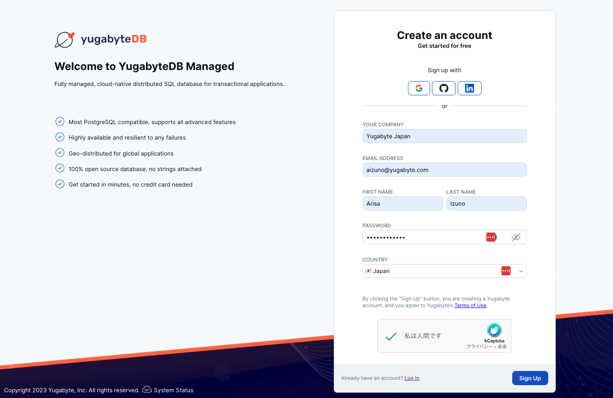

2. 入力したEメールアドレス宛に、確認のメールが届きます。[Verify Email] ボタンをクリックしてください。

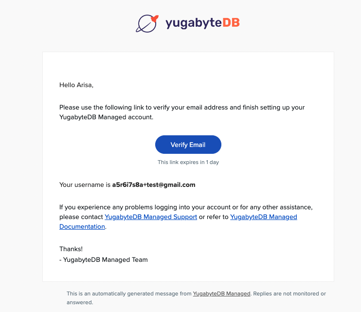

3. ログイン画面にリダイレクトされます。設定したユーザーIDとパスワードでログインしてください。ログインが成功したら以下のような画面が表示されます。

以上で、YugabyteDB Managedへのサインアップは完了です。

## 無料枠のクラスター作成
Duration: 01:00

YugabyteDB Managedでは、アカウントにつき1つ、期間の限りなく使用可能な1ノードのクラスタを作成可能です。高可用性やスケールアウトといった本番運用に必要な機能は試すことができませんが、Postgres互換のYSQLやCassanrda互換のYCQLを試すなど、チュートリアルに最適なSandbox環境として使用することができます。

以下は、SandboxとDedicated (有償環境) の機能比較です。

このハンズオンでは、この無料枠で1ノードのクラスタを作成します。

## シングルノードクラスタの作成
Duration: 10:00

ここではYugabyteDB Managedの無料枠を使用して、1ノードのクラスタを作成します。

1. YugabyteDB Managedのアカウントにログインします。
2. 左側のメニューから[Clusters]を選択し、[Add Cluster]ボタンをクリックしてください。
3. クラスタ作成のウィザードが開始します。左側のSandboxの下にある [Choose]ボタンをクリックしてください。

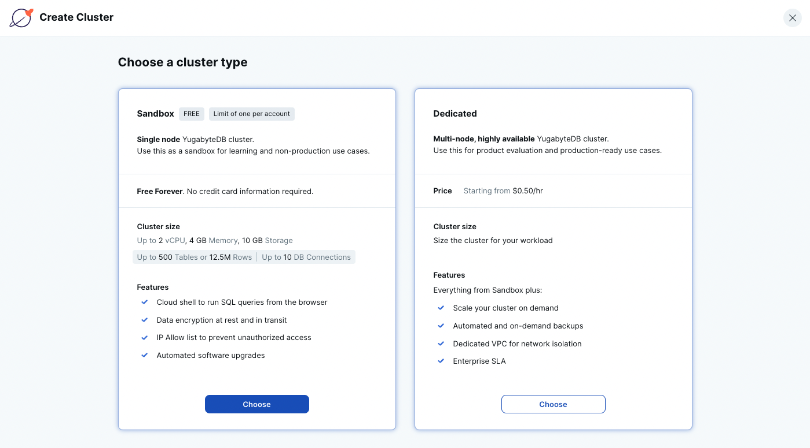

4. Cluster settingsページが表示されます。クラスタの名前には適当な名前が自動生成されます。お好きなクラウド・プロバイダとリージョンを選択して、[Next] をクリックしてください。

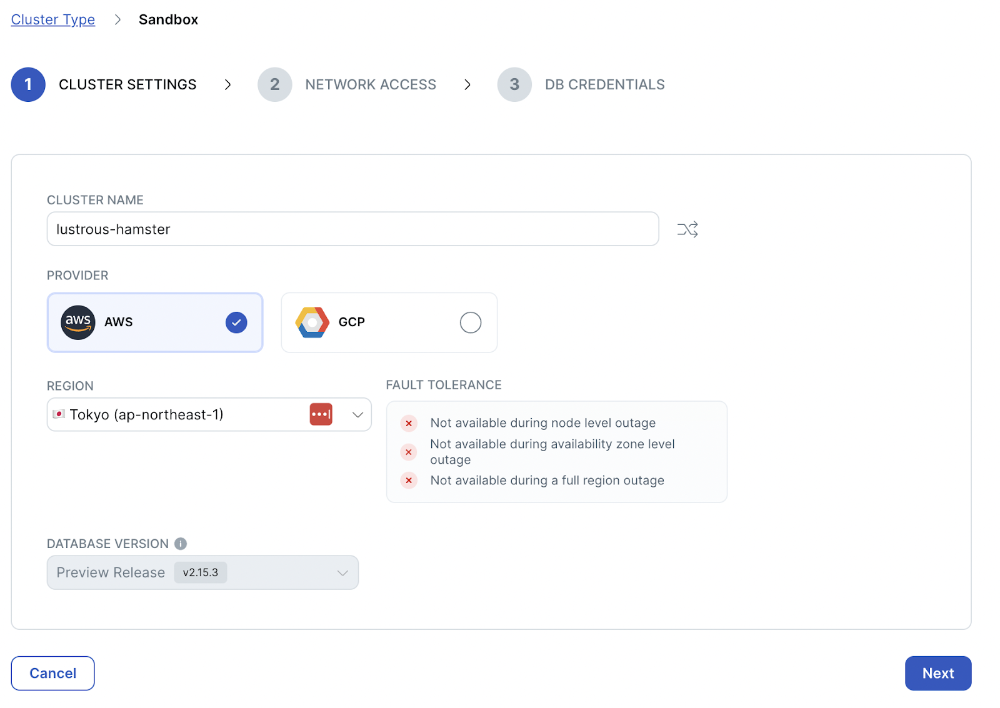

5. Network Accessページが表示されます。[Add Current IP Address]をクリックして、自分の端末のIPアドレスをアクセス許可リストに追加してください。

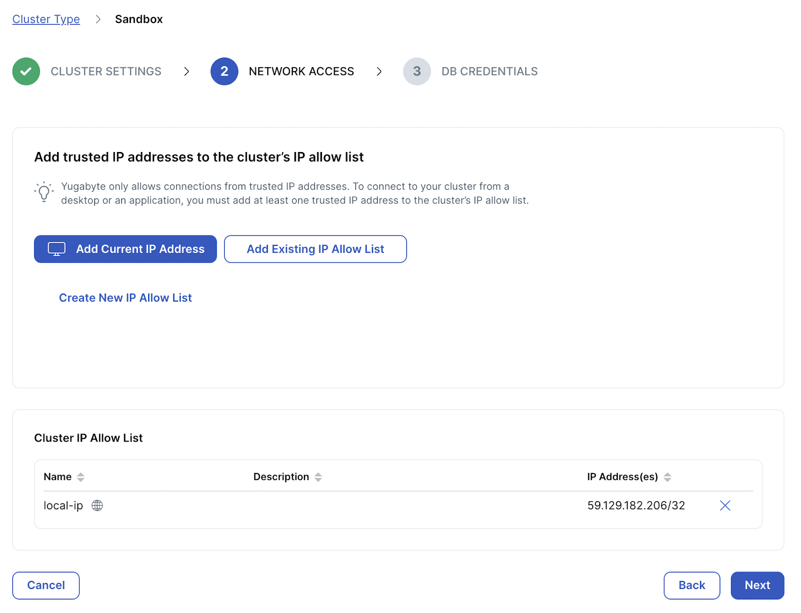

6. [Next]をクリックします。
7. DB Credentialsページが表示されます。ユーザー名とパスワードは自動設定されます。設定をカスタマイズしたい場合は、[Add your own credentials]をクリックしてユーザー名やパスワードを自分で設定します。 [Download credentials]ボタンをクリックして、アクセス情報のファイルをローカルに保存してください。

> aside negative
> 
> **Note:** このアクセス情報は、ハンズオンの後のステップで使用します。ファイルを保存した場所を忘れないようにしてください。

8. [Create Cluster]ボタンをクリックします。プロビジョニングが開始され、DBクラスタが開始するまでに数分かかります。

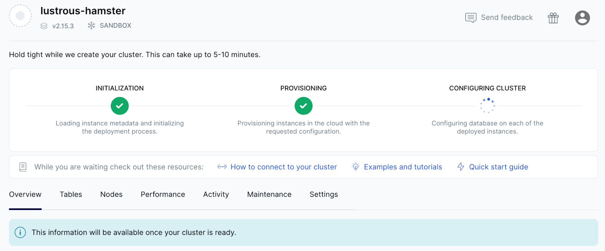

9. 起動が完了するとクラスターのダッシュボードが表示されます。

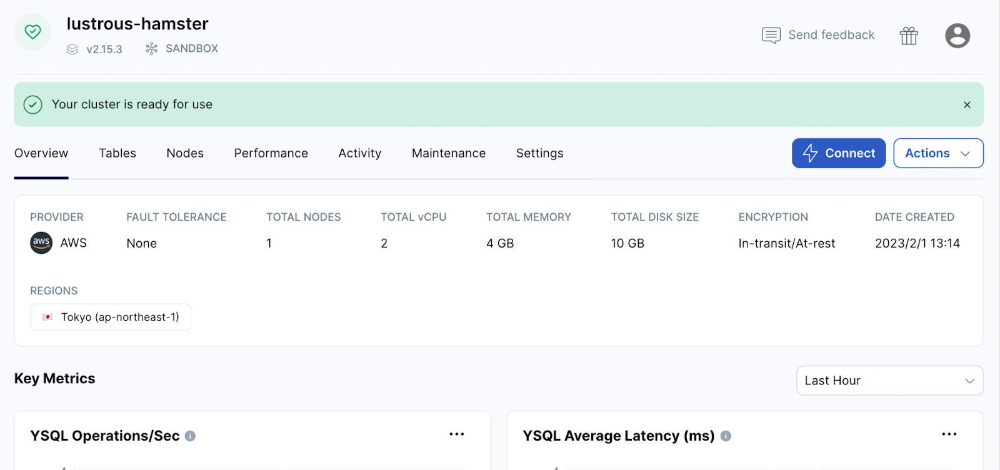

以上で、クラスタの作成は完了です。

## Cloud Shell を使用したクラスタへのアクセス
Duration: 03:00

YugabyteDB Managedのクラスタにアクセスするには、いくつかの方法があります。

* Cloud Shell （ブラウザベースのCLI）
* YugabyteDB Client Shell (MacやLinuxのターミナル、またはDockerを使用するCLI）
* その他のデータベース・クライアントアプリケーション (pgAdmin, DBeaverなど）

このセクションでは、Cloud Shellを使用したアクセスを行います。

1. 前のステップで作成したクラスタのダッシュボードを開きます。
2. クラスタのダッシュボードの右上にある、[Coneect]ボタンをクリックしてください。
3. クラスタに接続するための方法が複数表示されます。一番上にある[Launch Cloud Shell]ボタンをクリックしてください。

4. データベース名やユーザー名を確認し、[Confirm]ボタンをクリックしてください。

5. 新しいブラウザ・タブが開き、クラスタにアクセスするためのシェルが表示されます。クラスタ作成時にダウンロードしたcredentialファイルに記載された、パスワードを入力してください。

6. パスワードが認証されると、あらかじめ作成されたyugabyteデータベースに接続し、YSQLの入力モード (yugabyte=&gt;) になります。

        これでCloud Shellからクラスタにアクセスすることができました。

## テーブル作成とデータ挿入
Duration: 05:00

YugabyteDB Managedでは、初めて使用する開発者向けのチュートリアルが提供されています。ここでは、チュートリアルのガイドにそって、前のステップで接続したyugabyteデータベースにテーブルを作成します。

1. 前のステップでyugabyteデータベースに接続した、Cloud Shellのブラウザ・タブが開いていることを確認してください。
2. 左側に表示された[YugabyteDB Quick Start Guide]から、[Step 1. Create a Table]をクリックしてください。チュートリアルの手順がCloud Shellの下側に表示されます。

3. Step1では、部門(dept)テーブルを作成します。テーブルを作成するSQLをCloud Shellに直接入力するか、SQLのボックス右上にある[Copy]ボタンをクリックして貼り付ける、もしくは、[Run]ボタンをクリックして、SQLを実行してください。[CREATE TABLE]のメッセージが表示されたことを確認します。

4. 同様に、Step2では従業員(emp)テーブルを作成します。[CREATE TABLE]のメッセージを確認してください。

5. チュートリアル手順の上部にある[Next Step &gt;]ボタンをクリックするか、左側のガイドから[Step 2. Insert Data]をクリックして、データを挿入する手順を表示します。

6. 部門(dept)テーブルにデータを挿入します。[Step1]に表示されたSQLを実行してください。4行のデータが挿入され、[INSERT 0 4]のメッセージが表示されます。

7. 同様に、従業員(emp)テーブルにデータを挿入します。[Step2]に表示されたSQLを実行してください。14行のデータが挿入され、[INSERT 0 14]のメッセージが表示されるはずです。

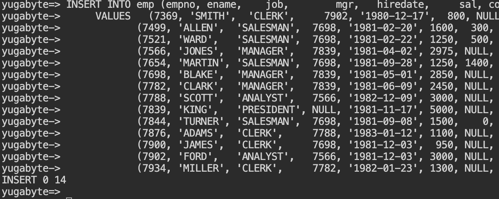

8. データの挿入が完了すると、右側のウィンドウにチュートリアルへのリンクが表示されます。[Let's get started with the tutorials -&gt;]をクリックしてください。

9. 左側ウィンドウにYSQLのチュートリアルが表示されます。先ほど作成したテーブルを使用して、様々なSQL機能を試すことができます。このハンズオンでは実施しませんが、お時間のある時に是非やってみてください。

 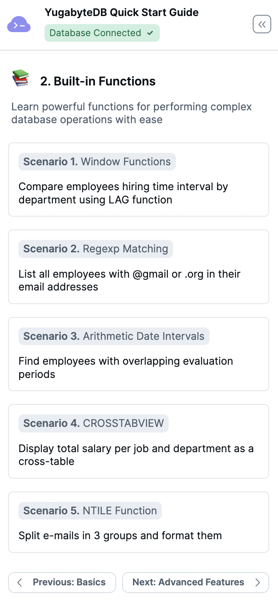 

これでテーブル作成とデータ挿入のステップは完了です。

## pgAdminを使用したクラスタへのアクセス
Duration: 06:00

pgAdminはPostgreSQLを管理するGUIのツールです。PostgreSQL互換のYugabyteDBでも使用することができます。

このセクションでは、pgAdminを使用してYugabyteDB Managedのクラスタにアクセスします。

pgAdminは [こちら](https://www.pgadmin.org/download/)からダウンロードできます。

インストールの詳細な手順については、 [SRA OSS社のブログ](https://www.sraoss.co.jp/tech-blog/pgsql/pgadmin4/)で紹介されていますので、参考にしてみてください。

1. アプリケーションからYugabyteDB Managedのクラスタにアクセスするには、SSL通信のための証明書が必要です。クラスターのダッシュボードを開いて、右上にある[Connect]ボタンをクリックしてください。

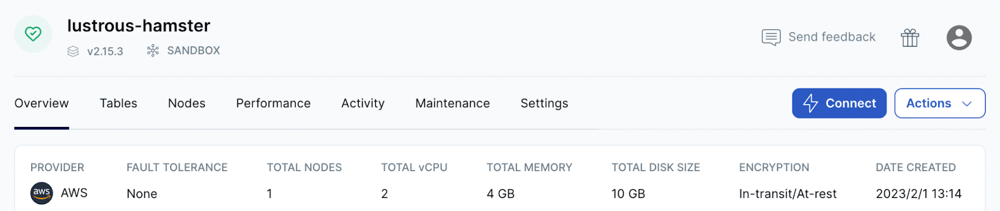

2. 表示されたウィンドウで、[Connect to your Application]の右にある矢印ボタンを押します。

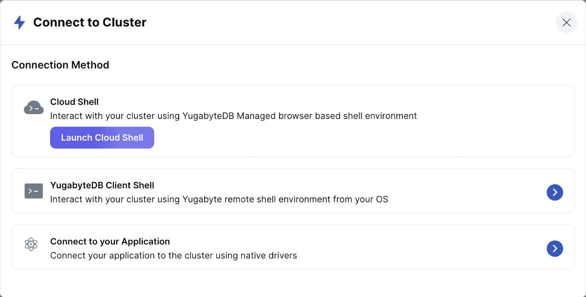

3. [Download CA Cert]のリンクをクリックして、クラスタに接続するためのCA証明書をダウンロードしてください。

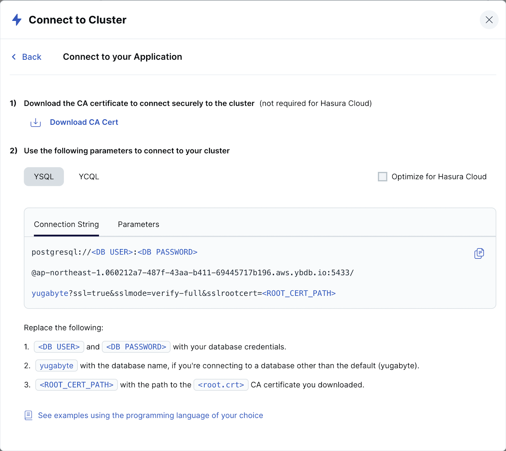

> aside negative
> 
> **Note:** この証明書はClient ShellやpgAdminのようなリモートのクライアントからクラスタにアクセスするために必要です。クラスターのダッシュボードから何度でもダウンロードは可能ですが、ファイルを保存した場所を忘れないようにしてください。

4. クラスタの接続パラメータをコピーし、ホスト名部分 (2行目の＠マーク以下、ybdb.ioまで）メモしておいてください。
5. pgAdminを開きます。Master passwordの入力を求められるので、初めて開く場合はパスワードを設定してください。

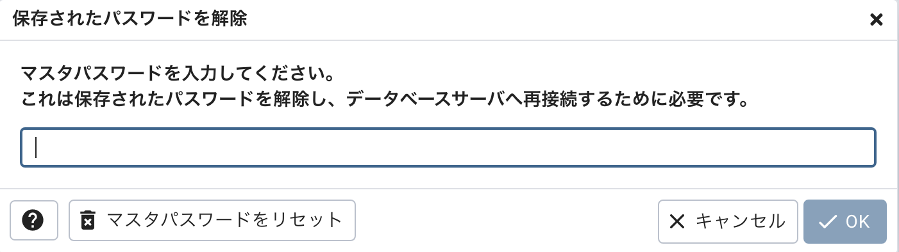

6. (オプション) pgAdminの画面を日本語表示にする場合は、メニューの[Preference(設定)]から設定画面を開き、[User language(ユーザ言語)]をJapaneseに設定します。

7. pgAdminの左上で[Servers]を右クリックし、[登録] &gt; [サーバ...]を選択してください。

8. [General]タブで、任意の名前を入力します。(接続にはホスト名を使用するので、実際のクラスター名を入力する必要はありません。）

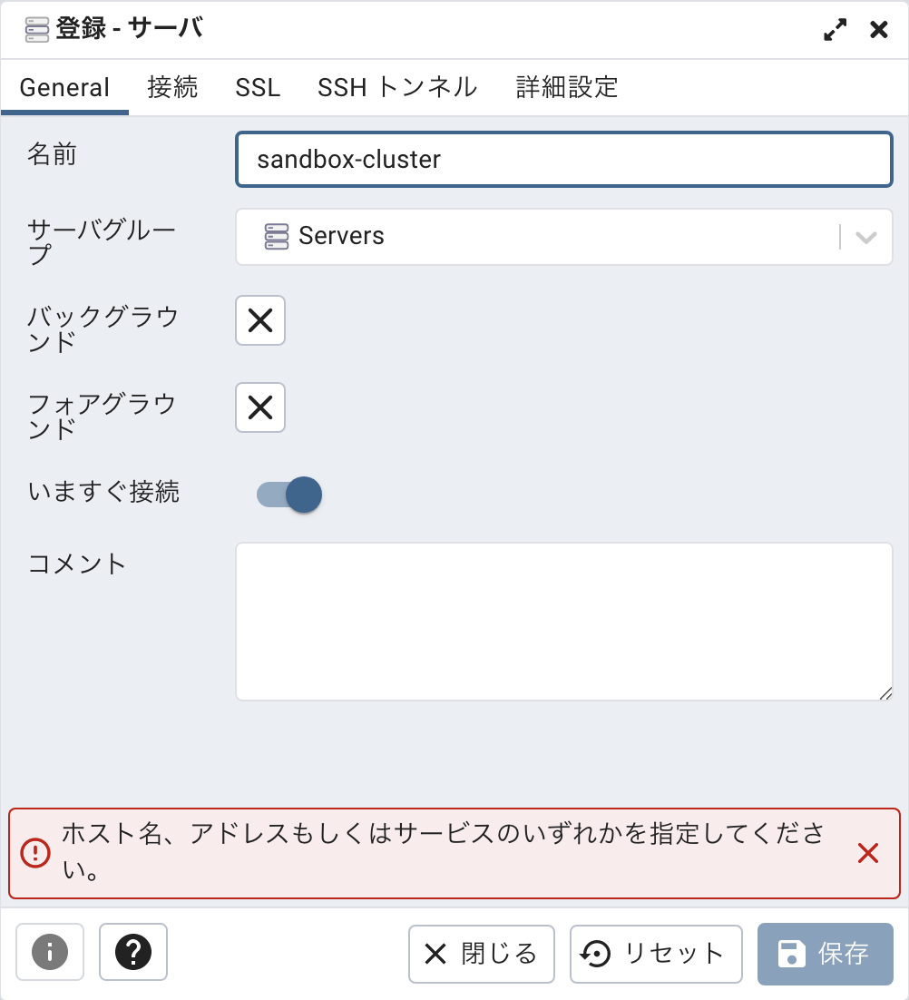

9. [接続]タブで、[ホスト名/アドレス]に先ほどコピーしたホスト名を入力します。[ポート番号]は5433、[管理用データベース]はyugabyte、[ユーザ名]と[パスワード]には、クラスターのcredentialファイルに設定した情報を入力します。また、[パスワードを保存]をオンにしてください。

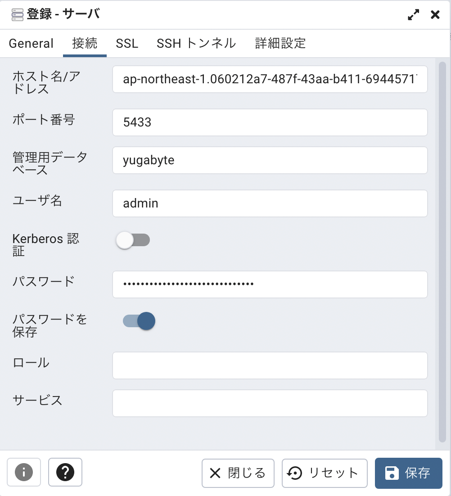

10. [SSL]タブで、[SSLモード]をVerify-Fullに設定します。また、先ほどダッシュボードからダウンロードしたCA証明書ファイルを[ロール認証]に設定してください。

11. [保存]ボタンをクリックして、ウィンドウを閉じます。
12. pgAdminの左側のリストに、登録したサーバが表示されます。データベースを選択し、[PSQLツール]をクリックしてください。

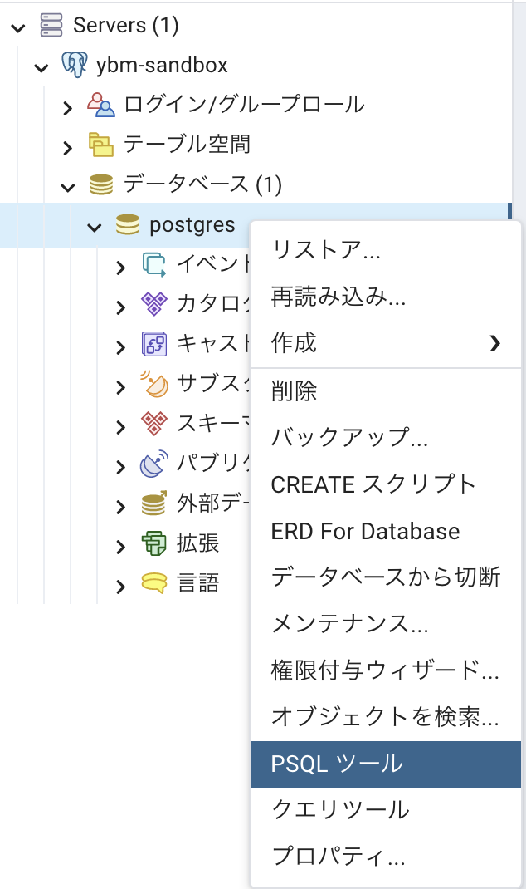

> aside negative
> 
> **Note:** pgAdminのバージョンによって、接続直後にyugabyteデータベースが表示される場合と、表示されない (postgres等、別のデータベースのみ表示される) 場合があります。

13. Yugabyteデータベースに接続できていない場合は、`\c yugabyte`と入力して、接続先を切り替えてください。

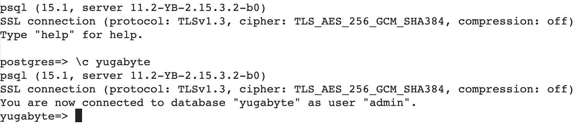

14. `\d` と入力すると、作成済みのテーブルが表示されます。

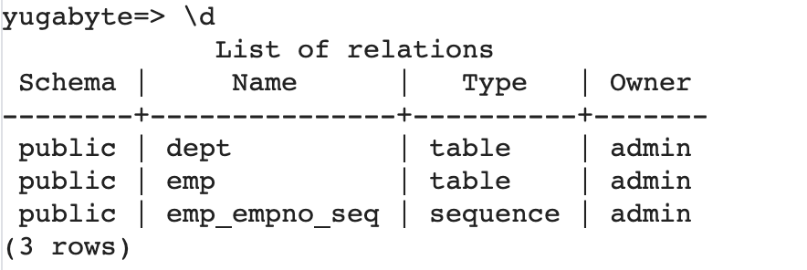

15. 前のステップで挿入したデータを確認してみましょう。select * from emp where deptno='20'; と入力してください。部門コードが20の従業員がリストされます。

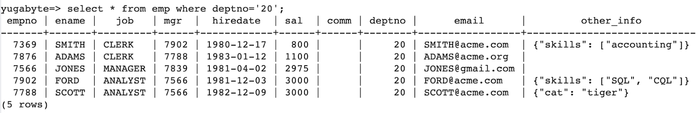

以上で、pgAdminを使用したクラスタへのアクセスは完了です。

## (オプション) pgAdminでのデータベース作成
Duration: 05:00

pgAdminでは、前のステップで使用したPSQLツールだけでなく、GUIを使用してテーブルやデータを確認することができます。このセクションでは、pgAdminで新しいデータベース(northwind) を作成し、GUIの操作を確認します。

1. データベースにテーブルを作成するDDLファイル( [northwind_ddl.sql.txt](https://files.cdn.thinkific.com/file_uploads/540012/attachments/a36/29a/bd2/northwind_ddl.sql.txt))と、データを挿入するDMLファイル( [northwind_data.sql.txt](https://files.cdn.thinkific.com/file_uploads/540012/attachments/886/c8a/550/northwind_data.sql.txt))をダウンロードします。以下のリンクをクリックして新しいブラウザ・タブで開き、ブラウザの[ファイル] &gt; [別名で保管] (Chromeの場合、ブラウザによって異なります) から、テキストファイルを任意のローカルフォルダに保管してください。

2. pgAdminを開きます。左側のナビゲータで[データベース]を右クリックし、[作成] &gt; [データベース...]を選択してください。

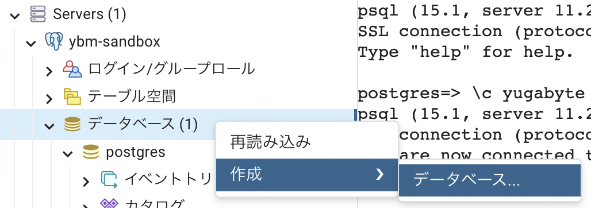

3. [データベース]に northwind と入力し、[保存]ボタンをクリックしてください。

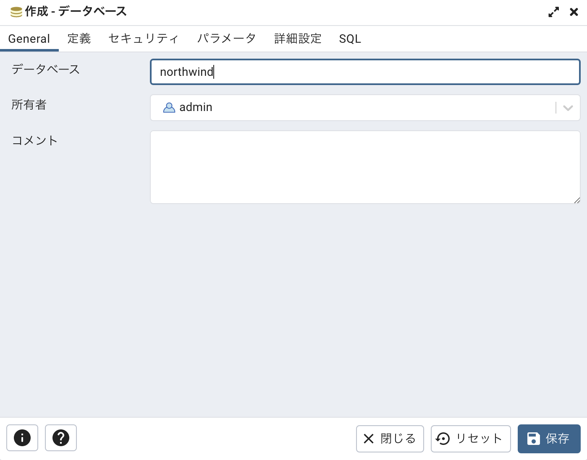

4. ナビゲータにnorthwindデータベースが表示されます。PSQLツールを再度開くか、すでに開いている場合は `\c northwind` と入力して、接続先データベースを切り替えてください。
5. 最初のステップでダウンロードしたDDLファイルをインポートして、テーブルを一括作成します。`\i ‘&lt;ダウンロードしたDDLファイルのパス&gt;'` と入力してください。(\iの後に半角スペース、ファイルパスはシングルクオート(')で囲みます。)

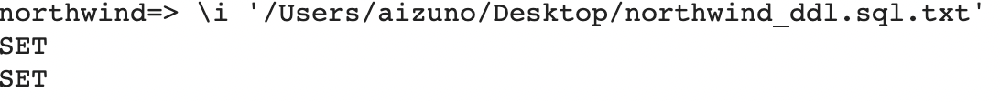

6. 同様に、ダウンロードしたDMLファイルをインポートして、データを一括挿入します。`\i ‘&lt;ダウンロードしたDMLファイルのパス&gt;'` と入力してください。
7. 左側のナビゲータで、[northwind] &gt; [スキーマ] &gt; [テーブル] と展開してください。上の手順で作成された14個のテーブルが確認できます。

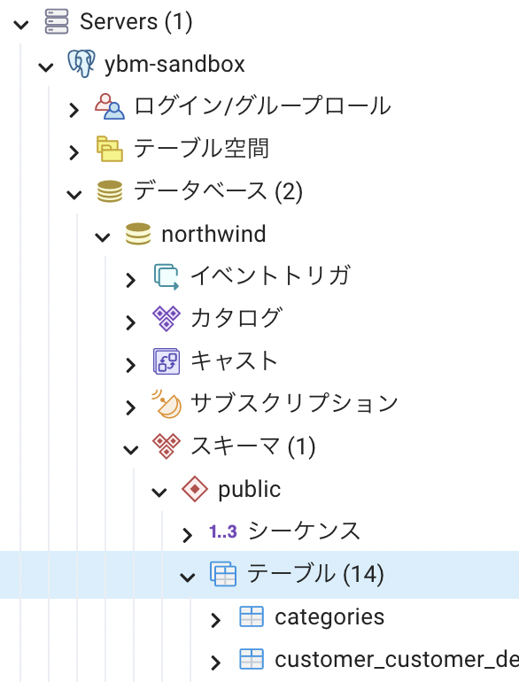

8. employeeテーブルを右クリックして、[データを閲覧/編集] &gt; [すべての行]を選択してください。

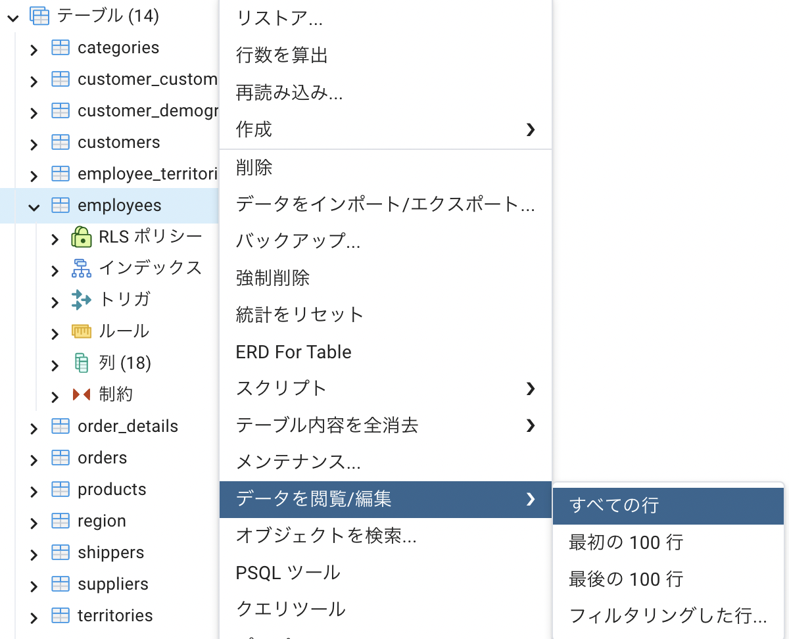

9. 右側に、実行されたクエリとデータ出力が表示されます。

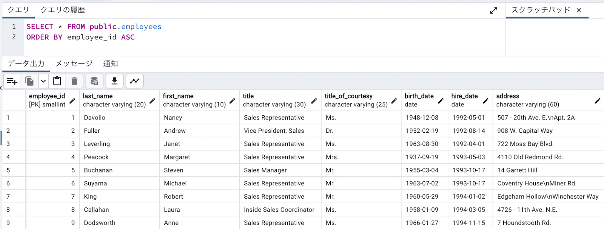

以上で、pgAdminでのデータベースやテーブルの作成は完了です。

## まとめ
Duration: 01:00

お疲れ様でした。YugabyteDB Managed入門ハンズオンは、これで終了です。

YugabyteDB Managedは、データベースを導入するハードウェアやOSを準備しなくても、数ステップの操作で使い始められるマネージドのデータベース・サービスです。

YugabyteDB Managedでは、CLIやGUIのツールを使って、使い慣れたSQLで操作できることを確認できたと思います。

### 次におすすめのハンズオン

以下のハンズオンも実施してみてください。

* YugabyteDB Managedチュートリアル (Cloud Shellから表示)
*  [YugabyteDB Managedの耐障害性と拡張性](https://yugabytedb-japan.github.io/codelabs/ybm-cluster-resiliency/index.html)

### 参考資料

*  [YugabyteDB Managed 公式ドキュメント](https://docs.yugabyte.com/preview/yugabyte-cloud/)
*  [Yugabyte University: YugabyteDB Managed Basics](https://university.yugabyte.com/courses/yugabytedb-managed-basics)

