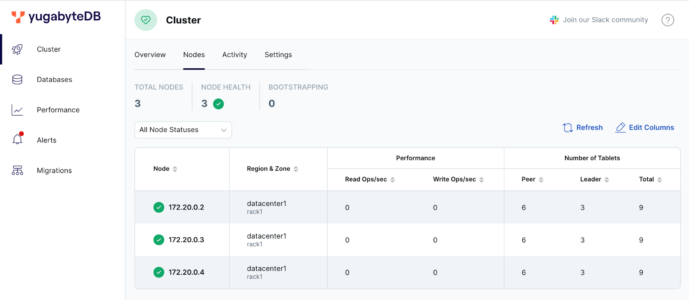
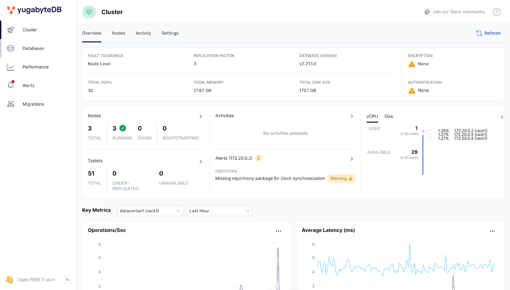
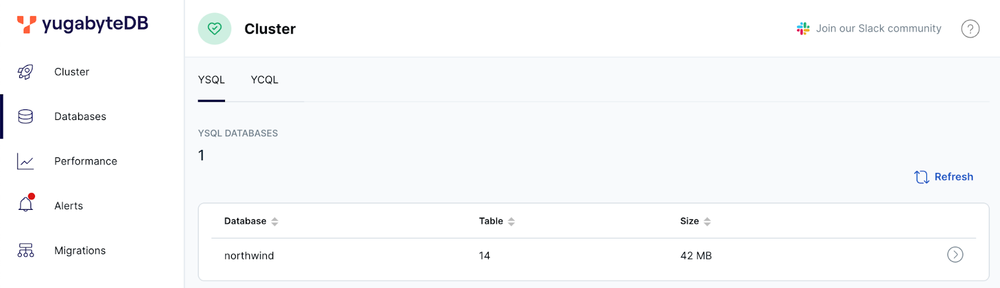
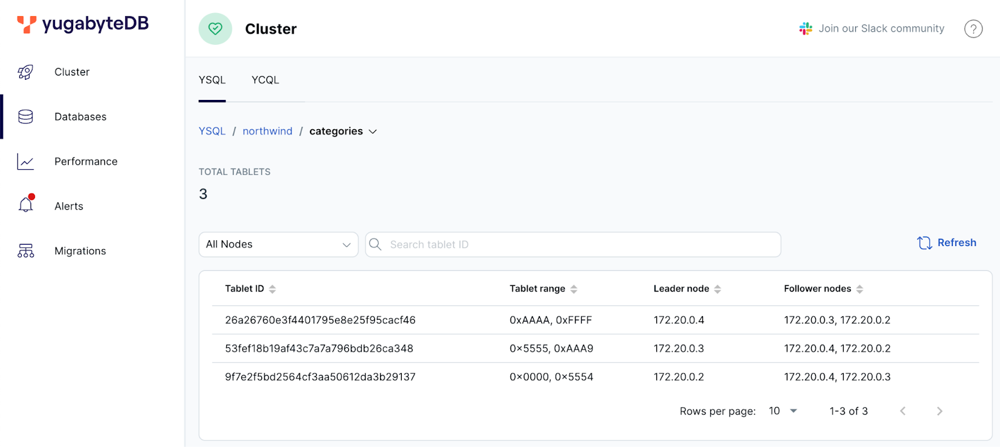
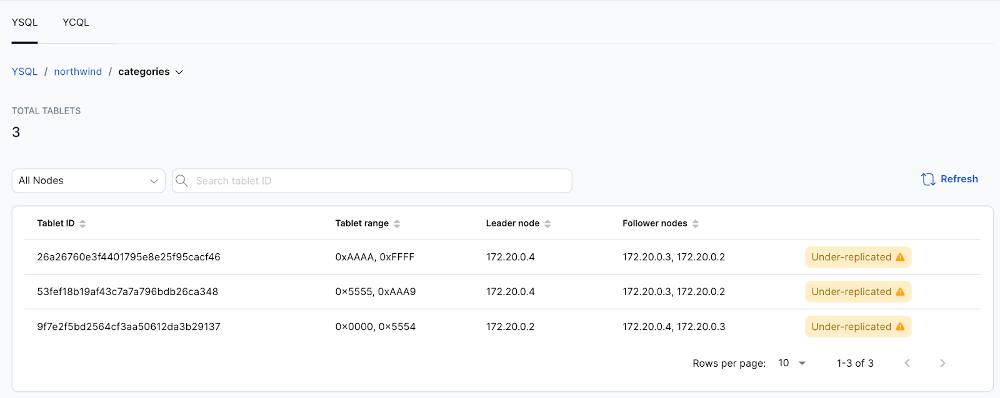
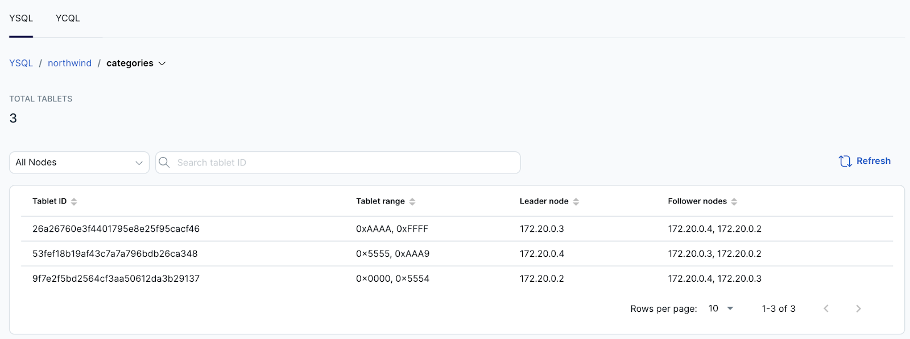
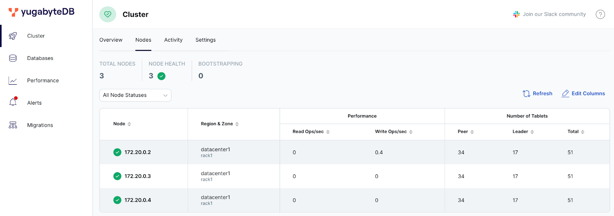
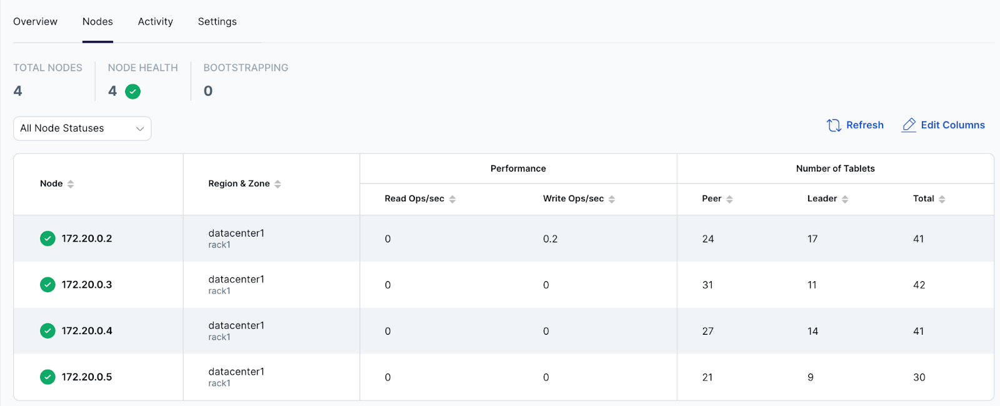
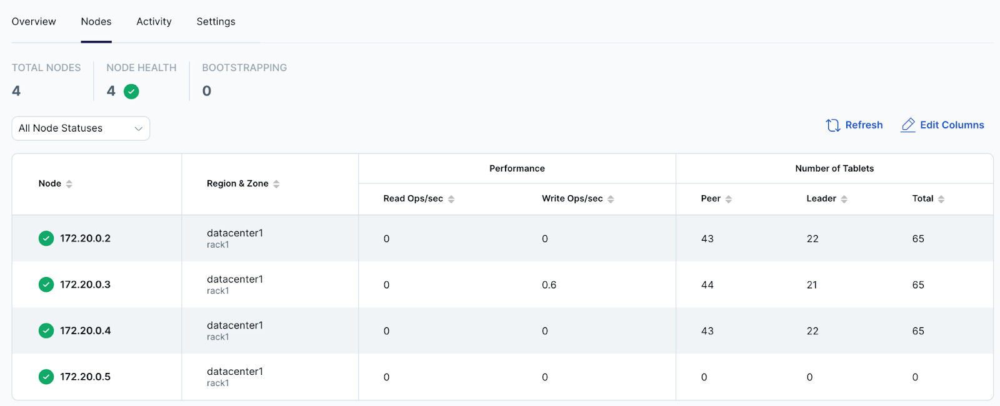

# はじめてのYugabyteDB

[Codelab Feedback](https://yugabytedb-japan.github.io/)


## はじめに
Duration: 01:00


**Last Updated:** 2024-07-06

### **YugabyteDBとは？**

YugabyteDBは、PostgresSQL互換の分散SQLデータベースです。自動シャーディングによるデータの分散配置とレプリケーションを行うため、柔軟なスケールや高い耐障害性、ゼロダウンタイムでのメンテナンスを行うことができます。

### **ハンズオンで実施すること**

このハンズオンではYugabyteDBのDockerイメージを使用して、ローカル環境で3つのコンテナで構成されるクラスタを作成します。テーブルを作成したときにどのようにデータ (タブレット) が配置されるか、スケールアウトやスケールインによってどう変化するかを確認します。

以下の内容を実施します:

* Dockerイメージのダウンロード
* 3つのコンテナでクラスタを構成
* サンプルデータベースの作成
* タブレット配置の確認
* コンテナの停止と起動

### **ハンズオン実施に必要なもの**

* Docker Desktop


## Dockerでの YugabyteDB クラスタ作成
Duration: 05:00


1. ターミナルから以下のコマンドを入力して、最新のYugabyteDBのイメージをダウンロードします。

```
docker pull yugabytedb/yugabyte
```

2. Dockerコンテナがデータを保管するフォルダを作成します。

```
mkdir ~/yb_data
```

3. コンテナ間で通信を行うため、Dockerネットワークを作成します。

```
docker network create yb-network
```

4. 最初のコンテナを起動します。

&lt;Windowsの場合&gt;

```
docker run -d --name yugabyte-n1 --net yb-network `
    -p 15433:15433 -p 7001:7000 -p 9101:9000 -p 5433:5433 `
    -v ~/yb_data/node1:/home/yugabyte/yb_data --restart unless-stopped `
    yugabytedb/yugabyte `
    bin/yugabyted start `
    --base_dir=/home/yugabyte/yb_data --background=false
```

&lt;Macの場合&gt;

```
docker run -d --name yugabyte-n1 --net yb-network \
    -p 15433:15433 -p 7001:7000 -p 9001:9000 -p 5433:5433 \
    -v ~/yb_data/node1:/home/yugabyte/yb_data --restart unless-stopped \
    yugabytedb/yugabyte \
    bin/yugabyted start \
    --base_dir=/home/yugabyte/yb_data --background=false
```

5. Dockerコマンドで、コンテナが開始されていることを確認してください。

```
docker ps
```

6. 2つ目、3つ目のコンテナを起動します。

&lt;Windowsの場合&gt;

```
docker run -d --name yugabyte-n2 --net yb-network `
    -p 15434:15433 -p 7002:7000 -p 9102:9000 -p 5434:5433 `
    -v ~/yb_data/node2:/home/yugabyte/yb_data --restart unless-stopped `
    yugabytedb/yugabyte `
    bin/yugabyted start --join=yugabyte-n1 `
    --base_dir=/home/yugabyte/yb_data --background=false

docker run -d --name yugabyte-n3 --net yb-network `
    -p 15435:15433 -p 7003:7000 -p 9103:9000 -p 5435:5433 `
    -v ~/yb_data/node3:/home/yugabyte/yb_data --restart unless-stopped `
    yugabytedb/yugabyte `
    bin/yugabyted start --join=yugabyte-n1 `
    --base_dir=/home/yugabyte/yb_data --background=false
```

&lt;Macの場合&gt;

```
docker run -d --name yugabyte-n2 --net yb-network \
    -p 15434:15433 -p 7002:7000 -p 9002:9000 -p 5434:5433 \
    -v ~/yb_data/node2:/home/yugabyte/yb_data --restart unless-stopped \
    yugabytedb/yugabyte \
    bin/yugabyted start --join=yugabyte-n1 \
    --base_dir=/home/yugabyte/yb_data --background=false

docker run -d --name yugabyte-n3 --net yb-network \
    -p 15435:15433 -p 7003:7000 -p 9003:9000 -p 5435:5433 \
    -v ~/yb_data/node3:/home/yugabyte/yb_data --restart unless-stopped \
    yugabytedb/yugabyte \
    bin/yugabyted start --join=yugabyte-n1 \
    --base_dir=/home/yugabyte/yb_data --background=false
```

7.  [http://localhost:15433](http://localhost:15433) にアクセスします。3つのDockerコンテナで構成されたクラスタが確認できるはずです。




## サンプルデータベースの作成
Duration: 05:00


### **データベースの作成**

1. 以下のコマンドを入力して、ysqlインターフェースにアクセスします。

```
docker exec -it yugabyte-n1 bash -c '/home/yugabyte/bin/ysqlsh --echo-queries --host $(hostname)'
```

2. YSQLの入力ができるようになります。YugabyteDBのサンプルとして付属している、northwindデータベースを作成します。

```
CREATE DATABASE northwind;
\c northwind
\i share/northwind_ddl.sql
```

3. 作成されたテーブルを確認してください。

```
\dt
```

4. データを投入します。

```
\i share/northwind_data.sql
```

5. Selectコマンドでデータを確認してください。

```
select * from categories;
```

### **yugabytedのUI確認**

1.  [http://localhost:15433](http://localhost:15433) にアクセスしてください。



2. 左側のメニューからDatabaseを選択します。



3. YSQLタブにあるデータベースの表から、northwindデータベースの行をクリックすると、テーブルの一覧が表示されます。


4. 一番上にある、categoriesテーブルの行をクリックしてください。このテーブルが3つのタブレットに分割され、それぞれのタブレットが3つのコピーを持ち、1つのリーダーと2つのフォロワータブレットが分散配置されていることがわかります。




## ノード障害のシミュレート
Duration: 05:00


1. 以下のコマンドを入力して、1つのDockerコンテナを停止します。

```
docker stop yugabyte-n2
```

2. ysqlのインターフェースを終了してしまった場合は、再度以下のコマンドを入力します。

```
docker exec -it yugabyte-n1 bash -c '/home/yugabyte/bin/ysqlsh --echo-queries --host $(hostname)'
```

3. northwindデータベースにアクセスをして、selectコマンドを実行します。1つのコンテナが停止しても、問題なくクエリ実行ができることを確認してください。

```
\c northwind
select * from categories;
```

4. yugabyted ( [http://localhost:15433](http://localhost:15433)) にアクセスし、categoriesテーブルのタブレット配置を確認します。



5. 以下のコマンドを入力して、停止したコンテナを再開してください。

```
docker start yugabyte-n2
```

6. yugabytedの画面をリフレッシュすると、リーダータブレットの配置が分散されていることがわかります。




## スケールアウト
Duration: 05:00


1. yugabyted ( [http://localhost:15433](http://localhost:15433)) にアクセスし、左側のClusterメニューを選択します。Nodesタブで、タブレットが分散配置されていることを確認してください。



2. 以下のコマンドを入力して、4つめのコンテナを開始します。

&lt;Windowsの場合&gt;

```
docker run -d --name yugabyte-n4 --net yb-network `
    -p 15436:15433 -p 7004:7000 -p 9104:9000 -p 5436:5433 `
    -v ~/yb_data/node4:/home/yugabyte/yb_data --restart unless-stopped `
    yugabytedb/yugabyte `
    bin/yugabyted start --join=yugabyte-n1 `
    --base_dir=/home/yugabyte/yb_data --background=false
```

&lt;Macの場合&gt;

```
docker run -d --name yugabyte-n4 --net yb-network \
    -p 15436:15433 -p 7004:7000 -p 9004:9000 -p 5436:5433 \
    -v ~/yb_data/node4:/home/yugabyte/yb_data --restart unless-stopped \
    yugabytedb/yugabyte \
    bin/yugabyted start --join=yugabyte-n1 \
    --base_dir=/home/yugabyte/yb_data --background=false
```

3. yugabyedのページをリフレッシュして、タブレットがリバランスされていることを確認してください。



4. 続いて、スケールインするために1つのコンテナを停止してみましょう。yugabytedの画面上から、ノードは削除されるでしょうか？

```
docker stop yugabyte-n4
```

5. コンテナを停止すると、ノード障害の発生がyugabytedに表示されますが、クラスタからノードは削除されません。コンテナを再開してください。

```
docker start yugabyte-n4
```

6. ノードを削除するには、管理コマンドを実行して、タブレットを移動してから安全に構成を変更する必要があります。yugabytedのCluster &gt; Settingsのタブから、4つ目のコンテナのTserverのserver_broadcast_addresses (ポート番号9100)と、tserver_master_addrsを確認して以下のコマンドを入力してください。

```
docker exec -it yugabyte-n1 bash -c '/home/yugabyte/bin/yb-admin -master_addresses <tserver_master_addrs> change_blacklist ADD <server_broadcast_addresses>'
```

7. yugabytedのCluster &gt; Nodes タブを確認すると、4つ目のコンテナがブラックリストされて全てのタブレットが移動していることが確認できます。



> aside negative
> 
> Dockerベースのyugabytedコマンドは [Early Accessでの提供](https://docs.yugabyte.com/preview/reference/configuration/yugabyted/#create-a-multi-region-cluster-in-docker)のため、2024年7月現在、ノードの削除までをコマンドで完結することはできません。


## まとめ
Duration: 01:00


YugabyteDB のDockerイメージは、ローカル環境でYugabyteDBの動作を確認するのに適しています。yugabytedコマンドを使用することで、masterプロセスとtserverプロセスを個別起動しなくてもクラスタのサービスを開始/停止することができます。

yugabytedはUIも提供していますが、全てのオペレーションはCLIでの操作になります。UIからの操作やオペレーションの自動化、より詳細なメトリクスの監視を行いたい場合は、YugabyteDB Anywhereを使用することをお勧めします。

### 次におすすめのハンズオン

以下のハンズオンはYugabyteDB Managed向けに作成されていますが、ローカル環境でも実行可能です。是非お試しください。

*  [YugabyteDB Managedの耐障害性と拡張性](https://yugabytedb-japan.github.io/codelabs/ybm-cluster-resiliency/index.html)

### 参考資料

*  [YugabyteDB クイックスタート](https://docs.yugabyte.com/preview/quick-start/docker/)


