# YugabyteDB Managed の基礎

[Codelab Feedback](https://yugabytedb-japan.github.io/)


## はじめに
Duration: 01:00


**Last Updated:** 2022-03-22

### **YugabyteDB Managedとは？**

YugabyteDBはクラウドネイティブなアプリケーションに最適な、100%オープンソースの分散SQLデータベースです。YugabyteDB Managedは、YugabyteDBをコアコンポーネントのデータベースとして使用している、フルマネージドのサービスです。サーバーやクラウドのアカウントを事前に準備しなくても、すぐにYugabyteDBをサービスとして使用することができます。

### **ハンズオンで実施すること**

このハンズオンでは、YugabyteDB Managedの無料枠を使用してYSQLテーブルの作成と操作を行います。以下の内容を実施します:

* pgAdminのインストール
* northwindデータベースの作成
* ユーザ定義関数の作成
* トリガーの作成

### **ハンズオンで学習すること**

* データベースクライアントツールによるYugabyteDB Managedへのアクセス
* YSQLでサポートする機能

### **ハンズオン実施に必要なもの**

* **インターネット接続可能な端末**、およびその**IPアドレス**：セキュリティ・ツールによってIPアドレスが書き換えられる場合は、セキュリティ・ツールによって設定されるIPアドレスの範囲、もしくは、ハンズオン中にセキュリティ・ツールの一時無効化ができるかをご確認ください。
* **ブラウザ** (Chrome, Safari, Microsoft Edge, Firefoxなど)
* **YugabyteDB Managedアカウント**：未登録の場合は [YugabyteDB Managed入門](https://yugabytedb-japan.github.io/codelabs/getting-started-ybm/index.html)を参考にサインアップしてください。
* **YugabyteDB Managedのシングルノード・クラスター**：アクセス情報 (ユーザIDとパスワードを含むテキストファイル) をご確認ください。
* **pgAdmin 4**：ハンズオン内でインストールを行います。ログインユーザにインストール権限があるかどうかをご確認ください。


## pgAdmin 4のインストール (Mac)
Duration: 05:00


pgAdminはPostgreSQLを管理するGUIのツールです。PostgreSQL互換のYugabyteDBでも使用することができます。pgAdminについての解説やLinuxインストールの方法については、 [SRA OSS社のブログ](https://www.sraoss.co.jp/tech-blog/pgsql/pgadmin4/)で紹介されていますので、参考にしてみてください。

ここでは、Macへのインストール手順をご紹介します。

### **インストール手順**

1.  [Mac用のインストーラ](https://www.pgadmin.org/download/pgadmin-4-macos/)から、最新のバージョン (2023年3月時点では、V6.21) のリンクをクリックします。

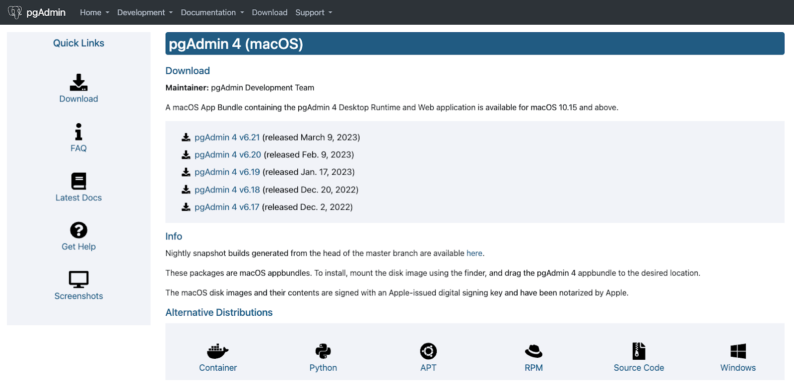

2. ファイル・ブラウザから、インストール・ファイル (dmg) をクリックしてダウンロードしてください。

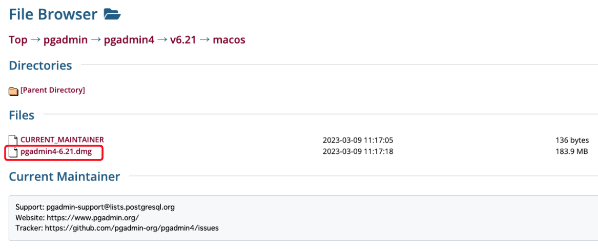

3. ダウンロードしたファイルを開きます。使用許諾の内容を確認し [Agree] をクリックしてください。

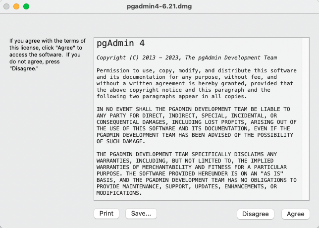

4. pgAdmin 4のインストーラが表示されます。左側の pgAdmin 4.app を右側のApplications フォルダにドラッグアンドドロップしてください。

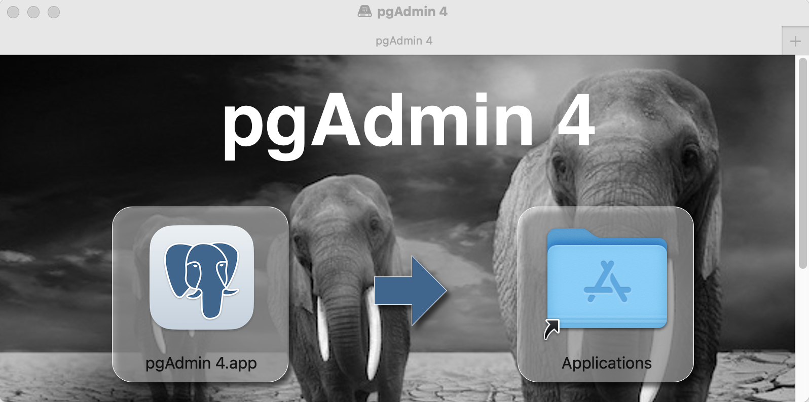

5. 古いバージョンのpgAdminが既にインストールされている場合は、上書きの確認メッセージが表示されます。[両方とも残す]もしくは[上書き]を選択すると、pgAdmin 4 V6.21がアプリケーションフォルダにコピーされ、使用可能になります。
6. pgAdmin 4を起動すると、マスターパスワードの入力画面が表示されます。初回インストールの場合は、マスターパスワードを新しく設定してください。古いバージョンで設定したパスワードを忘れてしまった場合は、リセットして再設定が可能です。

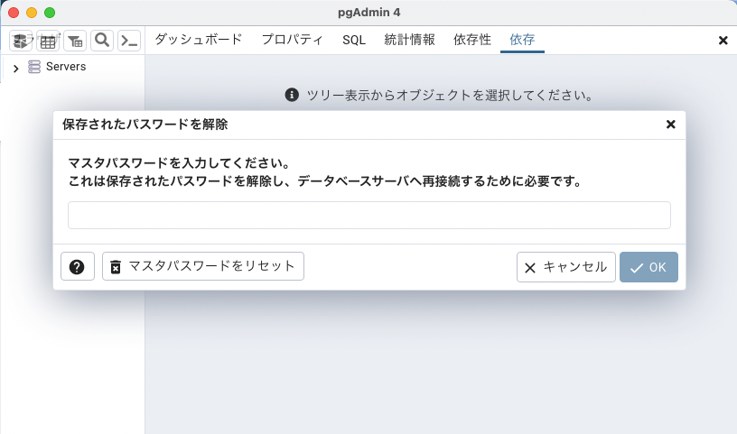

7. pgAdminの画面が開きます。必要に応じて、メニューの[Preference(設定)]から[User language(ユーザ言語)]を[Japanese]に設定し、pgAdminの画面を日本語表示にしてください。（表示言語の切り替えには、再読み込みが必要です。）

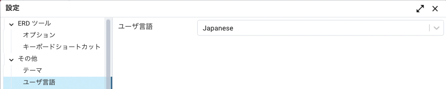


## pgAdmin 4のインストール (Windows)
Duration: 05:00


pgAdminはPostgreSQLを管理するGUIのツールです。PostgreSQL互換のYugabyteDBでも使用することができます。pgAdminについての解説やLinuxインストールの方法については、 [SRA OSS社のブログ](https://www.sraoss.co.jp/tech-blog/pgsql/pgadmin4/)で紹介されていますので、参考にしてみてください。

ここでは、Windowsへのインストール手順をご紹介します。

### **インストール手順**

1.  [Windows用のインストーラ](https://www.pgadmin.org/download/pgadmin-4-windows/)から、最新のバージョン (2023年3月時点では、V6.21) のリンクをクリックします。

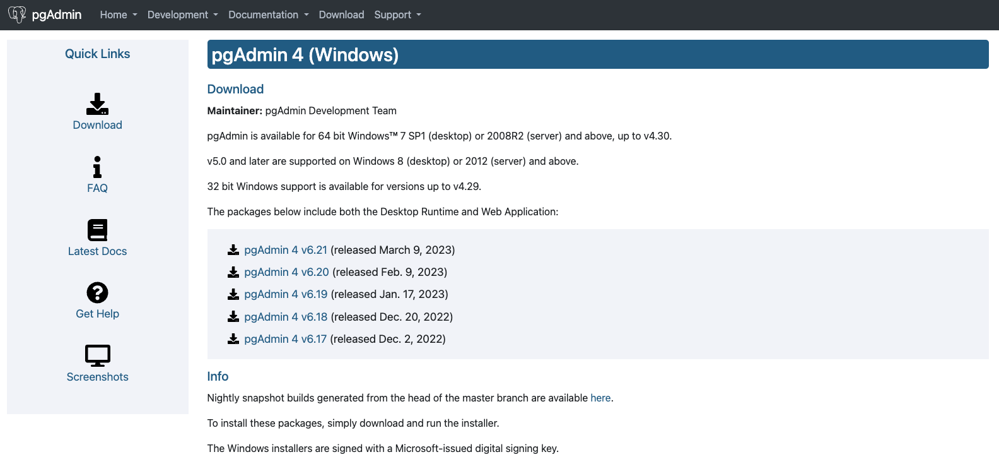

2. ファイル・ブラウザから、インストール・ファイル (exe) をクリックしてダウンロードしてください。

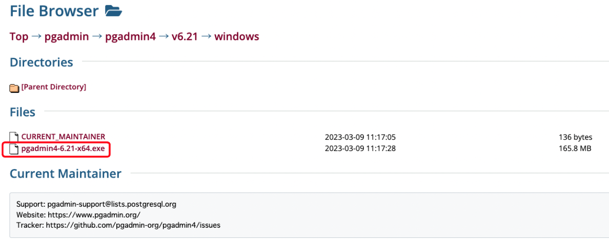

3. ダウンロードしたファイルを選択し、[管理者として実行]してインストーラを起動します。[Next]をクリックしてください。

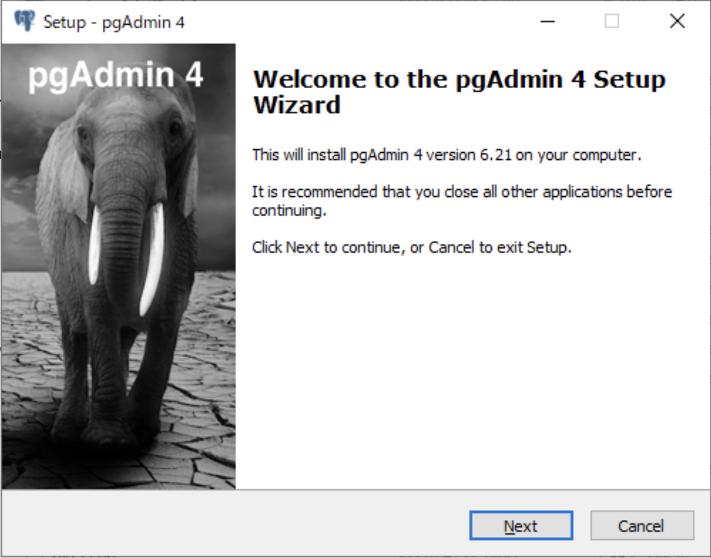

4. 使用許諾の内容を確認し、[I accept...]を選択してから[Next]ボタンをクリックしてください。

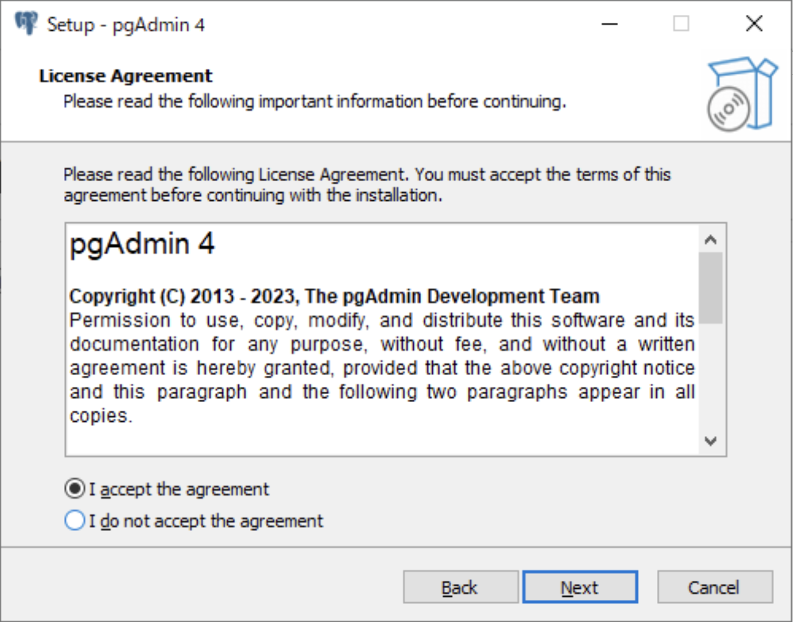

5. インストールフォルダを選択し、[Next]をクリックします。

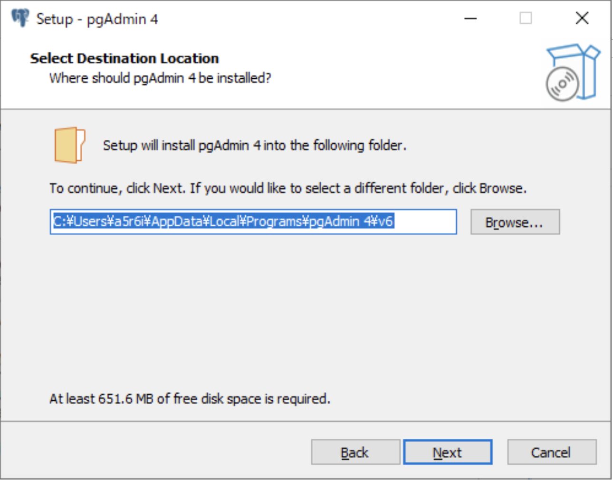

6. スタート・メニューのフォルダ名（または追加しない）を設定し、[Next]をクリックします。

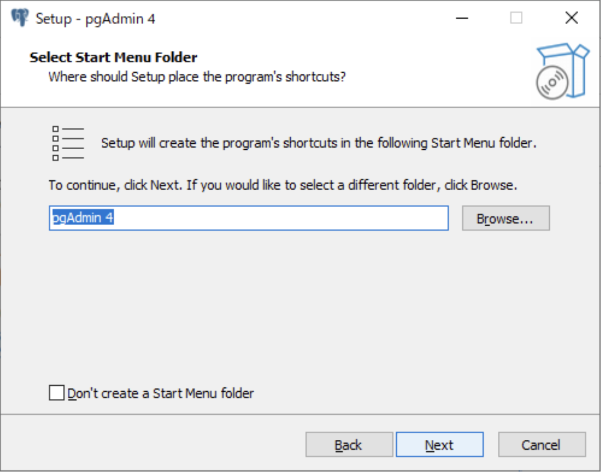

7. インストール内容を確認し、[Install]をクリックしてください。

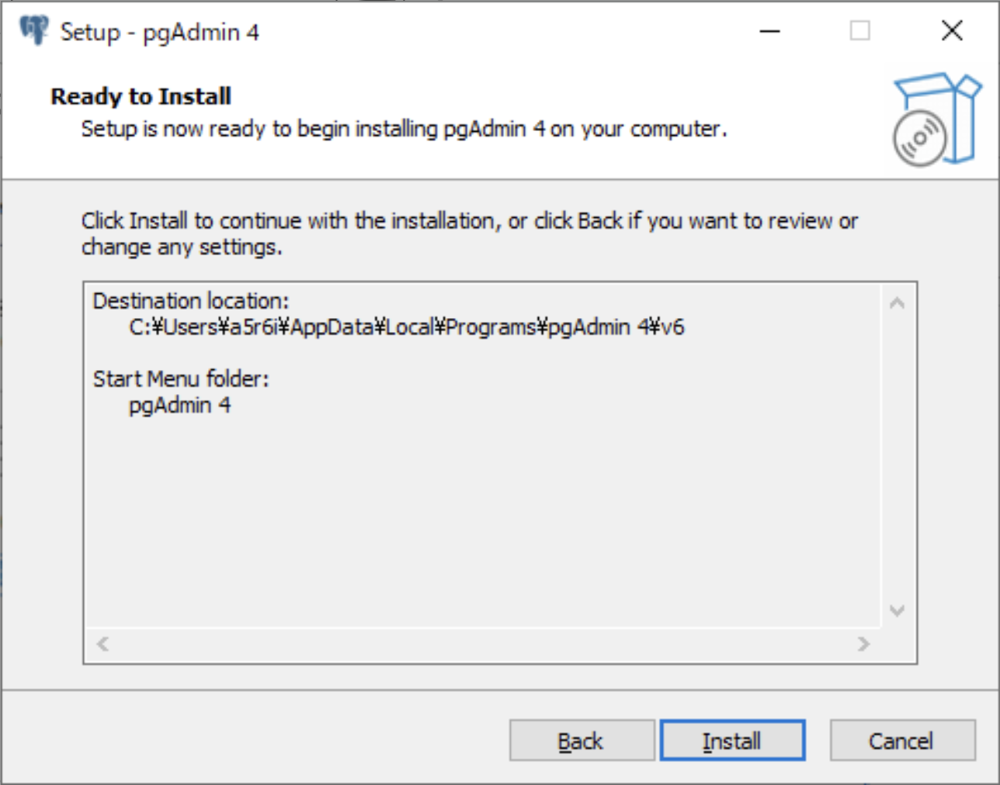

8. インストールが開始され、進捗状況が表示されます。しばらくすると、以下の完了画面が表示されるので、[Finish]をクリックしてインストーラを閉じてください。

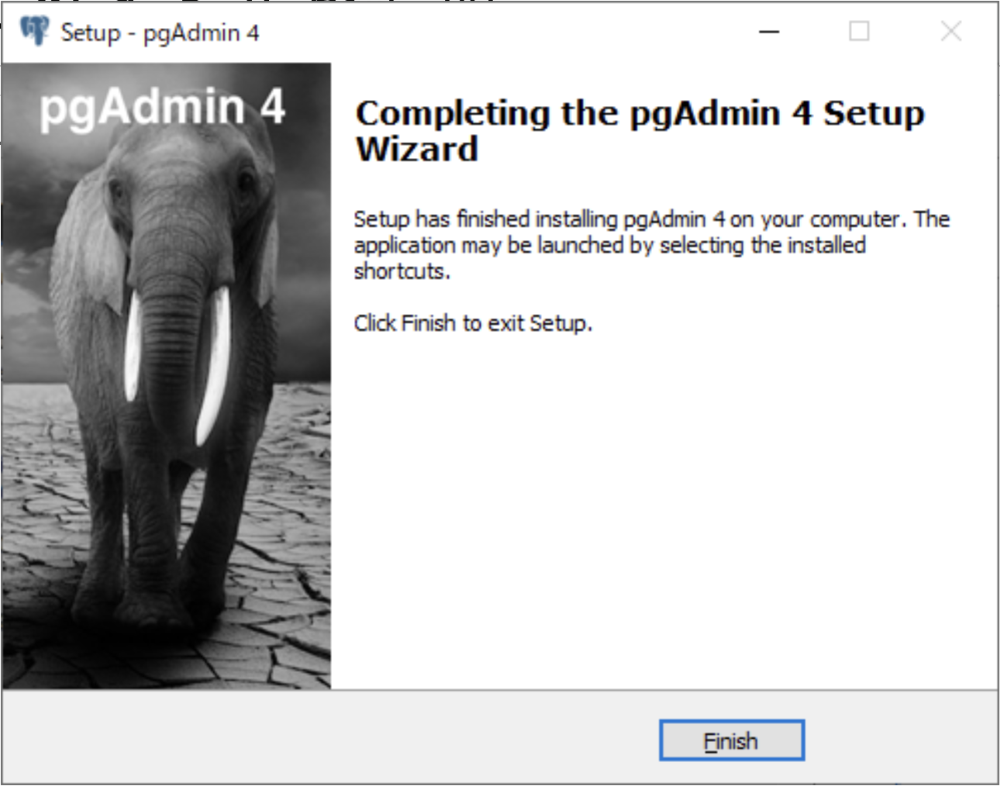

9. スタートメニューから[pgAdmin 4]を選択して起動すると、マスターパスワードの入力画面が表示されます。初回インストールの場合は、マスターパスワードを新しく設定してください。古いバージョンで設定したパスワードを忘れてしまった場合は、リセットして再設定が可能です。

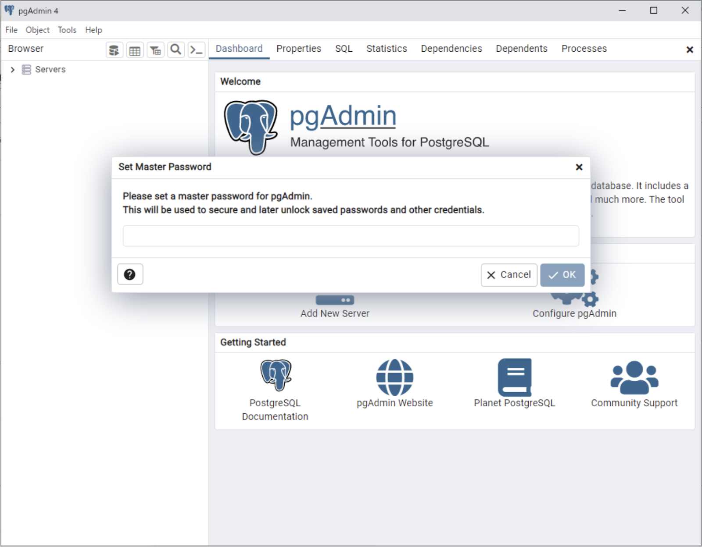

10. pgAdminの画面が開きます。必要に応じて、メニューの[Preference(設定)]から[User language(ユーザ言語)]を[Japanese]に設定し、pgAdminの画面を日本語表示にしてください。（表示言語の切り替えには、再読み込みが必要です。）

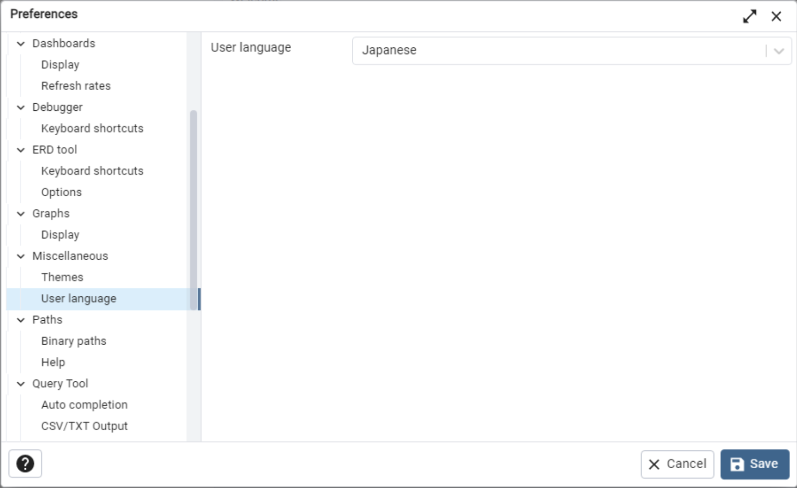

以上で、pgAdmin 4のインストールは完了です。


## YugabyteDB Managed クラスタへのアクセス
Duration: 05:00


このセクションでは、pgAdminを使用してYugabyteDB Managedのクラスタにアクセスします。YugabyteDB ManagedのSandboxクラスタを未作成または削除した場合は、 [こちら](https://yugabytedb-japan.github.io/codelabs/getting-started-ybm/index.html?index=..%2F..index#2)の手順を参照して再作成してください。

### **証明書のダウンロード**

1. アプリケーションからYugabyteDB Managedのクラスタにアクセスするには、SSL通信のための証明書が必要です。 [YugabyteDB Managedのコンソール](https://cloud.yugabyte.com/login)から、クラスターのダッシュボードを開いて、右上にある[Connect]ボタンをクリックしてください。


2. 表示されたウィンドウで、[Connect to your Application]の右にある矢印ボタンを押します。


3. [Download CA Cert]のリンクをクリックして、クラスタに接続するためのCA証明書をダウンロードしてください。


> aside negative
> 
> **Note:** この証明書はClient ShellやpgAdminのようなリモート・クライアントからクラスタにアクセスするために必要です。クラスターのダッシュボードから何度でもダウンロード可能ですが、ファイルを保存した場所を忘れないようにしてください。

4. クラスタの接続パラメータをコピーし、ホスト名 (2行目の＠マーク以下、ybdb.ioまで）をメモしておいてください。

### **pgAdminへのサーバ登録**

1. pgAdminの左上で[Servers]を右クリックし、[登録] &gt; [サーバ...]を選択します。

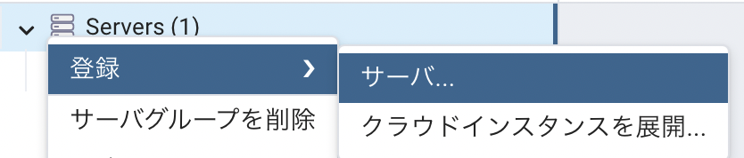

2. [General]タブで、任意の名前を入力します。(接続にはホスト名を使用するので、実際のクラスター名を入力する必要はありません。）

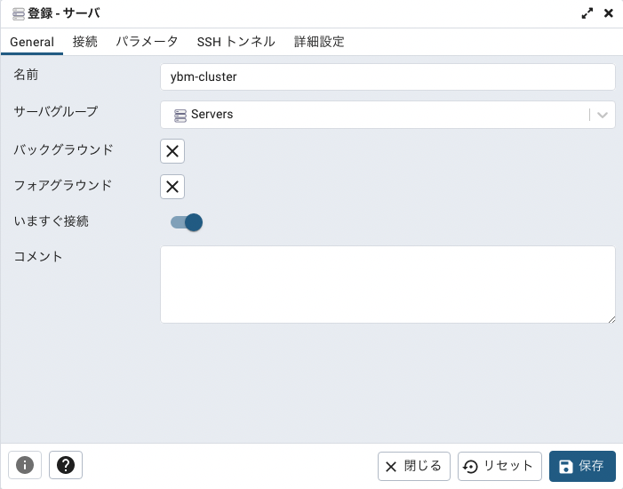

3. [接続]タブで、[ホスト名/アドレス]に先ほどコピーしたホスト名を入力します。[ポート番号]は5433、[管理用データベース]はyugabyte、[ユーザ名]と[パスワード]には、クラスターのアクセス情報 (ユーザ名とパスワードを含むテキストファイル) に設定された情報を入力します。また、[パスワードを保存]をオンにしてください。

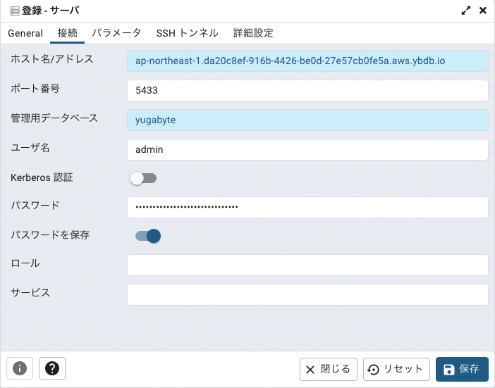

4. [SSL]タブで、[SSLモード]をVerify-Fullに設定します。また、先ほどダッシュボードからダウンロードしたCA証明書ファイルを[ロール認証]に設定してください。

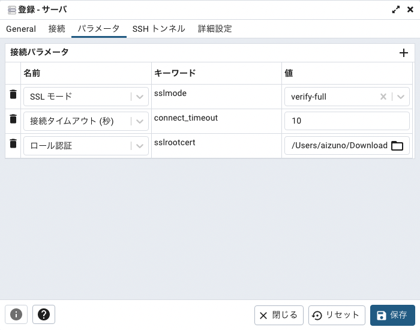

5. [保存]ボタンをクリックして、ウィンドウを閉じます。pgAdminの左側のリストに、登録したサーバが表示されていることを確認してください。

以上で、pgAdminを使用したクラスタへのアクセスは完了です。


## Northwind データベース作成
Duration: 05:00


#### **Northwindデータベースとは**

Northwind データベースは、もともと Microsoft 社が作成し、数十年にわたってさまざまなデータベース製品のチュートリアルに使用されてきたサンプルデータベースです。Northwind データベースには、世界中の特殊食品を輸出入している「Northwind Traders」という架空の会社の売上データが格納されています。Northwind データベースには、顧客、注文、在庫、購買、仕入、出荷、従業員など、以下のER図にある14のテーブルとテーブル間のリレーションシップが定義されています。


#### **Northwindデータベースの作成**

前のステップでインストールした pgAdmin 4を使用して、Northwindデータベースを作成します。

1. データベースにテーブルを作成するDDLファイル( [northwind_ddl.sql.txt](https://files.cdn.thinkific.com/file_uploads/540012/attachments/a36/29a/bd2/northwind_ddl.sql.txt))と、データを挿入するDMLファイル( [northwind_data.sql.txt](https://files.cdn.thinkific.com/file_uploads/540012/attachments/886/c8a/550/northwind_data.sql.txt))をダウンロードします。以下のリンクをクリックして新しいブラウザ・タブで開き、ブラウザの[ファイル] &gt; [別名で保管] (Chromeの場合、ブラウザによって異なります) から、テキストファイルを任意のローカルフォルダに保管してください。


2. pgAdminを開きます。左側のナビゲータで[データベース]を右クリックし、[作成] &gt; [データベース...]を選択してください。


3. [データベース]に northwind と入力し、[保存]ボタンをクリックしてください。


4. ナビゲータにnorthwindデータベースが表示されます。northwind データベースを右クリックしてPSQLツールを開いてください。

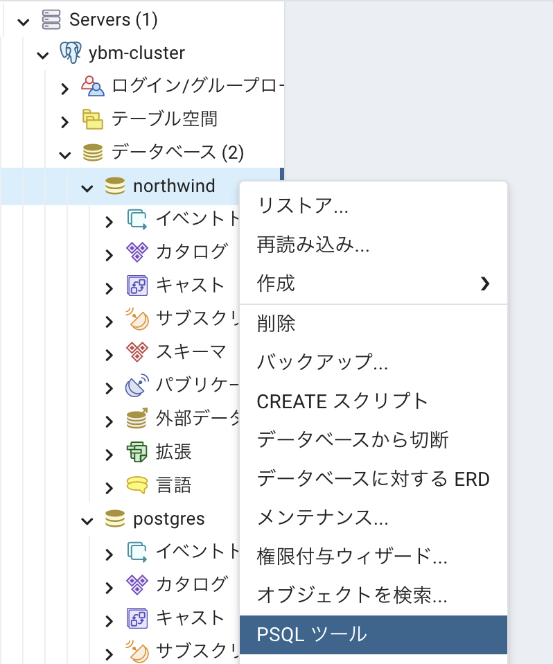

> aside negative
> 
> **Note:** WindowsにインストールしたpgAdminでは、*FATAL:  conversion between SJIS and UTF8 is not supported* というエラーが表示されnorthwindデータベースに接続できない場合があります。 [こちら](https://yugabytedb-japan.github.io/codelabs/ybm-basics/index.html?index=#5)のステップを参照して、エンコーディングを変更してください。

5. 最初のステップでダウンロードしたDDLファイルをインポートして、テーブルを一括作成します。`\i ‘&lt;ダウンロードしたDDLファイルのパス&gt;'` と入力してください。(\iの後に半角スペース、ファイルパスはシングルクオート(')で囲みます。)


6. 同様に、ダウンロードしたDMLファイルをインポートして、データを一括挿入します。`\i ‘&lt;ダウンロードしたDMLファイルのパス&gt;'` と入力してください。
7. 左側のナビゲータで、[northwind] &gt; [スキーマ] &gt; [テーブル] と展開してください。上の手順で作成された14個のテーブルが確認できます。


8. employeeテーブルを右クリックして、[データを閲覧/編集] &gt; [すべての行]を選択してください。


9. 右側に、実行されたクエリとデータ出力が表示されます。


> aside positive
> 
> **Note:** Northwindデータベースには、様々なSQLのサンプルや練習問題が提供されています。以下のような練習問題のサイトや [YSQLハンズオン](https://yugabytedb-japan.github.io/codelabs/ysql-basics/index.html)で、Northwindデータベースを使ったSQL操作を体験してみてください。
> 
> (例)  [https://www.w3resource.com/mysql-exercises/northwind/products-table-exercises/](https://www.w3resource.com/mysql-exercises/northwind/products-table-exercises/)

以上で、northwindデータベースの作成は完了です。


## (オプション) Windowsでのエンコーディング設定
Duration: 03:00


pgAdminをWindowsで使用する場合、エンコーディングのエラー (*FATAL:  conversion between SJIS and UTF8 is not supported*) によりYugabyteDB Managedのクラスタに接続できない場合があります。ここでは、上記エラーが表示された時の設定変更の方法をご紹介します。

1. PSQLツールを起動して、エンコーディングによる接続エラーが表示されることを確認します。

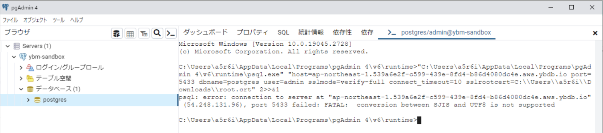

2. `SET PGCLIENTENCODING=utf-8` と入力し、pgAdminのエンコーディングをUTF-8に設定します。
3. `chcp 65001` と入力し、PSQLツールで使用する文字コードをUTF-8に設定します。
4. 以下のコマンドを入力し、YugabyteDB Managedのクラスタに接続してください。

```
psql -h <ホスト名> -p 5433 -d yugabyte -U admin
```

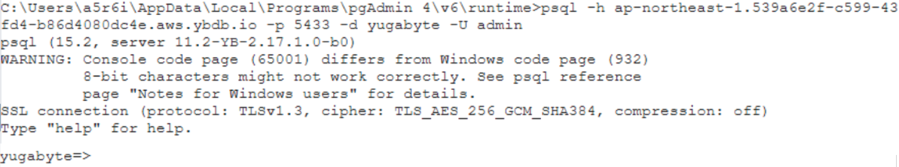

接続できると、`yugabyte=&gt;` のプロンプトが表示され、YSQLの入力ができるはずです。


## YSQLの体験
Duration: 05:00


Yugabyte SQL (YSQL)は、データ定義言語 (data definition language, DDL) およびデータ操作言語 (data manipulation language, DML) の両方で、PostgreSQL互換のAPIを提供しています。またPostgreSQLが提供している多くの機能、ストアード・プロシージャやユーザ定義関数、トリガーなどを使用することができます。

ここでは、YSQLのいくつかの機能を紹介します。

### **ユーザ定義関数の作成**

1. 前のステップで使用したPSQLツールを閉じてしまった場合は、左側のナビゲーションでnorthwindデータベースを選択した状態で、右上にあるPSQLツールのボタンをクリックしてください。

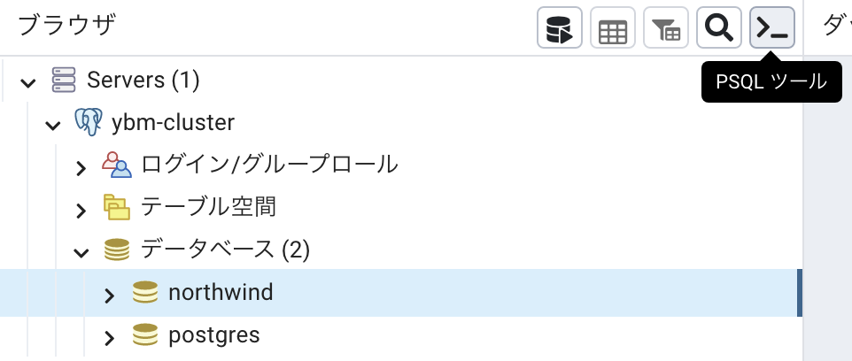

2. テーブルの行数をカウントする、ユーザ定義関数を作成します。以下のコードをコピーして、PSQLツールで実行してください。

```
CREATE FUNCTION count_rows_of_table(
  schema    text,
  tablename text
  )
  RETURNS  integer
  SECURITY  invoker
  LANGUAGE plpgsql
AS
$body$
DECLARE
  query_template constant text not null :=
    'select count(*) from "?schema"."?tablename"';

  query constant text not null :=
    replace(
      replace(
        query_template, '?schema', schema),
     '?tablename', tablename);

  result int not null := -1;
BEGIN
  EXECUTE query into result;
  RETURN result;
END;
$body$;
```

3. customersテーブルをサンプルとして使用し、ユーザ定義関数 count_rows_of_table() の動作確認をしてみましょう。`SELECT count_rows_of_table('public', 'customers');` と入力してください。 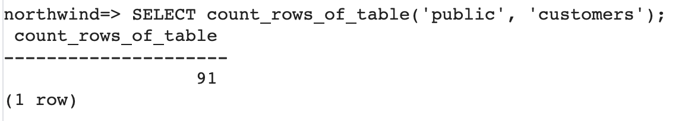

91行が結果として返るはずです。

### **トリガーの作成**

1. トリガーに使用する customers_audit テーブルを作成します。以下をコピーして、PSQLツールで実行してください。

```
CREATE TABLE customers_audit (
    id INT GENERATED ALWAYS AS IDENTITY,
    customer_id VARCHAR(40) NOT NULL,
    contact_name VARCHAR(40) NOT NULL,
    changed_on TIMESTAMP(6) NOT NULL
);
```

2. customersテーブルのコンタクト名の変更をcustomers_auditテーブルに記録する、トリガー関数を作成します。以下をコピーして、PSQLツールで実行してください。

```
CREATE OR REPLACE FUNCTION log_customers_contact_name_changes()
    RETURNS TRIGGER 
    LANGUAGE PLPGSQL
    AS
$$
BEGIN
    IF NEW.contact_name <> OLD.contact_name THEN
        INSERT INTO customers_audit(customer_id,contact_name,changed_on) VALUES(OLD.customer_id,OLD.contact_name,now());
    END IF;

    RETURN NEW;
END;
$$;
```

3. 続いて、先ほど作成したトリガー関数をcustomersテーブルにバインドします。

```
CREATE TRIGGER customers_contact_name_changes
    BEFORE UPDATE
    ON customers
    FOR EACH ROW
    EXECUTE PROCEDURE log_customers_contact_name_changes();
```

4. それでは、customersテーブルのデータを更新して、トリガーの動作確認をしてみましょう。以下をコピーして入力し、customers テーブルのコンタクト名を更新します。

```
UPDATE customers SET contact_name = 'Mark Jablonski' WHERE contact_name = 'Karl Jablonski'; 
```

5. 更新ができたかを確認してみましょう。自動的に見やすい表示になるよう `\x auto` でモードを切り替えてから、以下のコマンドを入力してください。

```
SELECT * FROM customers WHERE contact_name = 'Mark Jablonski';
```

6. コンタクト名がKarlからMarkに更新されていることを確認したら、customer_auditテーブルに変更が記録されていることを確認します。

```
SELECT * FROM customers_audit;
```

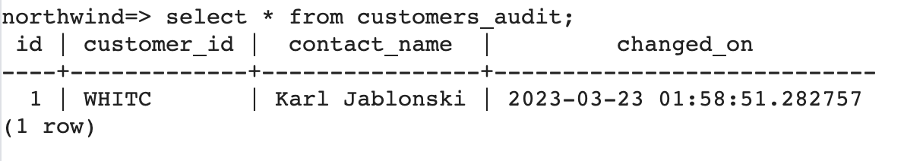

1行が結果として返るはずです。

以上で、ユーザ定義関数とトリガーを作成するYSQLの体験は完了です。


## まとめ
Duration: 01:00


お疲れ様でした。YugabyteDB Managed入門ハンズオンは、これで終了です。

YugabyteDB Managedは、データベースを導入するハードウェアやOSを準備しなくても、数ステップの操作で使い始められるマネージドのデータベース・サービスです。

YugabyteDB Managedでは、CLIやGUIのツールを使って、使い慣れたSQLで操作できることを確認できたと思います。

### 次におすすめのハンズオン

以下のハンズオンも実施してみてください。

*  [YSQLハンズオン](https://yugabytedb-japan.github.io/codelabs/ysql_basics/index.html)
*  [YugabyteDB Managedの耐障害性と拡張性](https://yugabytedb-japan.github.io/codelabs/ybm-cluster-resiliency/index.html)

### 参考資料

*  [YugabyteDB Managed 公式ドキュメント](https://docs.yugabyte.com/preview/yugabyte-cloud/)
*  [Yugabyte University: YugabyteDB Managed Basics](https://university.yugabyte.com/courses/yugabytedb-managed-basics)


