# YugabyteDB Managed の耐障害性と拡張性

[Codelab Feedback](https://yugabytedb-japan.github.io/)


## はじめに
Duration: 01:00


**Last Updated:** 2022-01-20

### **分散SQLデータベースの高可用性と耐障害性**

分散SQLデータベースであるYugabyteDBは、拡張性（水平スケール）や高可用性を前提とした設計となっており、デフォルトで高い耐障害性を備えています。スケール時にもサービス停止は発生せず、ローリング・アップグレードといったゼロダウンタイムでのオペレーションが可能です。

このハンズオンでは、YugabyteDB Managedを使用して、ノード障害やクラスタのスケール時にもダウンタイムが発生せず、クラスタが処理を継続できることを確認します。

### **ハンズオンで実施すること**

このハンズオンでは、YugabyteDB Managedでクラスタを構成し、障害発生や構成変更の際にもサービス停止が発生しないことを確認します。以下の内容を実施します:

* YugabyteDB Managedへのサインアップ
* 3ノード・クラスタの構成
* ワークロード・シミュレータを使用した、テーブルの作成、データの挿入
* ワークロード・シミュレータを使用した、ノード停止やクラスタのスケール

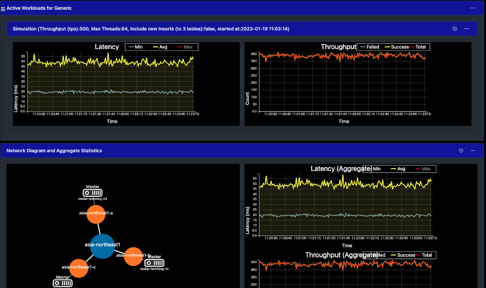

### **ハンズオンで学習すること**

* YugabyteDB Managedのコンソール操作
* YugabyteDB Managedでのクラスタ作成
* YugabyteDB ManagedのREST API
* YugabyteDB Managedクラスタの耐障害性とスケーラビリティ

### **ハンズオン実施に必要なもの**

* YugabyteDB Managedアカウント
* Java 19
ワークロードシミュレータを実行するために必要です。Homebrewを使用している場合は、ターミナルから `brew install openjdk` を入力して最新のJava環境をインストールしてください。


## YugabyteDB Managedへのサインアップ
Duration: 03:00


YugabyteDB ManagedはフルマネージドのDBaaS (データベース・アズ・サービス）です。サインアップしてアカウントを作成することで、すぐにデータベースを使い始めることができます。初めてYugabyteDB Managedを使用する方は、以下の手順に従ってアカウントを作成してください。

1. ブラウザで [こちら](https://cloud.yugabyte.com/signup)にアクセスし、アカウントを作成してください。


2. 入力したEメールアドレス宛に、確認のメールが届きます。**[Verify Email]** ボタンをクリックしてください。


3. ログイン画面にリダイレクトされます。設定したユーザーIDとパスワードでログインしてください。ログインが成功したら以下のような画面が表示されます。


以上で、YugabyteDB Managedへのサインアップは完了です。


## トポロジーの選択
Duration: 01:00


YugabyteDB Managedでは、UIの項目選択によってクラスタ構成やノード仕様を設定することができます。

以下のような項目を設定します：

* クラウド・ベンダー（AWS, GCP）
* データベースのバージョン（安定版、プレビュー版）
* シングル・リージョンかマルチリージョンか
* 耐障害性のレベル
* なし
* ノードレベル
* AZレベル
* データの分散方法（マルチリージョン・クラスタのみ）
* マルチリージョン・クラスタ
* ジオ・パーティショニング


このハンズオンでは、シングル・リージョンにAZレベルの耐障害性をもつクラスタ（上の図の真ん中）を作成します。


## 3ノードクラスタの作成
Duration: 15:00


ここではGCP東京リージョンの各アベイラビリティ・ゾーンにノードを配置して、ゾーンレベルの耐障害性をもつ3ノードクラスタを構成します。

1. YugabyteDB Managedのアカウントにログインします。
2. 左側のメニューから**[Clusters]**を選択し、**[Add Cluster]**ボタンをクリックしてください。
3. クラスタ作成のウィザードが開始します。右側のDedicatedにある **[Request a Free Trial]**ボタンをクリックしてください。

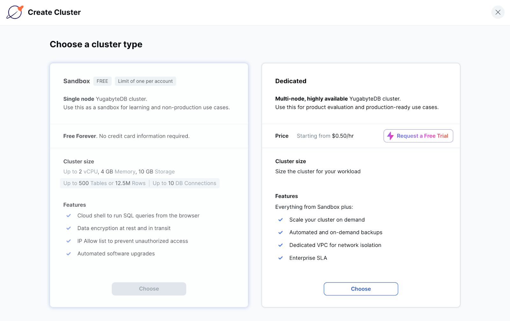

4. トライアル申し込みのウィンドウが表示されます。Eメールアドレス、電話番号、希望する連絡先を選択して、**[Send Request]** ボタンをクリックしてください。

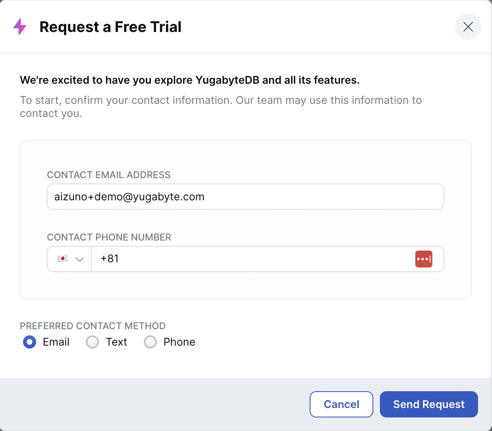

5. General settingsページが表示されます。クラスタの名前には適当な名前が自動生成されます。[GCP]を選択し、安定版 [Stable Release] が選択されていることを確認して [Next] をクリックしてください。

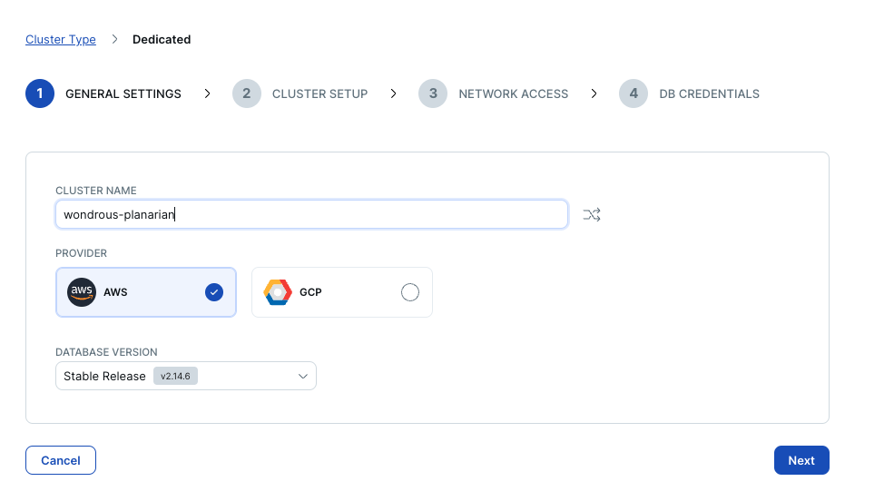

6. Cluster setupページが表示されます。ページ上部にある [Single-Region Deployment] を選択します。1の耐障害性レベルには [Availability Zone Level]、2のリージョンには [Tokyo] を選択してください。 クラスタの仕様は、vCPUを最小の [2] に設定します。vCPUのサイズを変更すると、メモリのとディスクのサイズは自動的に変更されます。

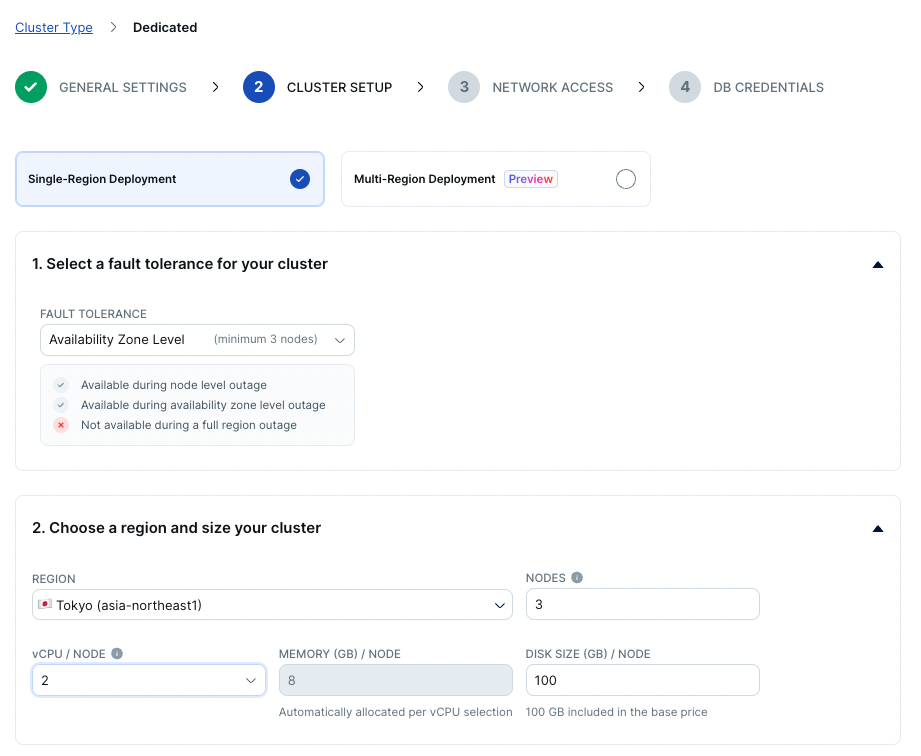

7. Cluster setupページの下部には、VPCの設定を行う箇所があります。このハンズオンでは使用しませんので、[Use VPC Peering] をオフにしたまま、[Next]をクリックしてください。

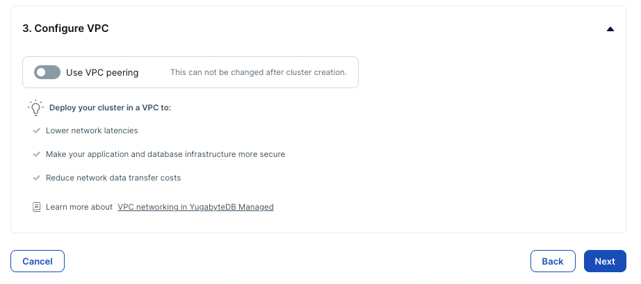

8. Network Accessの設定ページが表示されます。[Add Current IP Address]をクリックして、自分の端末のIPアドレスをアクセス許可リストに追加してください。

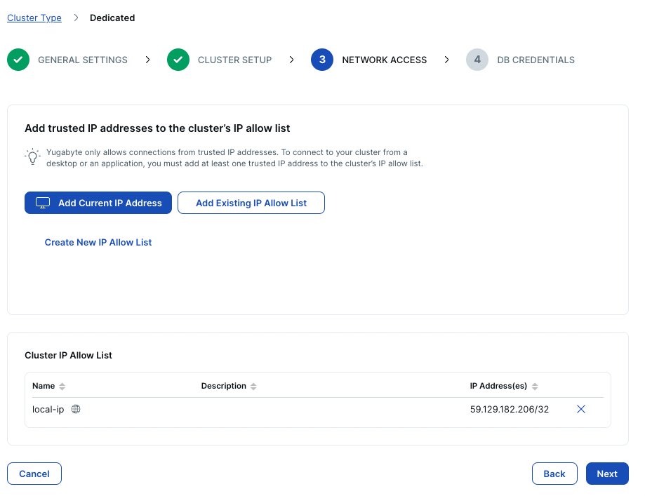

9. [Next]をクリックします。
10. DB Credentialsページが表示されます。ユーザー名とパスワードは自動設定されます。設定をカスタマイズしたい場合は、[Add your own credentials]をクリックしてユーザー名をパスワードを自分で設定します。このままで問題なければ [Download credentials]ボタンをクリックして、アクセス情報のファイルをローカルに保存してください。

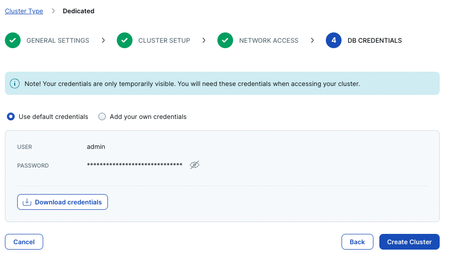

> aside negative
> 
> **Note:** このアクセス情報は、ハンズオンの後のステップで使用します。ファイルを保存した場所を忘れないようにしてください。

11. [Create Cluster]ボタンをクリックします。プロビジョニングが開始され、DBクラスタが開始するまでに数分かかります。

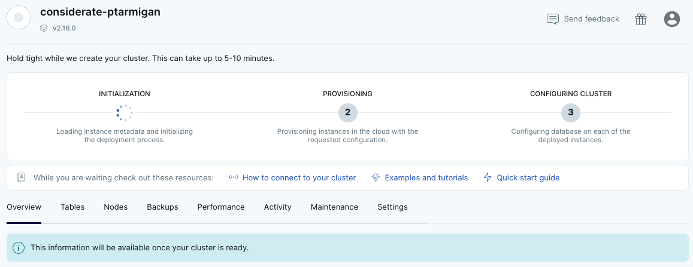

12. 起動が完了するとクラスターのダッシュボードが表示されます。


以上で、クラスタの作成は完了です。


## クラスタのアクセス情報の確認
Duration: 05:00


クラスタにアクセスするには、いくつかの情報やファイルが必要です。このセクションでは、以下の情報を確認します。

* データベースのユーザー名とパスワード（前のステップで作成したもの）
* 作成したクラスタのID
* YugabyteDB ManagedのアカウントID、プロジェクトID
* YugabyteDB Managed REST APIを使用するためのAPI Key

1. 前のステップで作成したクラスタのダッシュボードを開きます。
2. クラスタのダッシュボードの右上にある、[Coneect]ボタンをクリックしてください。
3. クラスタに接続するための方法が複数表示されます。一番下にある[Connect to your Application]の右向き矢印をクリックします。


4. SSL通信のための証明書をダウンロードします。[Download CA  Cert]のリンクをクリックして、証明書ファイル (root.crt) をダウンロードしてください。


> aside negative
> 
> **Note:** この証明書は、ハンズオンの後のステップで使用します。ファイルを保存した場所を忘れないようにしてください。

5. [2)Use the following parameters to connect to your cluster]セクションの下で、YSQLの[Parameters]タブを選択します。[Host] の横にあるコピーボタンをクリックしてメモしてください。ホスト名は、&lt;Region&gt;.&lt;ClusterID&gt;.&lt;Cloud&gt;.ybdb.io で設定されています。最初の.(ドット) の後の文字列(上の例では、4e095914-fb49-4b71-8e3a-3dee1073f221)が、クラスターIDです。


6. 右上にあるXをクリックして、[Connect to Cluster]のウィンドウを閉じます。
7. 左側のメニューから、[Admin]を選択します。[API Keys]タブを選択して、[Create API Key] ボタンをクリックしてください。

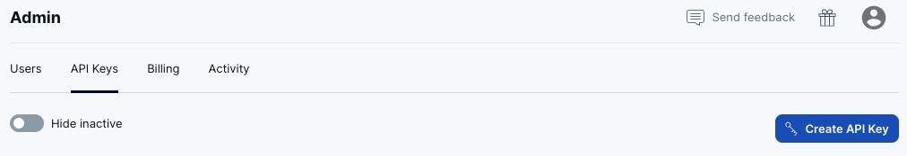

8. API Keyの名前に任意の名前を入力します。Roleは[Admin]を選択し、[Generate Key]ボタンをクリックしてください。


9. APIキーが表示されます。キーはこの画面でしか表示されないので、必ずキーをコピーしてメモしてください。
10. [View Details] セクションを開くと、アカウントIDとプロジェクトIDが表示されます。この2つもコピーして、メモしておいてください。


これで、クラスタへのアクセスに必要な情報が確認できました。


## シミュレータのセットアップ
Duration: 05:00


YB Workload Simulatorは、アプリケーションから見たレイテンシやスループットをシミュレートするJavaアプリケーションで、YugabyteDBのコードサンプルとして [GitHub](https://github.com/YugabyteDB-Samples/yb-workload-simulator)で公開されています。

シミュレータを使用することで、以下のことを実施できます。

* ワークロード実行のためのテーブルを作成/ドロップ
* ワークロード実行のためのデータをロード
* TPSやJavaのスレッド数を調整してワークロードを実行
* クラスタのトポロジーを可視化
* YugabyteDB Managedのオペレーション（ノード停止/再開、クラスタのスケール）

> aside negative
> 
> **Note:** シミュレータの実行にはJava 19が必要です。コマンドツール(Terminal等) でjava -versionと入力し、Javaのインストール・バージョンを確認してください。

1.  [リリース](https://github.com/YugabyteDB-Samples/yb-workload-simulator/releases)ページにアクセスして、最新のシミュレータのjarファイルをダウンロードしてください。
2. 前のステップでダウンロードしたクラスタのアクセス情報、証明書、アカウントIDやプロジェクトID、API Keyを確認して、以下のコマンドを入力します。

```
java -Dnode=<host name> \
     -Ddbname=<dbname> \
     -Ddbuser=<dbuser> \
     -Ddbpassword=<dbpassword> \
     -Dssl=true \
     -Dsslmode=verify-full \
     -Dsslrootcert=<path-to-cluster-certificate> \
     -Dybm-api-key=<ybm-api-key>
     -Dybm-account-id=<ybm-account-id> \
     -Dybm-project-id=<ybm-project-id> \
     -Dybm-cluster-id=<ybm-cluster-id> \
     -jar ./yb-workload-sim-0.0.2.jar
```

| &lt;host name&gt; | クラスタの接続情報で確認したホストのアドレス(例)asia-northeast1.4e095914-fb49-4b71-8e3a-3dee1073f221.gcp.ybdb.io |
| --- | --- |
| &lt;dbname&gt; | yugabyte |
| &lt;dbuser&gt; | クラスタのアクセス情報(&lt;cluster_name&gt;.txt)ファイルに記載(例) admin |
| &lt;dbpassword&gt; | クラスタのアクセス情報(&lt;cluster_name&gt;.txt)ファイルに記載 |
| &lt;path-to-cluster-certificate&gt; | クラスタの接続情報でダウンロードしたroot.crtファイルへのパス |
| &lt;ybm-api-key&gt; | Adminメニューで生成したAPI Key |
| &lt;ybm-account-id&gt; | API Key生成時に確認したアカウントID。管理コンソール右上のユーザーアイコンからも確認可能 |
| &lt;ybm_project-id&gt; | API Key生成時に確認したプロジェクトID。管理コンソール右上のユーザーアイコンからも確認可能 |
| &lt;ybm-cluster-id&gt; | ホスト名のリージョンの後にある、クラスタのUUID(例) 4e095914-fb49-4b71-8e3a-3dee1073f221 |

3. シミュレータが実行されると、以下のようなアスキーアートが表示されます。

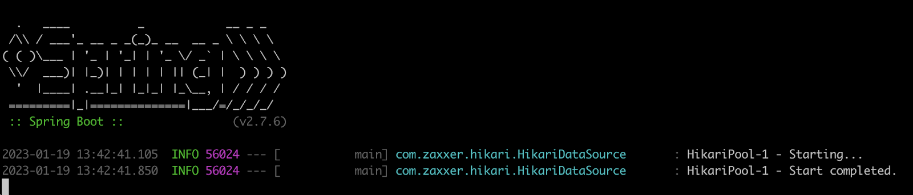

4. ブラウザを開いて、 [http://localhost:8080/](http://localhost:8080/) にアクセスしてください。シミュレータが表示されます。


5. [Network Diagram and Aggregate Statistics]ウィンドウの右上にある、歯車アイコンをクリックし、[Yugabyte Options] を選択してください。


6. パスワードの設定を要求する画面が表示されます。任意のパスワードを設定し、メモしておいてください。[OK]ボタンをクリックして、一度ウィンドウを閉じます。
7. 再度、歯車アイコンをクリックして[Yugabyte Options]を選択し、[Database in Use]に[Yugabyte Managed]を選択します。パスワードの入力を求められたら、先ほどのパスワードを入力し[Validate Password]をクリックしてください。


8. API Access KeyやアカウントIDを入力する画面が表示されます。メモしておいた内容を入力し、[OK] ボタンをクリックしてください。

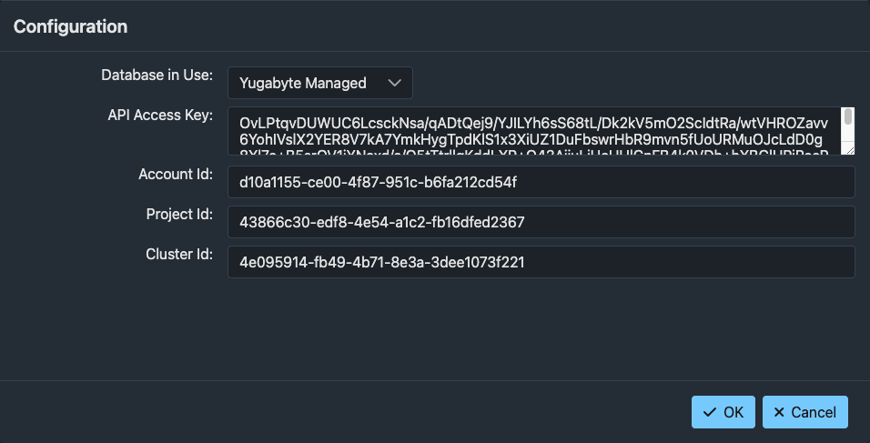

9. 設定が保存されると、ネットワーク図の下にクラスタを操作するボタンが表示されます。

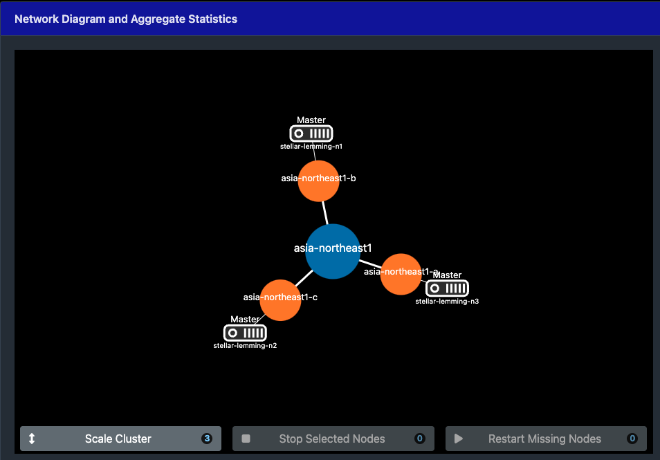


## テーブル作成とデータのロード
Duration: 05:00


ワークロード・シミュレータでは、シミュレーションを実行するためのテーブルやデータを生成する機能を提供しています。

1. シミュレータの左上にある、ハンバーガーアイコンをクリックしてください。


2. [Workload Management for Generic]ウィンドウが開きます。[Usable Operations]タブを表示してください。

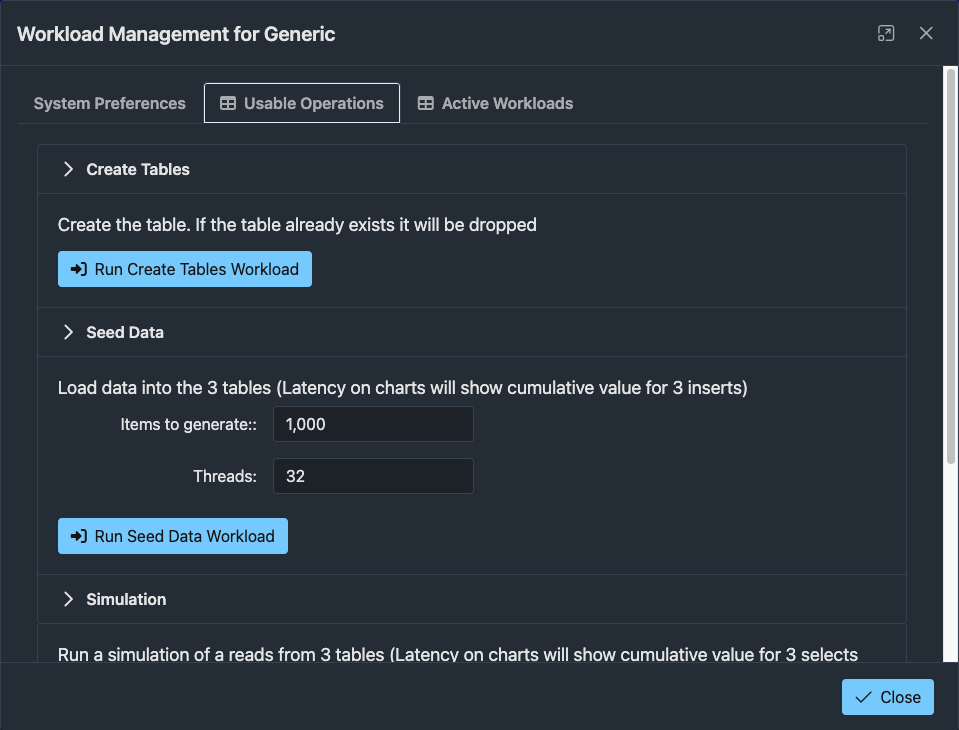

3. [Create Tables]セクションを開き、 [Run Create Tables Workload]ボタンをクリックしてください。"Workload CREATE_TABLES successfully submitted"のメッセージがウィンドウ下部に表示されます。
4. YugabyteDB Managedのコンソールで、クラスタのダッシュボードの[Tables]タブを表示すると、3つのテーブルが作成されていることがわかります。

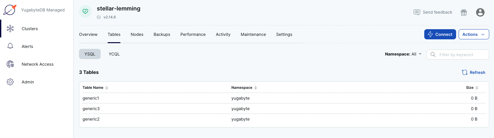

5. シミュレータ画面に戻り、[Workload Management for Generic]ウィンドウを開きます。
6. [Seed Data]セクションを開き、[Run Seed Data Workload]ボタンをクリックしてください。"Workload SEED_DATA successfully submitted."のメッセージがウィンドウ下部に表示されます。
7. YugabyteDB Managedのコンソールで、実際にデータがロードされたことを確認してみましょう。クラスタのダッシュボード右上にある[Connect]ボタンをクリックし、表示されるウィンドウで[Launch Cloud Shell]をクリックします。


8. データベース名やユーザー名を確認し、[Confirm]ボタンをクリックしてください。


9. 新しいブラウザ・タブが開き、クラスタにアクセスするためのシェルが表示されます。クラスタアクセス情報のファイルに記載された、パスワードを入力してください。


10. パスワードが認証されると、YSQLの入力モードになります。`SELECT count(*) from generic1;`と入力し、エンターキーを押してください。1000行のデータがロードされていることがわかります。

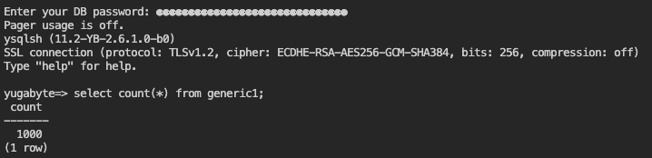

11. 続いて、データの一部を参照するため、`SELECT * from generic1 limit 10;`と入力してください。ロードされたデータの内容を確認したら、`exit;`と入力してシェルを終了し、タブを閉じます。 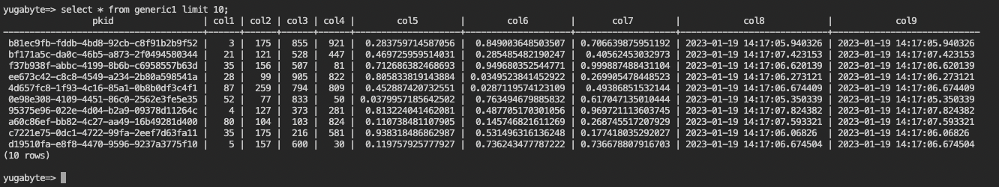


## ワークロードの実行
Duration: 05:00


シミュレータで作成したテーブルとデータを使用して、YugabyteDB Managedのクラスタに読み取り/書き込みのワークロードを実行します。

1. ワークロード・シミュレータのブラウザ・タブを開き、左上のハンバーガーアイコンから[Workload Management for Generic]ウィンドウを表示してください。
2. [Simulation]セクションで、スループットとスレッドの設定を確認します。読み取りだけでなく、書き込みのワークロードも生成するため、[Include new Inserts]のボタンをオンにして、[Run Simulation Workload]ボタンをクリックしてください。

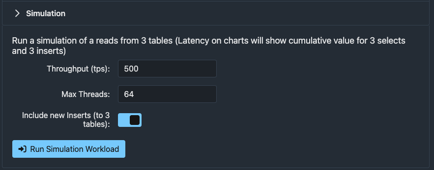

3. "Workload RUN_SIMULATION successfully submitted."のメッセージがウィンドウ下部に表示されることを確認し、[Close]ボタンをクリックしてウィンドウを閉じてください。
4. レイテンシーとスループットのグラフを確認してください。ワークロードが継続的に生成され、データベースがサービスを継続していることがわかります。

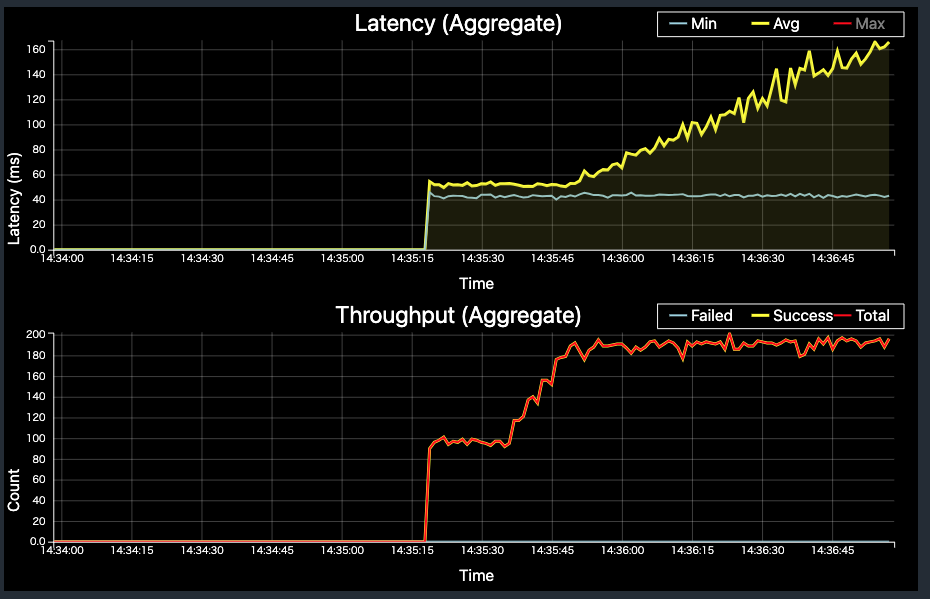


## AZ障害のシミュレート
Duration: 10:00


このハンズオンの前のステップで、複数のアベイラビリティゾーン(AZ)にノードを配置したクラスタを構成しました。そのため、AZレベルの障害であれば、クラスタは影響を受けずにサービスを継続することができる耐障害性を備えています。

このセクションでは、クラスタを構成する一つのノードを停止することでAZレベル障害を想定したシミュレーションを行います。

1. 前のステップで実行したワークロードのシミュレーションが継続していることを確認してください。
2. シミュレータのネットワーク図で、任意のノードを選択します。（選択されたノードがは青色になります。）ネットワーク図の下にある[Stop Selected Nodes]ボタンをクリックしてください。

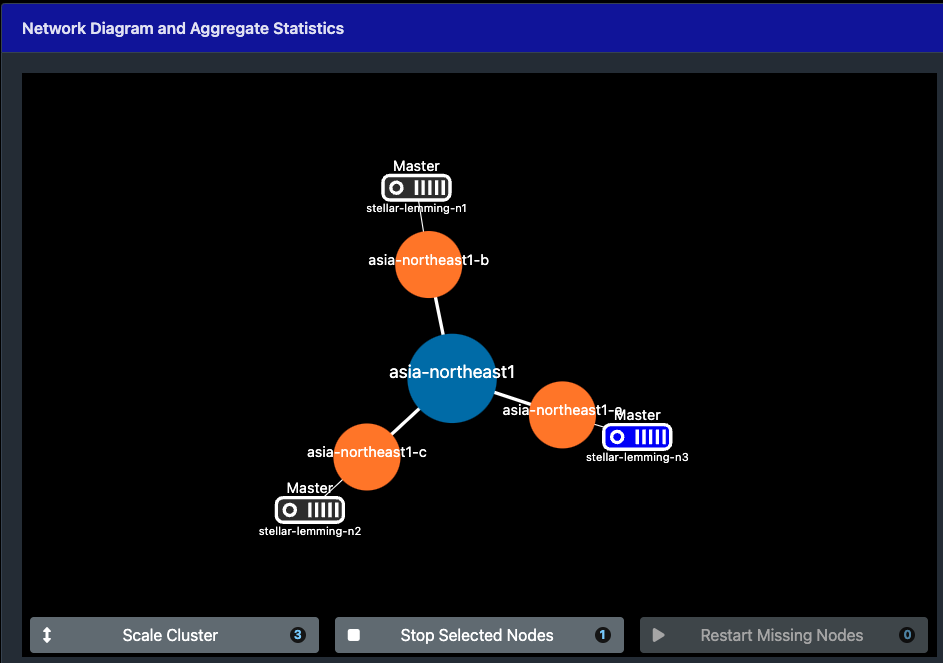

3. 確認ウィンドウが表示されたら、[Yes]をクリックしてください。

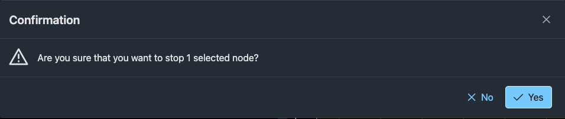

4. パフォーマンスを表示するグラフでは、数秒のレイテンシ増加とスループット停止が発生します。これはRaftコンセンサスを行うタブレット・ピアが新しいリーダーを選択し、処理を再開するまでのタイムラグです。また、ネットワーク図からは停止したノードが消えて2ノード構成になったことがわかります。

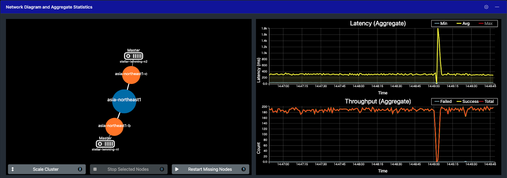

5. YugabyteDB Managedのコンソールでの表示も確認しましょう。ダッシュボードの[Node] タブを表示すると、1つのノードが停止していることを示す赤い警告アイコンが表示されています。一方で、クラスタ自体はサービスを継続しているため、緑色のハートアイコン(Cluster Healthy and Fully Operational)が表示されています。

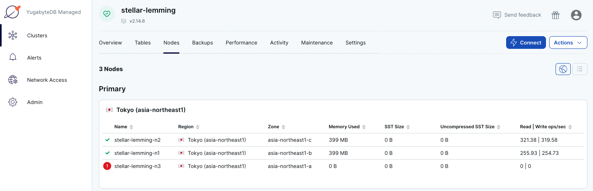

6. シミュレータに戻り、ネットワーク図の下にある[Restart Missing Nodes]ボタンをクリックしてください。確認ウィンドウが表示されたら、[Yes]をクリックします。


7. ノードの再起動とデータの同期には数分かかります。ノードの準備が整うと、タブレットの再配置とリーダー選挙が行われるため数秒のパフォーマンス低下が発生し、再起動したノードがネットワーク図に表示されます。

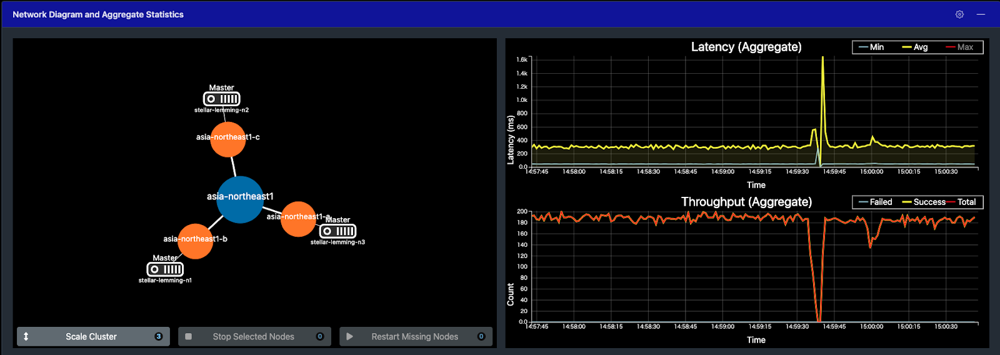

以上で、ノード停止によるAZ障害のシミュレートは完了です。クラスタ構成が変更される時に数秒のパフォーマンス低下が発生しますが、1つのノードが失われてもクラスタとしてはサービスが継続できることが確認できました。


## クラスターのスケール
Duration: 15:00


前のステップでは、ノード停止をシミュレートしました。ここでは、ワークロードが増加した時にクラスタをスケールアウトしたり、スケールインするオペレーションを行います。

1. 前のステップで実行したワークロードのシミュレーションが継続していることを確認してください。
2. クラスタへのリクエストが増加したことをシミュレートするため、追加のワークロードを実行します。左上にあるハンバーガーアイコンから、[Workload Management for Generic]ウィンドウを開き、[Include new Inserts]のオプションをオフにしてから[Run Simulation Workload]ボタンをクリックしてください。

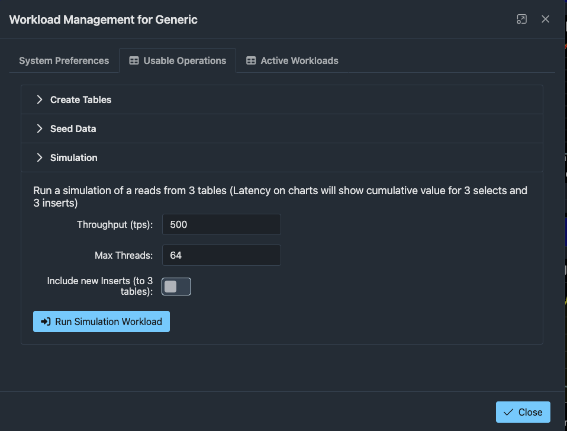

3. [Active Workloads]タブを表示すると、２種類のワークロードが実行中であることがわかります。[Close]ボタンをクリックしてウィンドウを閉じてください。

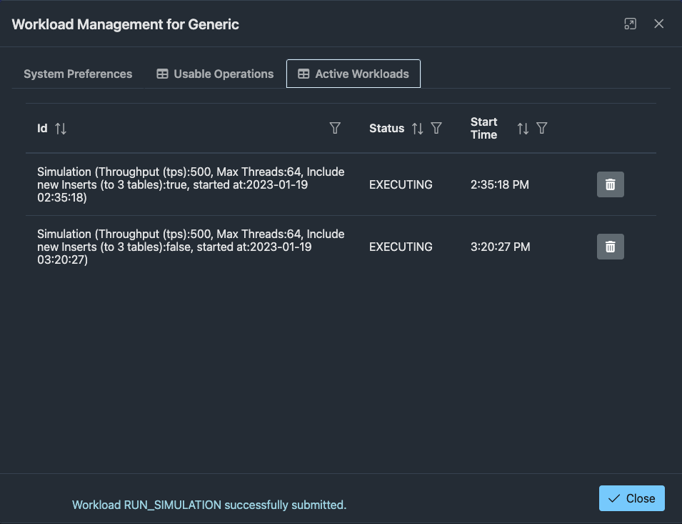

4. シミュレータのネットワーク図の下にある、[Scale Cluster]ボタンをクリックします。
5. クラスタのサイズを6に設定し、[OK]をクリックしてください。

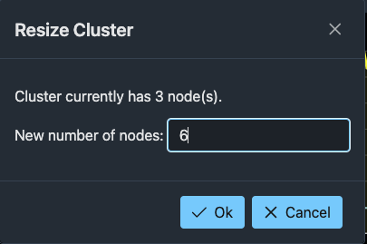

> aside negative
> 
> **Note:** YB Workload Simulatorは、YugabyteDB ManagedのREST APIを使用してクラスタの構成変更を行います。4ノードや5ノードへの拡張は、現時点ではサポートされていません。

6. "Cluster scaling initiated successfully!"のメッセージが表示されたことを確認して、[Close]ボタンでウィンドウを閉じます。
7. ノードの準備が整うと、新しく追加されたノードが、ネットワーク図に表示されます。タブレットが再配置されるタイミングでパフォーマンスの低下が発生しますが、クラスタ全体はサービスを継続していることを確認してください。

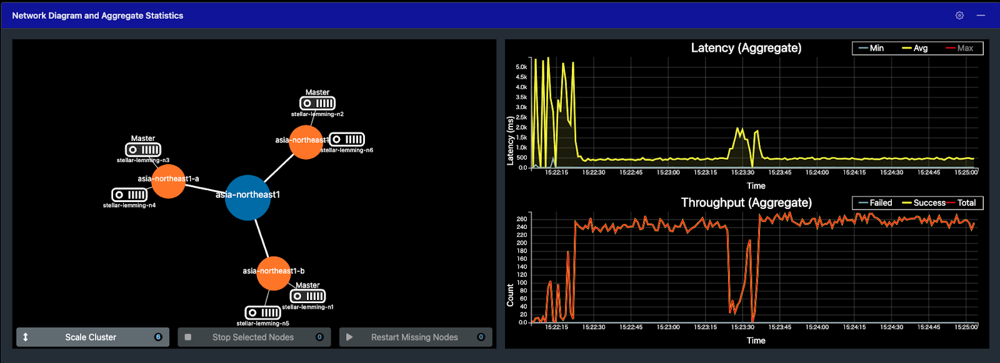

8. クラスタのノード数変更は、YugabyteDB Managedのコンソールからも可能です。クラスターのスケールインをManagedの画面から行ってみましょう。クラスタのダッシュボードを開きます。
9. 右上にある[Actions]ボタンをクリックして、[Edit Infrastructure]を選択します。(または[Settings]タブの[Regions]セクションの右にある、[Edit Infrastructure]からも可能です。)

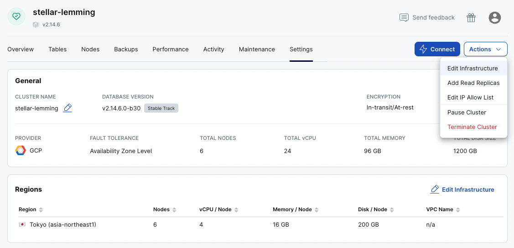

10. [Nodes]のボックスに表示される下向き矢印をクリックして、ノードの数を3に変更します。

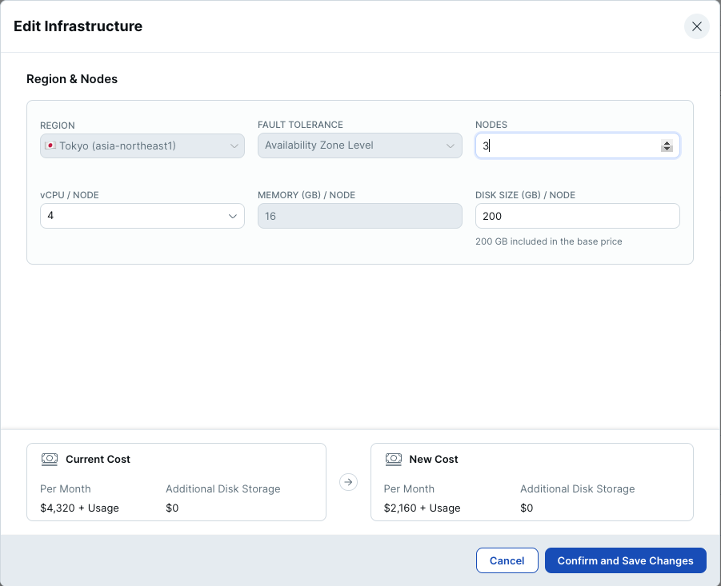

11. [Confirm and Save Changes]ボタンをクリックしてください。クラスタの構成変更中であるメッセージが画面上部に表示されます。

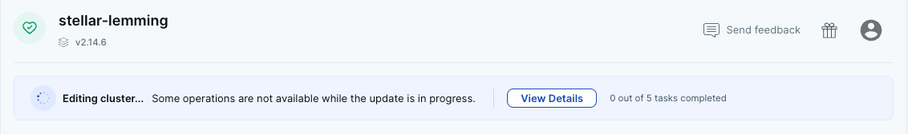

12. [View Details]ボタンをクリックして、タスクの進行状況を確認してください。

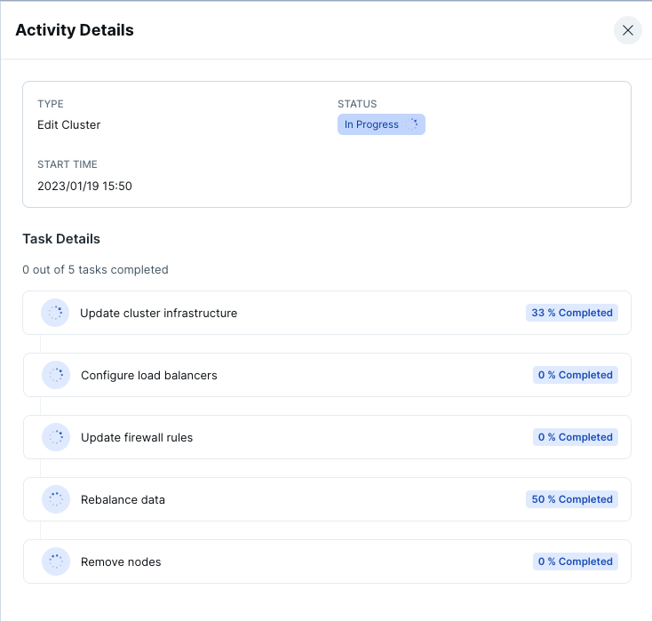

13. ワークロードシミュレータでも、ノード削除時のパフォーマンス低下やネットワーク図の変化が観察できることを確認してください。

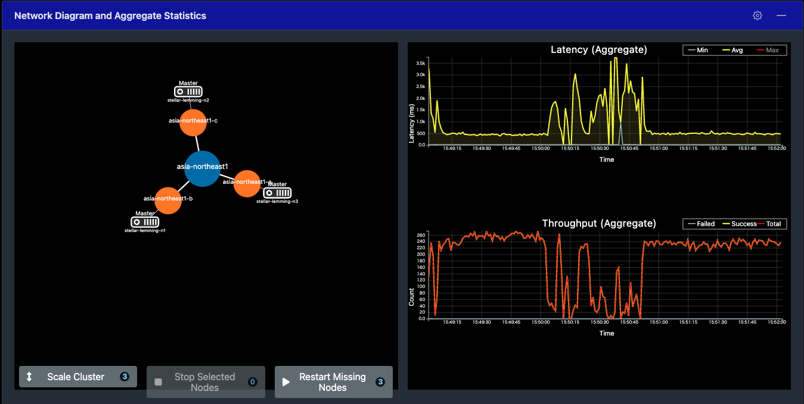

以上で、ワークロード実行中のスケールアウトおよびスケールインのテストは完了です。構成変更時に数秒のパフォーマンス低下が発生しますが、クラスタ全体としてはサービスが継続できることを確認しました。


## ワークロードの停止と環境のクリーンアップ
Duration: 05:00


ここまで実行したワークロードの停止と、クラスタの停止または削除を行います。

1. ワークロードシミュレータ画面で、左上にあるハンバーガーアイコンをクリックします。
2. [Active Workloads]タブを表示すると、実行中のワークロードのリストが表示されます。ゴミ箱アイコンをクリックして、全てのワークロードを停止してください。

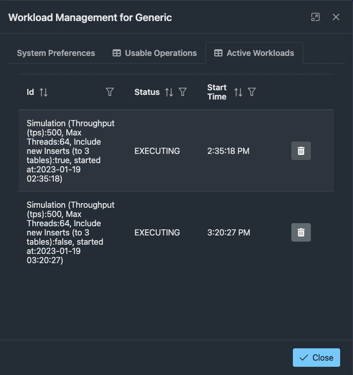

3. [Close]ボタンをクリックしてウィンドウを閉じます。
4. ワークロードが停止され、パフォーマンスのグラフが表示されなくなったことを確認してください。シミュレータを実行していたブラウザタブを閉じます。
5. シミュレータを起動したコマンドツール(Terminal等) に戻り、ctl+Cを入力して、アプリケーションの実行を停止してください。
6. YugabyteDB Managedのコンソール画面を開きます。クラスタのダッシュボードで右上にある[Action]ボタンをクリックし、 [Terminate Cluster]を選択してください。

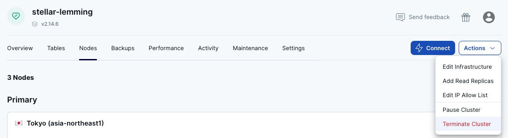

> aside negative
> 
> **Note:** [Terminate Cluster]はクラスタの全てのノードを停止し、削除します。継続してREST APIのテスト等を実施したい場合は、[Pause Cluster]でクラスタを停止し、クラスタIDやデータを維持しても構いません。

7. クラスタ削除の確認画面が表示されます。クラスタの名前を入力して、[Delete]ボタンをクリックしてください。

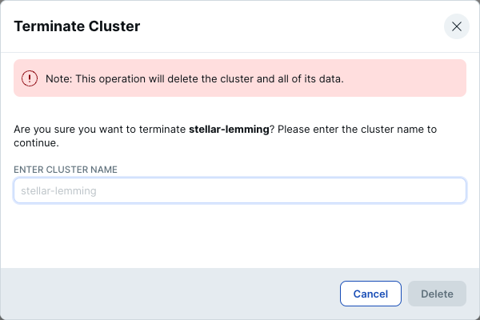

以上で、環境のクリーンアップは完了です。


## まとめ


YugabyteDB Managedの耐障害性と拡張性のハンズオンが完了しました！

YugabyteDB Managedでは、ノード障害やAZ障害に耐えるクラスタ構成が簡単にできることが確認できたと思います。このハンズオンではシミュレータを使用しましたが、カスタムのアプリケーションでも同様のスケーラビリティと耐障害性を実現することができます。

### 次におすすめのハンズオン

以下のハンズオンも実施してみてください。

* XX
* YY

### 参考資料

*  [YugabyteDB Managed 公式ドキュメント](https://docs.yugabyte.com/preview/yugabyte-cloud/)
*  [YugabyteDB API Doc](https://api-docs.yugabyte.com/)
*  [[DSS 2022] Enterprise Scale: Uncover how a Distributed Architecture Delivers Scale and Resilience](https://www.youtube.com/watch?v=HCaadv-oKG4)


