# YugabyteDB Managed の分散トポロジー

[Codelab Feedback](https://yugabytedb-japan.github.io/)


## はじめに
Duration: 01:00


**Last Updated:** 2023-10-20

### **YugabyteDBクラスターの様々なトポロジー**

分散SQLデータベースであるYugabyteDBは、従来の単一ノードのデータベースとは異なり、デフォルトで複数 (3以上) のノードでクラスタを構成します。このノードは、同じデータセンターのサーバー・ラックに配置することも、異なるデータセンターや異なるリージョンに配置することも可能です。

このハンズオンでは、YugabyteDB Managedを使用して、様々なトポロジーのクラスタを作成します。そして簡単なベンチマークやSQLを使用して、それぞれのクラスタ・トポロジーの特性を確認します。

### **ハンズオンで実施すること**

このハンズオンでは、YugabyteDB Managedで3種類のクラスタを構成します。以下の内容を実施します:

* 単一リージョンのクラスタ
* 複数リージョンのクラスタ
* ジオ・ディストリビューション (地理分散) クラスタ

### **ハンズオンで学習すること**

* YugabyteDB Managedでのクラスタ作成
* YugabyteDB Managedへのアクセス
* YugabyteDB Managedクラスタのトポロジーとそれぞれの特徴

### **ハンズオン実施に必要なもの**

* YugabyteDB Managedアカウント
* YSQL クライアント・シェル または Docker
*  [https://docs.yugabyte.com/preview/admin/ysqlsh/](https://docs.yugabyte.com/preview/admin/ysqlsh/)
* ハンズオン実施端末のグローバルIPアドレス  (クラスタへのホワイトリスト登録のため) 


## YugabyteDB Managedへのサインアップ
Duration: 03:00


YugabyteDB ManagedはフルマネージドのDBaaS (データベース・アズ・サービス）です。サインアップしてアカウントを作成することで、すぐにデータベースを使い始めることができます。初めてYugabyteDB Managedを使用する方は、以下の手順に従ってアカウントを作成してください。

1. ブラウザで [こちら](https://cloud.yugabyte.com/signup)にアクセスし、アカウントを作成してください。

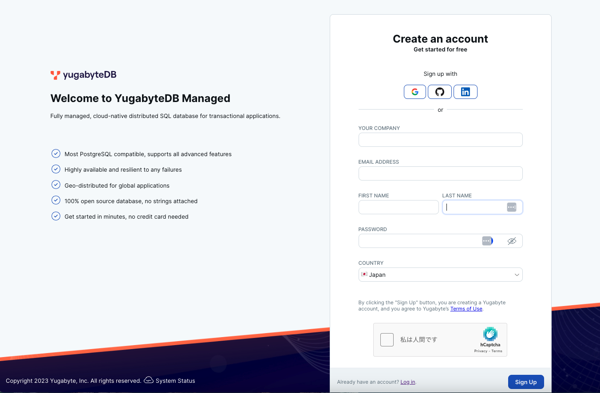

2. 入力したEメールアドレス宛に、確認のメールが届きます。**[Verify Email]** ボタンをクリックしてください。


3. ログイン画面にリダイレクトされます。設定したユーザーIDとパスワードでログインしてください。ログインが成功したら以下のような画面が表示されます。

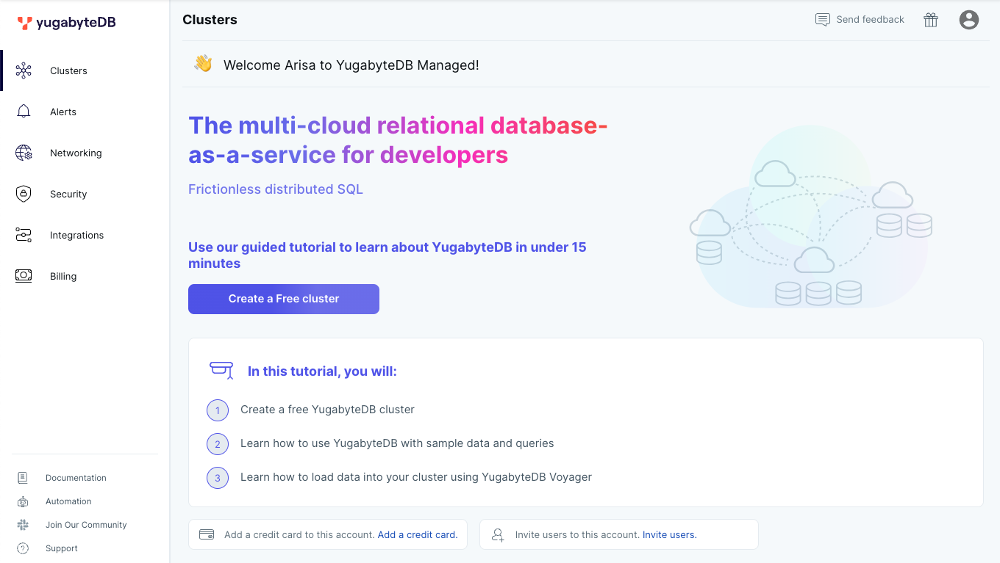

以上で、YugabyteDB Managedへのサインアップは完了です。


## トポロジーの選択
Duration: 01:00


YugabyteDB Managedでは、UIの項目選択によってクラスタ構成やノード仕様を設定することができます。

以下のような項目を設定します：

* クラウド・プロバイダー（AWS, Azure, GCP）
* データベースのバージョン（Production Track/Innovation Track）
* シングル・リージョンかマルチリージョンか
* 耐障害性のレベル
* なし
* ノードレベル
* AZレベル
* データの分散方法（マルチリージョン・クラスタのみ）
* マルチリージョン・クラスタ
* ジオ・パーティショニング

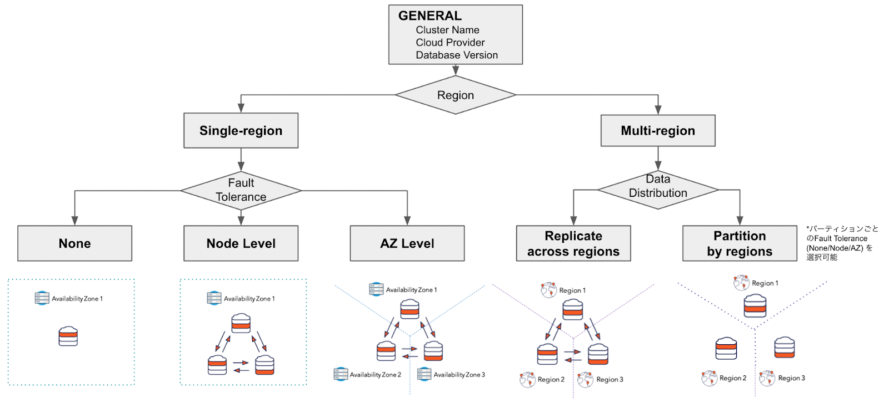

このハンズオンでは、シングル・リージョンにAZレベルの耐障害性をもつクラスタ、マルチリージョン・クラスタ、ジオ・パーティショニング（上の図の右3つ）を作成します。


## シングル・リージョン (AZレベル障害耐性) クラスタの作成
Duration: 10:00


ここではAWS東京リージョンの各アベイラビリティ・ゾーンにノードを配置して、ゾーンレベルの耐障害性をもつ3ノードクラスタを構成します。

1. YugabyteDB Managedのアカウントにログインします。
2. 左側のメニューから **[Clusters]** を選択し、 **[Create a Free cluster]**  (既にクラスタ作成済みの場合は **[Add Cluster]** ) ボタンをクリックしてください。
3. クラスタ作成のウィザードが開始します。右側のDedicatedにある **[Request a Free Trial]** ボタンをクリックしてください。


4. トライアル申し込みのウィンドウが表示されます。右側にプロモーション・コードを入力し、**[Start Free Trial]** ボタンをクリックしてください。

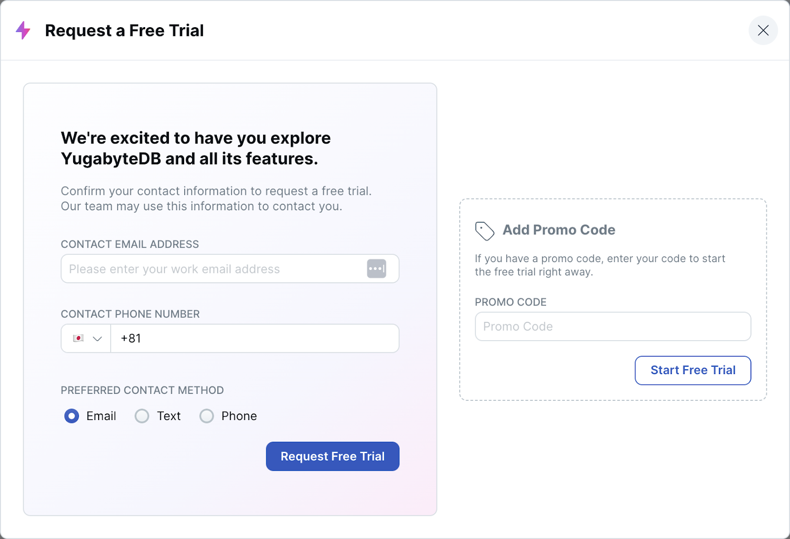

5. General settingsページが表示されます。クラスタの名前には適当な名前が自動生成されます。クラウド・プロバイダーには **[AWS]** 、データベース・バージョンはより新しいバージョンである **[Innovation Track]** を選択して、 **[Next]** をクリックしてください。

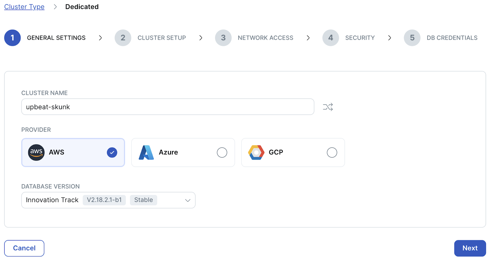

6. Cluster setupページが表示されます。ページ上部にある **[Single-Region Deployment]** を選択します。1の耐障害性レベルには **[Availability Zone Level]** 、2のリージョンには **[Tokyo]** を選択してください。 クラスタの仕様は、vCPUを最小の **[2]** に設定します。vCPUのサイズを変更すると、メモリのとディスクのサイズは自動的に変更されます。

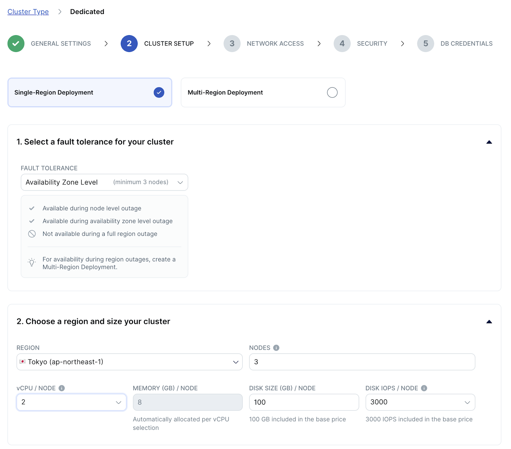

7. Cluster setupページの下部には、VPCの設定を行う箇所があります。このハンズオンでは使用しませんので、**[Select a VPC]** をオフにしたまま、**[Next]** をクリックしてください。

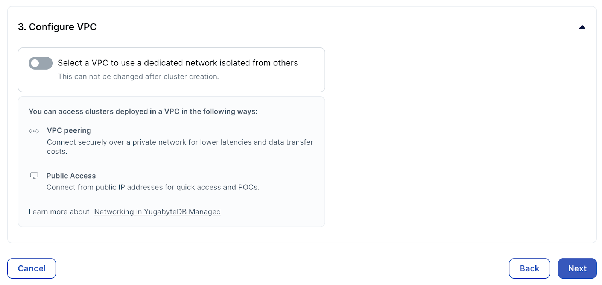

8. Network Accessの設定ページが表示されます。**[Add Current IP Address]** をクリックして、自分の端末のIPアドレスをアクセス許可リストに追加してください。


> aside negative
> 
> **Note:** [Could not detect a valid IPv4 address] というエラーメッセージが表示される場合は、コマンドラインや外部サイトを使用して、ハンズオンで使用しているマシンのグローバルIPを確認し、**[Create New IP Allow List]** からIP許可リストに追加してください。

9. **[Next]** をクリックします。保管データの暗号化の設定を行うページが表示されます。今回は使用しないため、そのままで **[Next]** をクリックしてください。

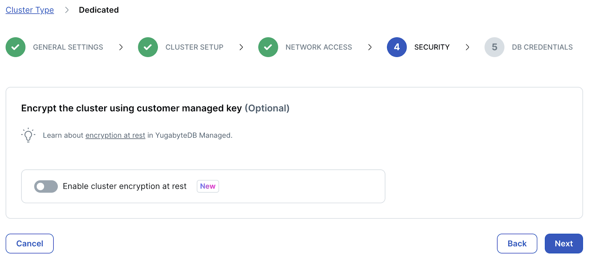

10. DB Credentialsページが表示されます。ユーザー名とパスワードは自動設定されます。設定をカスタマイズしたい場合は、 **[Add your own credentials]** をクリックしてユーザー名をパスワードを自分で設定します。このままで問題なければ **[Download credentials]** ボタンをクリックして、アクセス情報のファイルをローカルに保存してください。

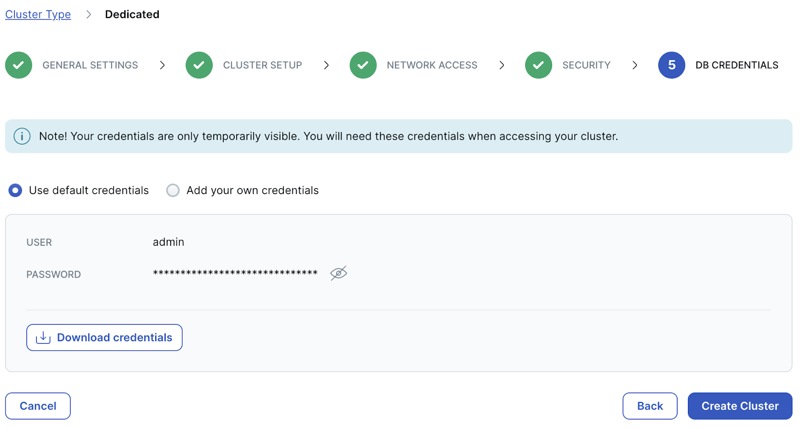

> aside negative
> 
> **Note:** このアクセス情報は、ハンズオンの後のステップで使用します。ファイルを保存した場所を忘れないようにしてください。

11. **[Create Cluster]** ボタンをクリックします。プロビジョニングが開始され、DBクラスタが開始するまでに数分かかります。


12. 起動が完了するとクラスターのダッシュボードが表示されます。

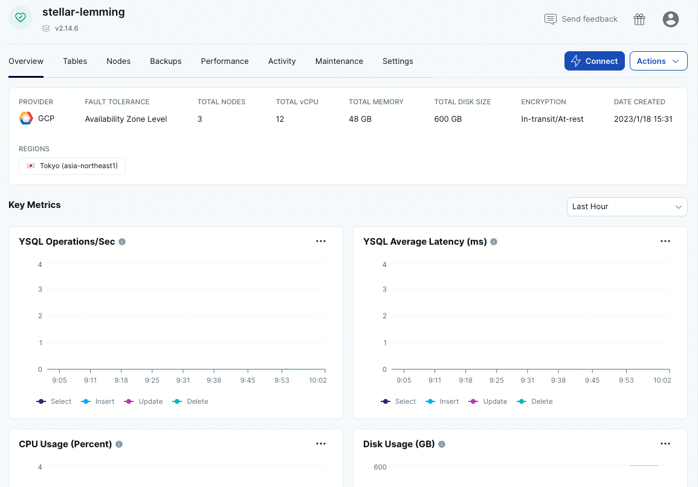

以上で、クラスタの作成は完了です。


## クライアント・シェルによるクラスタへのアクセス
Duration: 05:00


クラスタにアクセスするには、接続情報の設定とクライアントツールが必要です。このセクションでは、以下を行います。

* YugabyteDB YSQL クライアント・シェルのインストール
* SSL接続のための証明書ダウンロード
* データベースのユーザー名とパスワード（前のステップで作成したもの）の確認
* クラスタとの接続

1. 前のステップで作成したクラスタのダッシュボードを開きます。
2. クラスタのダッシュボードの右上にある、**[Coneect]** ボタンをクリックしてください。
3. クラスタに接続するための方法が複数表示されます。2番目にある[YugabyteDB Client Shell] の **[View Guide]** ボタンをクリックします。

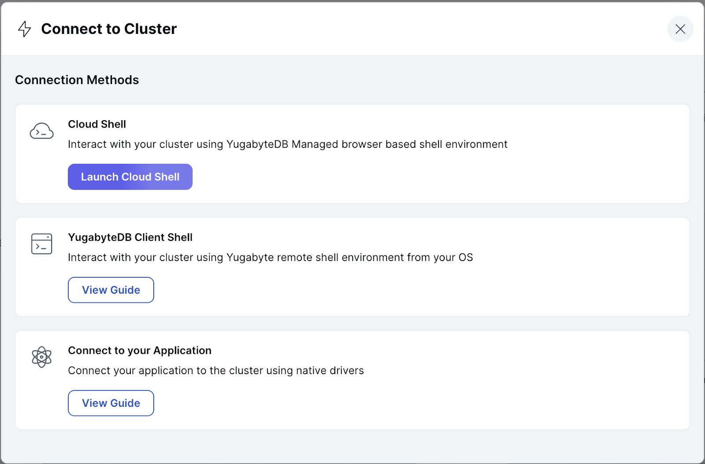

4. YSQLクライアント・シェルをダウンロードします。

* MacまたはLinuxの場合:

```
curl -sSL https://downloads.yugabyte.com/get_clients.sh | bash
```

* Windowsの場合:

```
docker pull yugabytedb/yugabyte-client:latest
docker run -d --name yugabyte-client yugabytedb/yugabyte-client
```

5. SSL通信のための証明書をダウンロードします。**[Download CA  Cert]** のリンクをクリックして、証明書ファイル (root.crt) をダウンロードしてください。

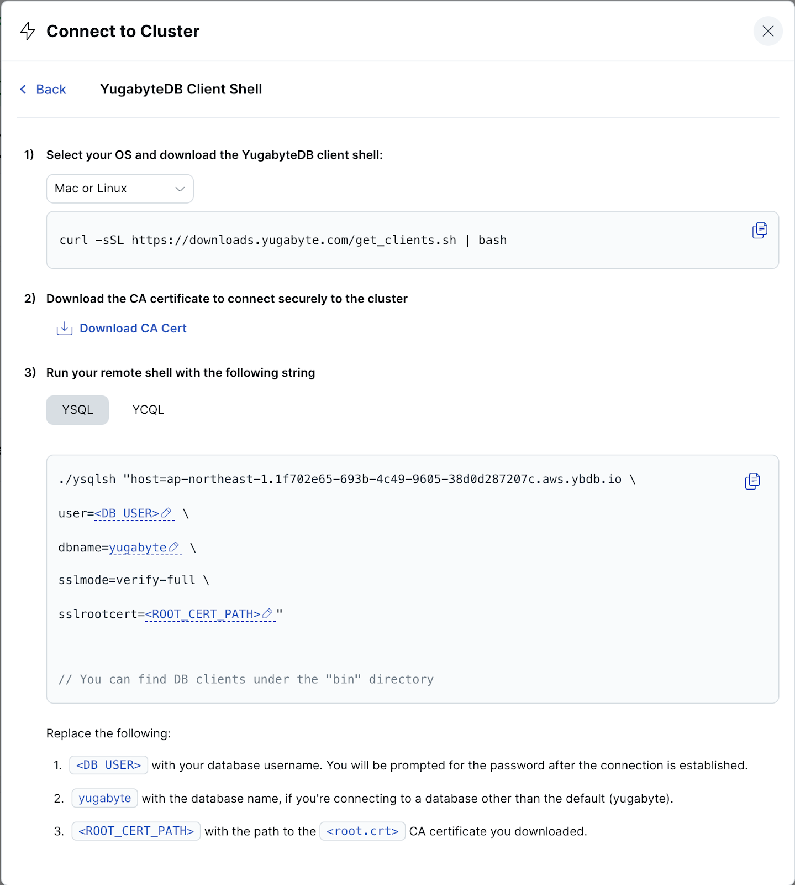

* Windowsの場合: 証明書ファイルをコンテナ内にコピーしてください。

```
docker cp <CERT_FILE> yugabyte-client:/home/yugabyte/<CERT_FILE>
```

6. [3)Use the following parameters to connect to your cluster]セクションのコマンドを参考に、クラスタへの接続を行います。

* MacまたはLinuxの場合:

```
cd yugabyte-client-2.16.0.1/bin/ysqlsh
./ysqlsh "host=<HOST ADDRESS> \
user=<DB USER> \
dbname=yugabyte \
sslmode=verify-full \
sslrootcert=<ROOT_CERT_PATH>"
```

* Windowsの場合:

```
docker exec -it yugabyte-client bash
./ysqlsh "host=<HOST ADDRESS> \
user=<DB USER> \
dbname=yugabyte \
sslmode=verify-full \
sslrootcert=<ROOT_CERT_PATH>"
```

7. クラスタに接続できると、パスワードの入力を求められます。クラスタ作成時にダウンロードした、DB Credentialsのテキストファイルからパスワードを入力してください。

YSQLコマンドの入力モードになったら、クライアント・シェルからのクラスタへのアクセスは成功です。

8. `\l` および `\dt` と入力して、既存のデータベースやテーブルを確認してください。クラスタにはデフォルトでいくつかのデータベースが作成されていますが、接続先のyugabyteデータベースでは、テーブルやインデックス等のオブジェクトは何も作成されていないはずです。
9. YSQLの入力モードを終了し、データベースとの接続を切断する場合は、`exit` または `\q`と入力してください。
10. 再度、接続する場合は、手順6. のコマンドを入力します。

以上で、このセクションは完了です。

## サンプルデータベースの作成
Duration: 10:00

さきほど作成したクラスタにデータを投入しましょう。

1. YSQLクライアント・シェルから、以下のコマンドを入力してデータベースを作成してください。

```
CREATE DATABASE yb_demo;
```

2. 作成したyb_demoに接続します。

```
\c yb_demo
```

3. 2つのテーブルを作成してください。

```
CREATE TABLE tbl1 (k int primary key, v int);
CREATE TABLE tbl2 (k int primary key, v int);
```

4. 作成したテーブルにそれぞれデータを挿入します。

```
insert into tbl1 select i, i%100 from generate_series(1,100000) as i;
insert into tbl2 select i, i%100 from generate_series(1,100000) as i;
```

5. tbl1にセカンダリ・インデックスを作成します。

```
create index on tbl1 (v);
```

6. クエリを実行する前に、YugabyteDB ManagedのダッシュボードでPerformance Advisorを確認してみましょう。**[Performance]** タブを選択して、右側のメニューから **[Performance Advisor]** を選択します。**[Scan]** ボタンをクリックすると、以下のようにパフォーマンス改善の提案が表示されるはずです。

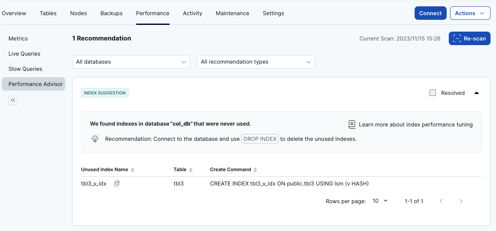

> aside positive
> 
> 今回は、インデックスを作成した直後に意図的にスキャンしたため、「使用されていないインデックスがある」というアドバイスが表示されます。
> 
> テーブルが更新されると、そのテーブルに作成されたインデックスは同期的に全て更新されます。多数のインデックスがある場合、書き込みパフォーマンスの劣化が発生するため、あまり使われていないインデックスは削除または部分インデックス等に変更することが推奨されます。

7. YSQLクライアント・シェルに戻ります。実行時間を計測するため、psqlコマンドで機能を有効化します。

```
\timing
```

8. 2つのテーブルそれぞれで、同じクエリがどのように実行されるのかを実行計画で確認します。

```
explain (analyze, costs off) select * from tbl1 where v=6;
explain (analyze, costs off) select * from tbl2 where v=6;
```

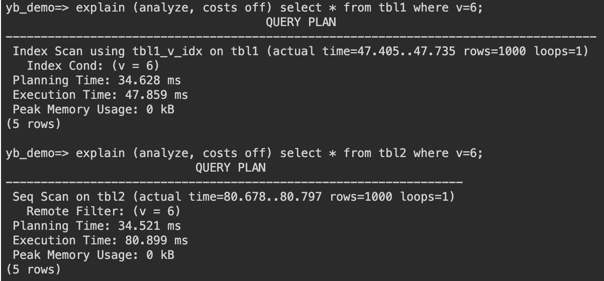

> aside positive
> 
> tbl1にはセカンダリ・インデックスを作成してあるため、Index Scanで効率的に実行されています。

1. 同様に、更新 (INSERT) の場合の実行時間を確認します。

```
explain (analyze, costs off) insert into tbl1 values(100001,77);
explain (analyze, costs off) insert into tbl2 values(100001,77);
```

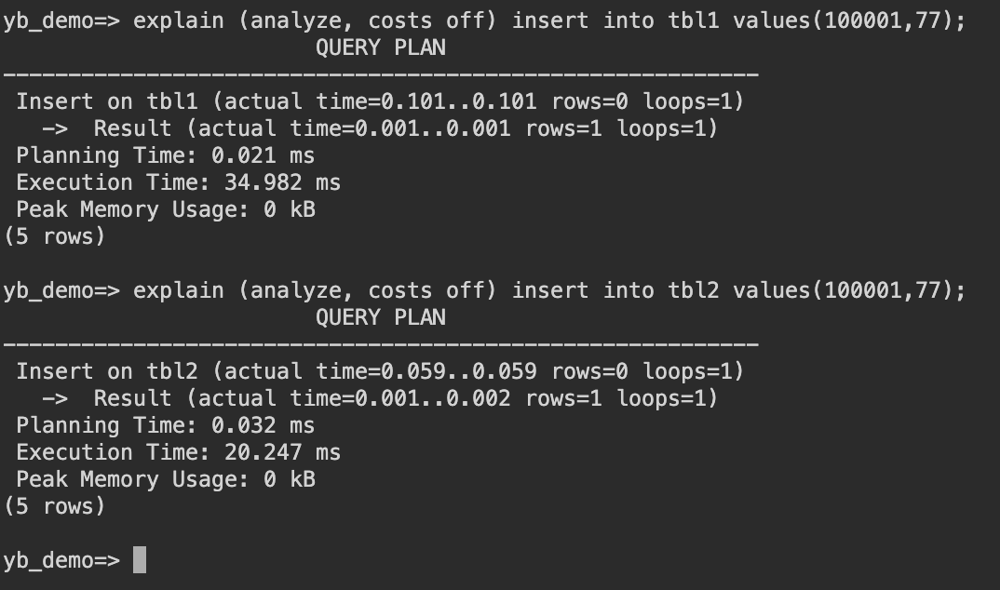


- `dist` オプションを利用して、YugabyteDBに特化した処理を確認します。
    
    ```
    explain (analyze, dist) insert into tbl1 values(100002,77);
    explain (analyze, dist) insert into tbl2 values(100002,77);
    ```

    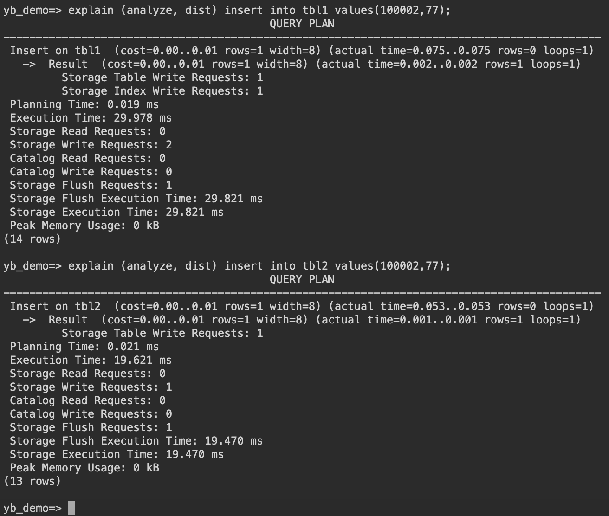
 

1.  続いて、テーブル結合(Join)した時のパフォーマンスを比較します。以下のように入力して、実行計画を確認してください。

```
explain (analyze, costs off) select * from tbl1, tbl2 where tbl1.k=tbl2.k and tbl1.v=6;
explain (analyze, costs off) select * from tbl1, tbl2 where tbl1.k=tbl2.k and tbl2.v=6;
```

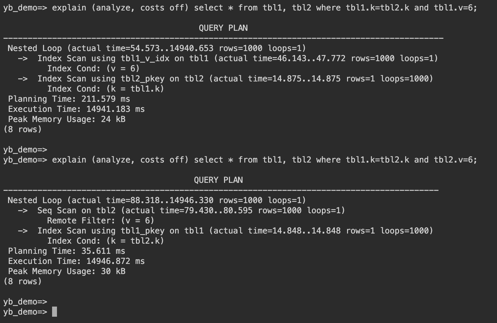


1.  YugabyteDBでは、分散ストレージへの読み取りリクエストを減らしてクエリ実行を効率化する、Batched Nested LoopというPushdown機能を提供しています。現在のバージョン (2.18) ではデフォルトで有効化されていないので、以下のように入力してBatched Nested Loopを有効化してください。

```
set yb_bnl_batch_size=1024; 
```

12. 手順 8. と同様にexplainコマンドを入力して、再度実行計画を確認してください。

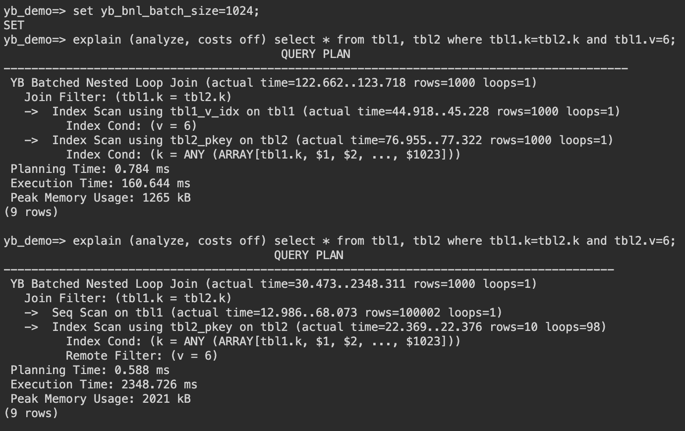

> aside positive
> 
> 結合 (Join) を使用したクエリ実行が、Nested LoopからBatched Nested Loopに変わりました。実行時間が短くなっていることを確認してください。

1.  いくつかのクエリを実行したので、再度YugabyteDB Managedのダッシュボードからパフォーマンスを確認してみましょう。**[Performance]** タブを選択して、右側のメニューから **[Slow Queries]** を選択します。クエリの履歴を検索し、実行時間の長かったクエリが表示されます。

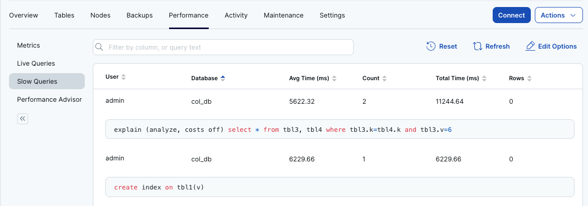

14. シングル・リージョンのクラスタを使用したハンズオンは以上です。ダッシュボードの右上にある **[Actions]** ボタンをクリックして、**[Pause Cluster]** を選択します。

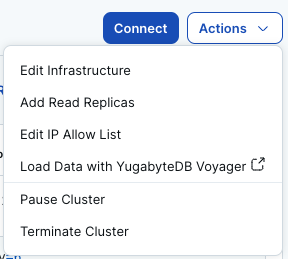 

> aside positive
> 
> このクラスタをもう使用しない場合は、[Terminate Cluster] を選択して、クラスタを削除しても構いません。

15. 確認画面で、**[Confirm & Pause]** をクリックして、クラスタを一時停止してください。

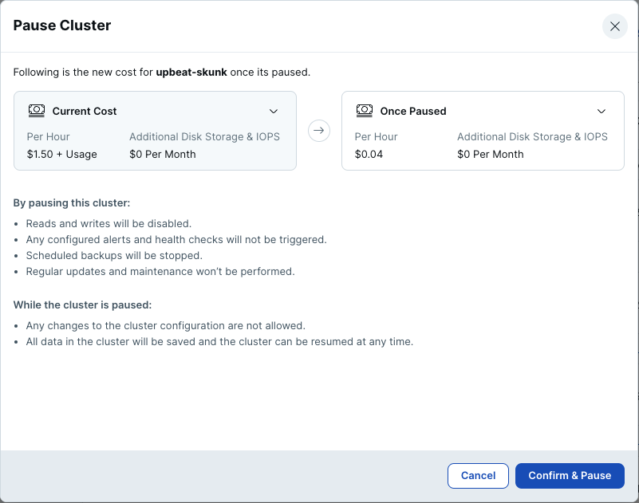

以上で、このセクションは完了です。


## コロケーション・データベースの作成
Duration: 10:00


コロケーションとは、YugabyteDBのデフォルトである自動シャーディングと分散配置を行わず、1つのタブレットにテーブル全体を配置する機能です。比較的小さくデータが増加しないテーブルが多数あるような場合、分散による同期的なコンセンサスがネットワークの負荷を大きくしたり、細分化されたタブレットがクエリ実行のパフォーマンスに影響したりすることがあります。

1. コロケーションは、データベース作成時に設定する必要があります。YSQLクライアント・シェルから、以下のコマンドを入力してコロケーション・データベースを作成してください。

```
CREATE DATABASE col_db WITH colocation = true;
```

2. 作成したcol-dbに接続します。

```
\c col_db
```

3. コロケーション・データベースでは、デフォルトでテーブルのコロケーションが有効化(colocation = true) されます。以下のように入力して、2つのコロケーション・テーブルと2つの非コロケーション・テーブルを作成してください。

```
CREATE TABLE tbl1 (k int primary key, v int);
CREATE TABLE tbl2 (k int primary key, v int);
CREATE TABLE tbl3 (k int primary key, v int) with (colocation=false);
CREATE TABLE tbl4 (k int primary key, v int) with (colocation=false);
```

4. 作成したテーブルに適当なデータを挿入するため、各テーブルにgenerate_series()を使用した値を挿入します。

```
insert into tbl1 select i, i%10 from generate_series(1,100000) as i;
insert into tbl2 select i, i%10 from generate_series(1,100000) as i;
insert into tbl3 select i, i%10 from generate_series(1,100000) as i;
insert into tbl4 select i, i%10 from generate_series(1,100000) as i;
```

5. Tbl1とtbl3にセカンダリ・インデックスを作成します。以下のように入力してください。

```
create index on tbl1 (v);
create index on tbl3 (v);
```

これで、コロケーション有無とセカンダリ・インデックス有無が異なる4つのテーブルが作成されました。

6. クエリを実行する前に、YugabyteDB ManagedのダッシュボードでPerformance Advisorを確認してみましょう。**[Performance]** タブを選択して、右側のメニューから **[Performance Advisor]** を選択します。**[Scan]** ボタンをクリックすると、以下のようにパフォーマンス改善の提案が表示されるはずです。


> aside positive
> 
> 今回は、インデックスを作成した直後に意図的にスキャンしたため、「使用されていないインデックスがある」というアドバイスが表示されます。
> 
> テーブルが更新されると、そのテーブルに作成されたインデックスは同期的に全て更新されます。多数のインデックスがある場合、書き込みパフォーマンスの劣化が発生するため、あまり使われていないインデックスは削除または部分インデックス等に変更することが推奨されます。

7. YSQLクライアント・シェルに戻ります。実行時間を計測するため、psqlコマンドで機能を有効化します。

```
\timing
```

8. 4つのテーブルそれぞれで、同じクエリがどのように実行されるのかを実行計画で確認します。まずは、インデックス有りのtbl1とtbl3について、以下のように入力して実行計画を確認してください。

```
explain (analyze, costs off) select * from tbl1 where v=6;
explain (analyze, costs off) select * from tbl3 where v=6;
```

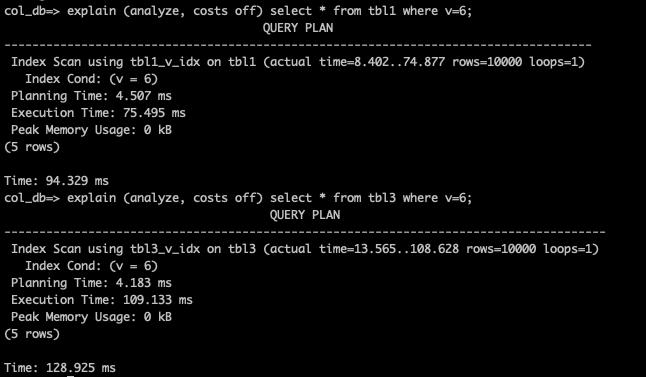

> aside positive
> 
> インデックスを作成してあるため、どちらもIndex Scanで効率的に実行されていますが、実行時間がコロケーション・テーブル(tbl1)の方が早いことがわかります。コロケーション・テーブルに作成されたインデックスは、デフォルトでコロケーションされます。一方、非コロケーション・テーブルでは、インデックスが複数タブレットに分散しているため、インデックス・スキャンにもより多い実行時間がかかります。

9. 同様に、更新 (INSERT) の場合の実行時間を確認します。

```
explain (analyze, costs off) insert into tbl1 values(100001,77);
explain (analyze, costs off) insert into tbl3 values(100001,77);
```

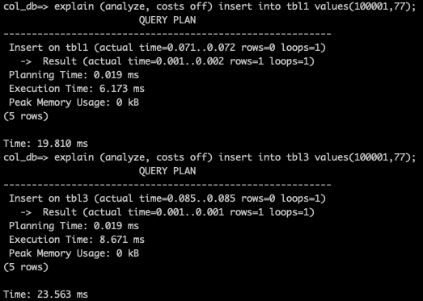

10. 続いて、テーブル結合(Join)した時のパフォーマンスを比較します。以下のように入力して、実行計画を確認してください。

```
explain (analyze, costs off) select * from tbl1, tbl2 where tbl1.k=tbl2.k and tbl1.v=6;
explain (analyze, costs off) select * from tbl3, tbl4 where tbl3.k=tbl4.k and tbl3.v=6;
```

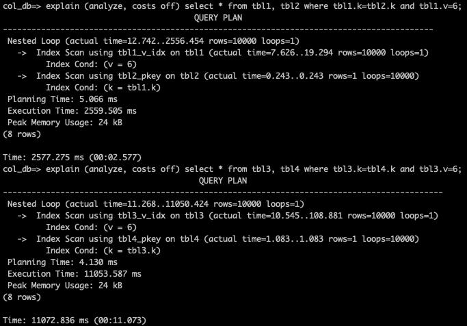

11. YugabyteDBでは、分散ストレージへの読み取りリクエストを減らしてクエリ実行を効率化する、Batched Nested LoopというPushdown機能を提供しています。現在のバージョン (2.18) ではデフォルトで有効化されていないので、以下のように入力してBatched Nested Loopを有効化してください。

```
set yb_bnl_batch_size=1024; 
```

12. 手順 8. と同様にexplainコマンドを入力して、再度実行計画を確認してください。

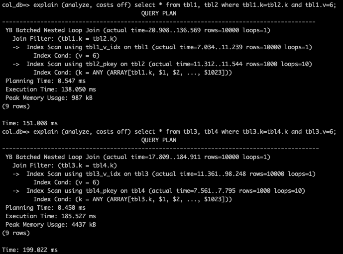

> aside positive
> 
> 結合 (Join) を使用したクエリ実行が、Nested LoopからBatched Nested Loopに変わりました。コロケーション・テーブル、非コロケーション・テーブル共に、実行時間が短くなっていることを確認してください。

13. いくつかのクエリを実行したので、再度YugabyteDB Managedのダッシュボードからパフォーマンスを確認してみましょう。**[Performance]** タブを選択して、右側のメニューから **[Slow Queries]** を選択します。クエリの履歴を検索し、実行時間の長かったクエリが表示されます。


14. シングル・リージョンのクラスタを使用したハンズオンは以上です。ダッシュボードの右上にある **[Actions]** ボタンをクリックして、**[Pause Cluster]** を選択します。

 

> aside positive
> 
> このクラスタをもう使用しない場合は、[Terminate Cluster] を選択して、クラスタを削除しても構いません。

15. 確認画面で、**[Confirm & Pause]** をクリックして、クラスタを一時停止してください。


以上で、このセクションは完了です。


## マルチ・リージョンのストレッチ・クラスタ作成
Duration: 20:00

ここではAWS東京リージョン、大阪リージョン、シンガポールリージョンにノードを配置して、リージョン・レベルの耐障害性をもつ3ノードクラスタを構成します。

1. YugabyteDB Managedのアカウントにログインします。
2. マルチ・リージョンのクラスタを作成する場合、VPCの作成が必要です。左側にある **[Networking]** のメニューを選択し、 **[Create VPC]** ボタンをクリックしてください。

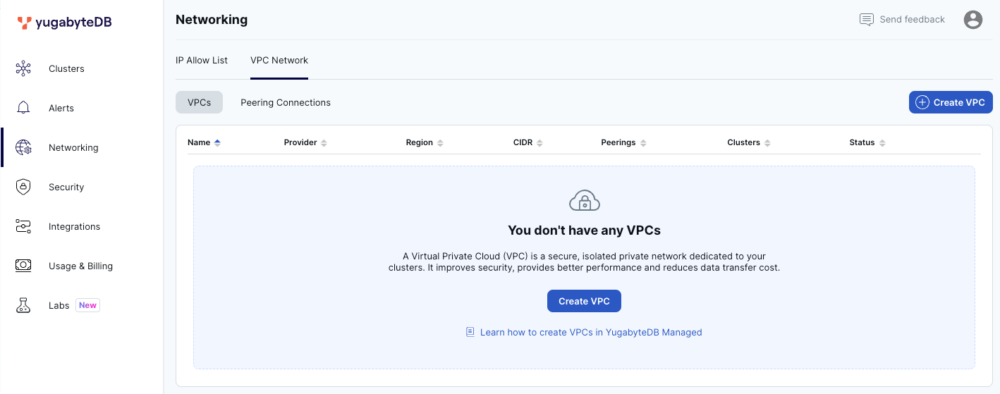

3. VPC作成のウィンドウで、任意の名前、Providerに **[AWS]**、REGIONに **[Tokyo (ap-northeast-1)]** を選択します。CIDRには、他のVPCと重複しない範囲を指定して **[Save]** をクリックしてください。

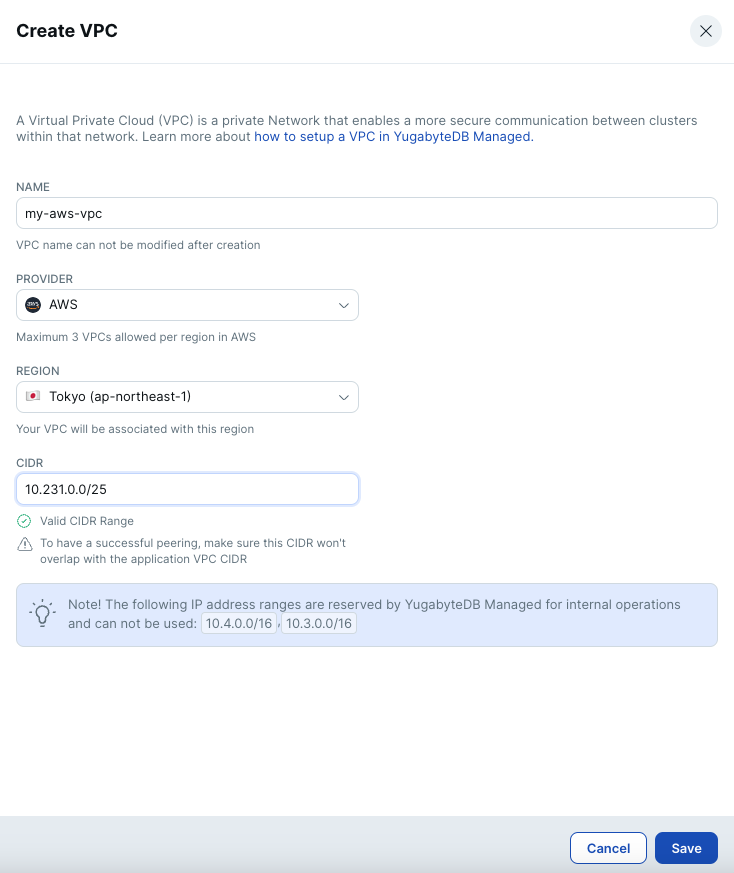

4. 同様の手順で、大阪リージョン (ap-northeast-3)、シンガポール・リージョン (ap-southeast-1) にもVPCを作成してください。
5. 左側のメニューから **[Clusters]** を選択し、 **[Create a Free cluster]** (既にクラスタ作成済みの場合は **[Add Cluster]** ) ボタンをクリックしてください。
6. クラスタ作成のウィザードが開始します。右側のDedicatedにある **[Choose]** ボタンをクリックしてください。


7. General settingsページが表示されます。クラスタの名前には適当な名前が自動生成されます。クラウド・プロバイダーには **[AWS]** 、データベース・バージョンはより新しいバージョンである **[Innovation Track]** を選択して、 **[Next]** をクリックしてください。


8. Cluster setupページが表示されます。ページ上部にある **[Multi-Region Deployment]** を選択し、1の分散モードには **[Replicated across regions]** を設定します。

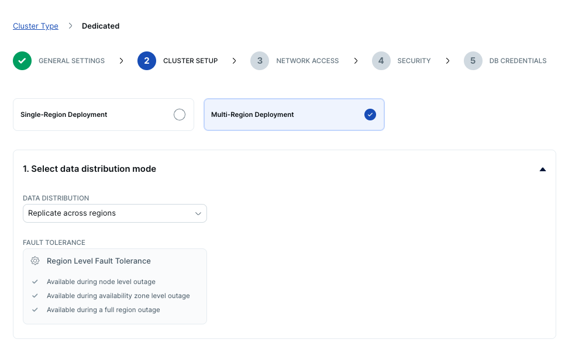

9. 2のリージョンには **[Tokyo], [Osaka], [Singapore]** を選択してください。リージョンを指定すると、事前に作成したVPCが自動的に選択されるはずです。
10. **[Tokyo]** を優先リージョン (リーダー・タブレットを優先的に配置するリージョン) に指定します。**[Set as pregerred region for reads and writes]** のラジオボタンをONにしてください。
11.  ノードの仕様は、vCPUを最小の **[2]** に設定します。vCPUのサイズを変更すると、メモリのとディスクのサイズは自動的に変更されます。**[Next]** をクリックしてください。

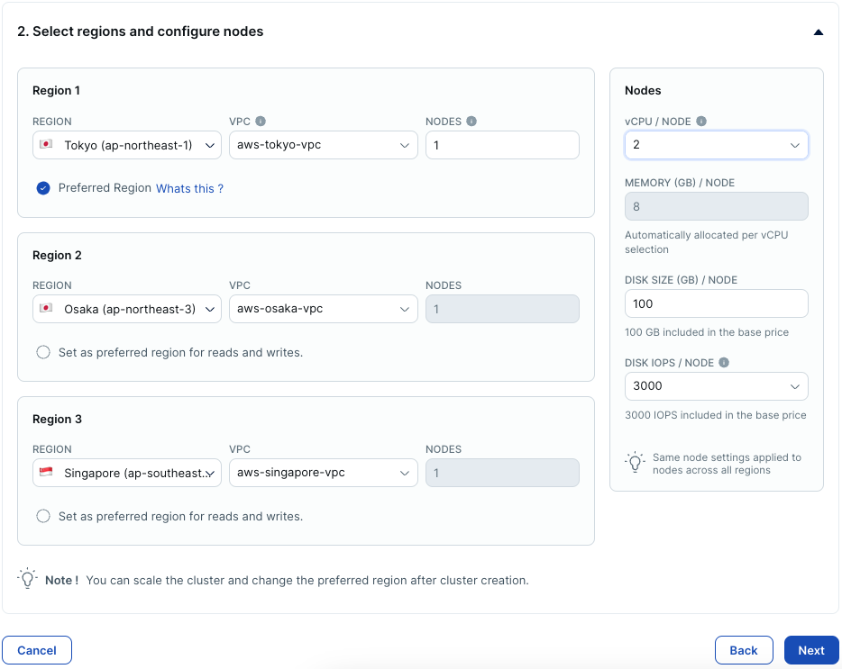

12. Network Accessの設定ページが表示されます。**[Add Current IP Address]** をクリックして、自分の端末のIPアドレスをアクセス許可リストに追加してください。


> aside positive
> 
> **Note:** 前のステップで自分のIPアドレスを登録済みの場合は、**[Add Existing IP allow list]** から登録済みのIPを選択して追加することもできます。

13. パブリックなIPアドレスを許可リストに追加しているという警告ウィンドウが表示されます。実環境ではアプリケーションのVPCとのみ接続して、プライベートなネットワークに閉じて使用することが推奨されますが、このハンズオンではアプリケーションVPCを別途用意しないため、そのまま **[Enable Public Access and Add IP Allow List]** をクリックしてください。

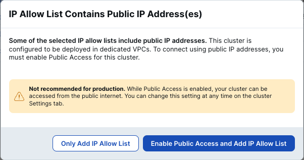

14. **[Next]** をクリックします。保管データの暗号化の設定を行うページが表示されます。今回は使用しないため、そのままで **[Next]** をクリックしてください。


15. DB Credentialsページが表示されます。ユーザー名とパスワードは自動設定されます。設定をカスタマイズしたい場合は、**[Add your own credentials]** をクリックしてユーザー名をパスワードを自分で設定します。このままで問題なければ **[Download credentials]** ボタンをクリックして、アクセス情報のファイルをローカルに保存してください。


> aside negative
> 
> **Note:** このアクセス情報は、ハンズオンの後のステップで使用します。ファイルを保存した場所を忘れないようにしてください。

16. **[Create Cluster]** ボタンをクリックします。プロビジョニングが開始され、DBクラスタが開始するまでに数分かかります。


17. 起動が完了するとクラスターのダッシュボードが表示されます。**[Settings]** タブを表示してください。**[Connection Parameters]** のセクションには、各リージョンごとに接続アドレスが表示されます。(＋アイコンをクリックすると確認できます。)東京リージョンが、優先リージョン (PREFERRED) に設定されていることを確認してください。

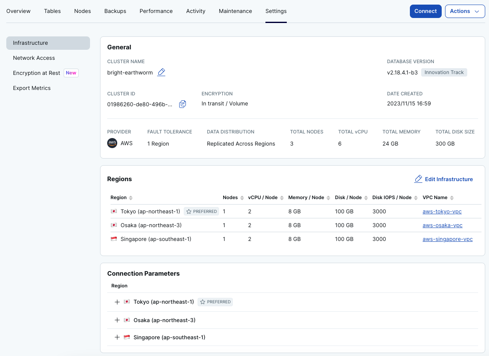

> aside positive
> 
> シングル・リージョンのクラスタでは、ロードバランサが作成されて単一のアドレスを提供し、各ノードにリクエストをルーティングしていました。
> 
> マルチ・リージョンのクラスタでは、複数リージョン間でロードバランシングするグローバル・ロードバランサは含まれていません。

18. このクラスターに対して、「サンプルデータベースの作成」あるいは「コロケーション・データベースの作成」セクションと同様の手順を実施し、パフォーマンスの違いを確認してください。接続先のアドレスは、東京リージョンのPublicのHostアドレスを使用します。

以上で、このセクションは完了です。


## 地理分散クラスタの作成
Duration: 10:00


ここでは、グローバルに分散したジオ・パーティション・クラスタを作成します。

1. YugabyteDB Managedのダッシュボードから、**[Networking]** &gt; **[VPC Network]** を選択して、**[Create VPC]** ボタンをクリックします。前の手順と同様に、**Frankfurt (eu-central-1)**と**California (us-west-1)** のリージョンにVPCを作成してください。

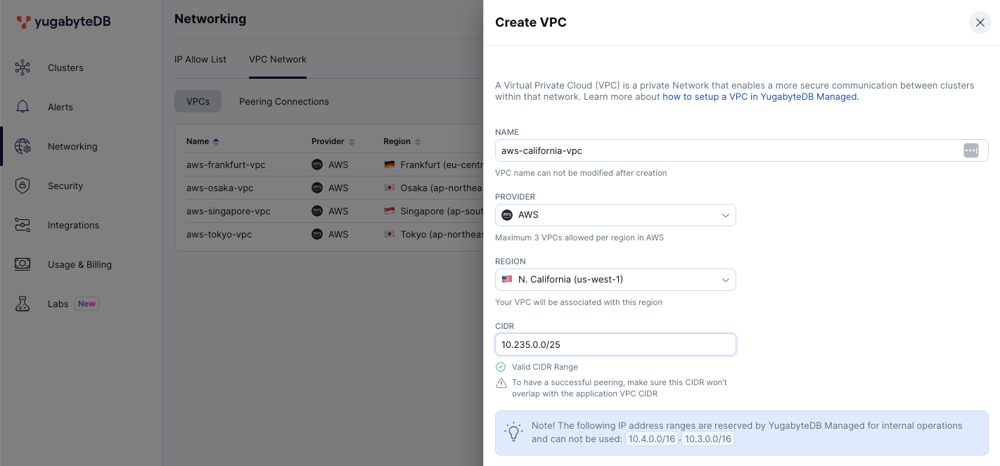

2. **[Clusters]** メニューに移動し、**[Add Cluster]** ボタンをクリックします。
3. クラスタ作成のウィザードが開始します。右側のDedicatedにある **[Choose]** ボタンをクリックしてください。


4. General settingsページが表示されます。クラスタの名前には適当な名前が自動生成されます。クラウド・プロバイダーには **[AWS]** 、データベース・バージョンはより新しいバージョンである **[Innovation Track]** を選択して、 **[Next]** をクリックしてください。


5. Cluster setupページが表示されます。ページ上部にある **[Multi-Region Deployment]** を選択し、1の分散モードには **[Partition by region]**、耐障害性レベルには **[None]** を設定します。

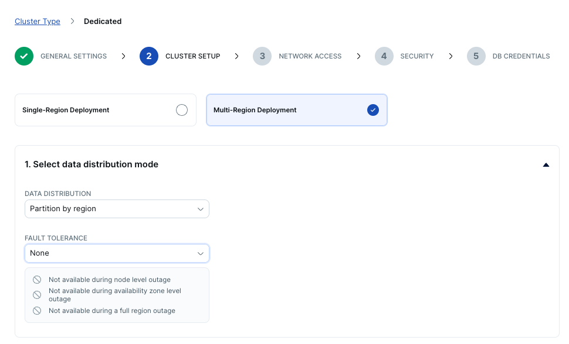

> aside positive
> 
> **Note:** 耐障害性モードをアベイラビリティ・ゾーンレベル、あるいはノードレベルと設定した場合は、各リージョンに最低 3ノード (クラスタ全体で 9ノード) がプロビジョンされることになります。このハンズオンは、ジオ・パーティションの仕組みや設定を確認することが目的なので、最小限の構成で実施します。

6. 2のリージョンには **[Tokyo], [Frankfurt], [N.California]** を選択してください。リージョンを指定すると、事前に作成したVPCが自動的に選択されるはずです。
7. ノードの仕様は、vCPUを最小の **[2]** に設定します。vCPUのサイズを変更すると、メモリのとディスクのサイズは自動的に変更されます。**[Next]** をクリックしてください。
8. Network Accessの設定ページが表示されます。**[Add Current IP Address]** をクリックして、自分の端末のIPアドレスをアクセス許可リストに追加してください。


> aside positive
> 
> **Note:** 前のステップで自分のIPアドレスを登録済みの場合は、**[Add Existing IP allow list]** から登録済みのIPを選択して追加することもできます。

9. パブリックなIPアドレスを許可リストに追加しているという警告ウィンドウが表示されます。実環境ではアプリケーションのVPCとのみ接続して、プライベートなネットワークに閉じて使用することが推奨されますが、このハンズオンではアプリケーションVPCを別途用意しないため、そのまま **[Enable Public Access and Add IP Allow List]** をクリックしてください。


10. **[Next]** をクリックします。保管データの暗号化の設定を行うページが表示されます。今回は使用しないため、そのままで **[Next]** をクリックしてください。


11. DB Credentialsページが表示されます。ユーザー名とパスワードは自動設定されます。設定をカスタマイズしたい場合は、**[Add your own credentials]** をクリックしてユーザー名をパスワードを自分で設定します。このままで問題なければ **[Download credentials]** ボタンをクリックして、アクセス情報のファイルをローカルに保存してください。


> aside negative
> 
> **Note:** このアクセス情報は、ハンズオンの後のステップで使用します。ファイルを保存した場所を忘れないようにしてください。

12. **[Create Cluster]** ボタンをクリックします。プロビジョニングが開始され、DBクラスタが開始するまでに数分かかります。

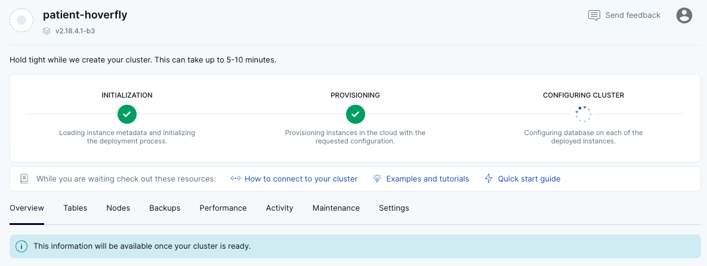

13. クラスタの起動が完了すると、ダッシュボードが表示されます。

以上で、このセクションは完了です。


## パーティション・テーブルの作成
Duration: 10:00


ジオ・パーティションのクラスタでは、行レベルでデータの配置場所を指定することが可能です。場所の指定に使用されるのがテーブル・スペースです。YugabyteDB Managedのジオ・パーティションのクラスタでは、クラスタの作成時に自動的に各リージョンのテーブルスペースが作成されます。

1. クラスタのダッシュボードから、**[Tables]** タブを選択してください。 3つのテーブルスペースが作成されていることが確認できます。

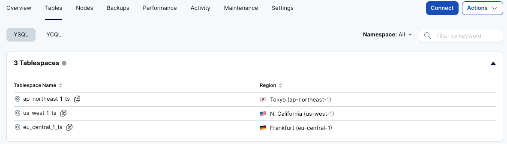

2. 右上にある **[Connect]** ボタンをクリックします。YugabyteDB Client Sellで接続するためのガイドを **[View Guide]** ボタンをクリックして表示します。

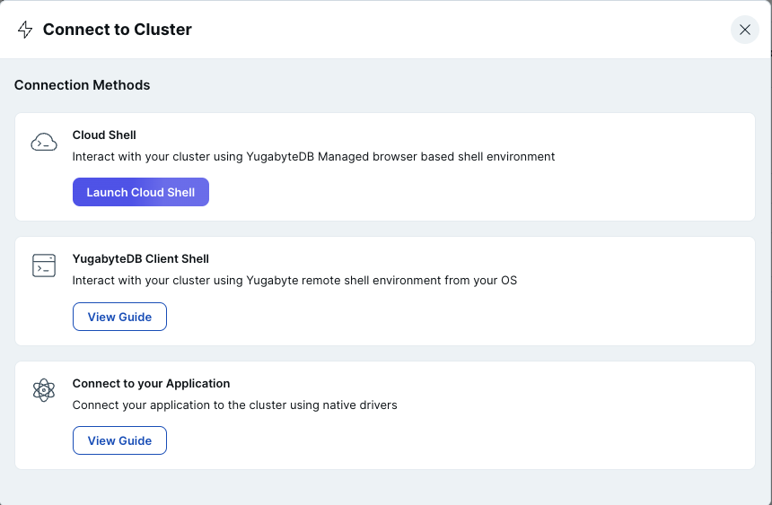

3. **[Download CA Cert]** をクリックして、TLS通信のための証明書 (root.crt) をダウンロードしてください。

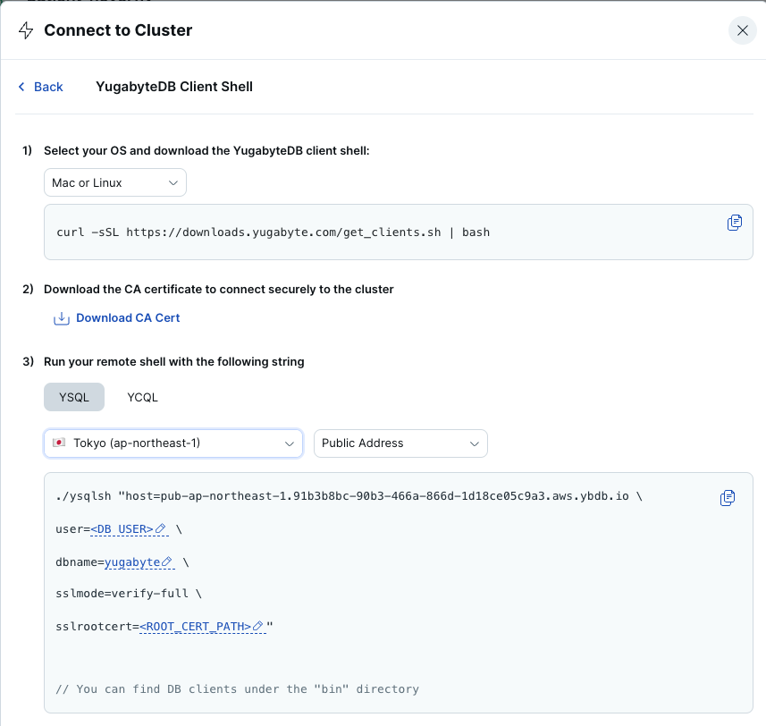

4. YSQLクライアント・シェルから、クラスタにアクセスします。以下を参考に、コマンドを入力してクラスタに接続してください。

```
./ysqlsh "host=<HOST ADDRESS> \
user=<DB USER> \
dbname=yugabyte \
sslmode=verify-full \
sslrootcert=<ROOT_CERT_PATH>"
```

5. クラスタに接続できると、パスワードの入力を求められます。クラスタ作成時にダウンロードした、DB Credentialsのテキストファイルからパスワードを入力してください。

YSQLコマンドの入力モードになったら、クライアント・シェルからのクラスタへのアクセスは成功です。

6. 先ほどWebコンソールで確認したテーブルスペースを、YSQLクライアントからも確認します。

```
\x auto
\db+
```

7. 2つのパーティション・テーブル customers と orders を作成します。order テーブルは、外部キーとして customers テーブルの cust_id を参照しています。

```
---create customers table
CREATE TABLE customers (
    cust_id int not null,
    name text not null,
    email text,
    geo_partition text
) PARTITION BY LIST (geo_partition);

--create partitioned table
CREATE TABLE customers_eu PARTITION OF customers (
    cust_id unique, name, email, geo_partition,
    PRIMARY KEY (cust_id hash, geo_partition)
) FOR VALUES IN ('EU') TABLESPACE eu_central_1_ts;

CREATE TABLE customers_ap PARTITION OF customers (
    cust_id unique, name, email, geo_partition,
    PRIMARY KEY (cust_id hash, geo_partition)
) FOR VALUES IN ('ASIA') TABLESPACE ap_northeast_1_ts;

CREATE TABLE customers_us PARTITION OF customers (
    cust_id unique, name, email, geo_partition,
    PRIMARY KEY (cust_id hash, geo_partition)
) FOR VALUES IN ('US') TABLESPACE us_west_1_ts;

--create orders table
CREATE TABLE orders (
    order_id int not null,
    product_id int not null,
    product_name text,
    amount int,
    geo_partition text,
    cust_id int
) PARTITION BY LIST (geo_partition);

--create partitioned table
CREATE TABLE orders_eu PARTITION OF orders (
    order_id, product_id, amount, geo_partition, cust_id,
    PRIMARY KEY (order_id hash, product_id, geo_partition),
    FOREIGN KEY (cust_id) REFERENCES customers_eu (cust_id) ON DELETE CASCADE
) FOR VALUES IN ('EU') TABLESPACE eu_central_1_ts;

CREATE TABLE orders_ap PARTITION OF orders (
    order_id, product_id, amount, geo_partition, cust_id,
    PRIMARY KEY (order_id hash, product_id, geo_partition),
    FOREIGN KEY (cust_id) REFERENCES customers_ap (cust_id) ON DELETE CASCADE
) FOR VALUES IN ('ASIA') TABLESPACE ap_northeast_1_ts;

CREATE TABLE orders_us PARTITION OF orders (
    order_id, product_id, amount, geo_partition, cust_id,
    PRIMARY KEY (order_id hash, product_id, geo_partition),
    FOREIGN KEY (cust_id) REFERENCES customers_us (cust_id) ON DELETE CASCADE
) FOR VALUES IN ('US') TABLESPACE us_west_1_ts;
```

8. 以下のコマンドを入力して、2つのテーブルの定義を確認してください。

```
\d+ customers
\d+ orders
```

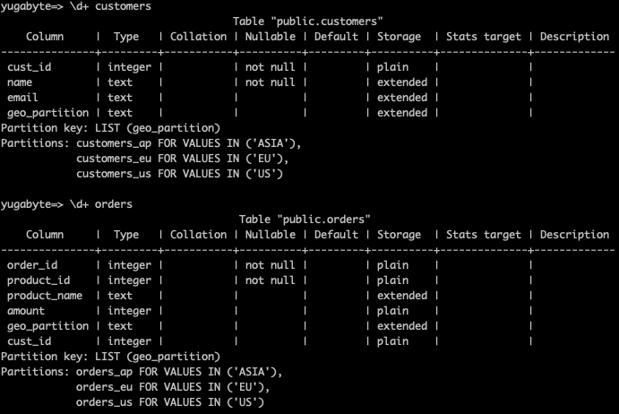

9. 続いて、2つのテーブルに、サンプルのデータを投入します。

```
--insert some customers data
INSERT INTO customers VALUES(1001,'山田花子','hanako@acme.com','ASIA');
INSERT INTO customers VALUES(1002,'鈴木太郎','taro@gmail.com','ASIA');
INSERT INTO customers VALUES(3001,'Franck Ribery','franckr@abc-de.com','EU');
INSERT INTO customers VALUES(3002,'Natalie Wood','natalie@xxx.com','EU');
INSERT INTO customers VALUES(5001,'John Doe','john@yyy.com','US');
INSERT INTO customers VALUES(5002,'Cathy Freeman','cathy@abcde.com','US');

--insert some orders data
INSERT INTO orders VALUES(9001,35,'YB T-Shirt M',2,'ASIA',1001);
INSERT INTO orders VALUES(9002,41,'YB Mug black',10,'ASIA',1002);
INSERT INTO orders VALUES(9003,35,'YB T-Shirt M',5,'EU',3001);
INSERT INTO orders VALUES(9004,70,'YB Multi-color Pen',24,'EU',3002);
INSERT INTO orders VALUES(9005,35,'YB T-Shirt M',10,'US',5001);
INSERT INTO orders VALUES(9006,54,'YB Sticker',100,'US',5002);
```

10. パーティション・テーブルでは、親テーブルからも子テーブルからもデータをクエリすることができます。実行時間の計測を有効化して、両方の場合の実行計画を確認してください。

```
/timing
explain (analyze, costs off) select * from customers_ap;
explain (analyze, costs off) select * from customers;
```

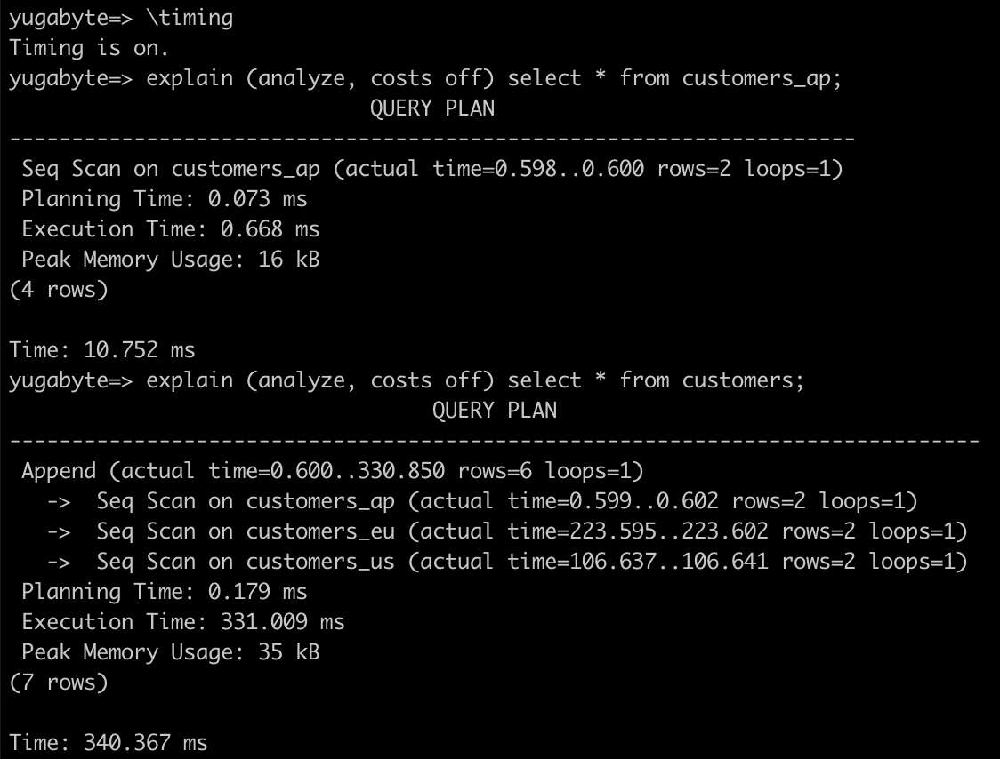

11. パーティション・テーブルへのデータの挿入は、親テーブルから実施する必要があります。customer テーブルと、orders テーブルに新しいデータを挿入します。

```
INSERT INTO customers VALUES(5003,'Yuga Hero','hero@yugabyte.com','EU');
INSERT INTO orders VALUES(9901,54,'YB Sticker',100,'EU',5003);
```

12. 前の手順で挿入したデータが、どのテーブル・パーティションにあるかを確認します。tebleoidパーティション・カラムの値によって EU のテーブルに配置されていることが確認できます。

```
SELECT tableoid::regclass, cust_id, name, email from customers where cust_id=5003;
```

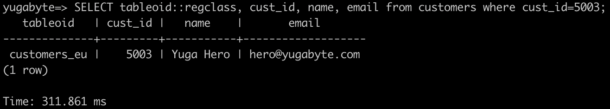

13. 子テーブル同士を結合するクエリの実行計画を見てみましょう。

```
explain (analyze, costs off) select order_id, product_name, c.geo_partition, c.name from orders_ap join customers_ap c on orders_ap.cust_id=c.cust_id;
```

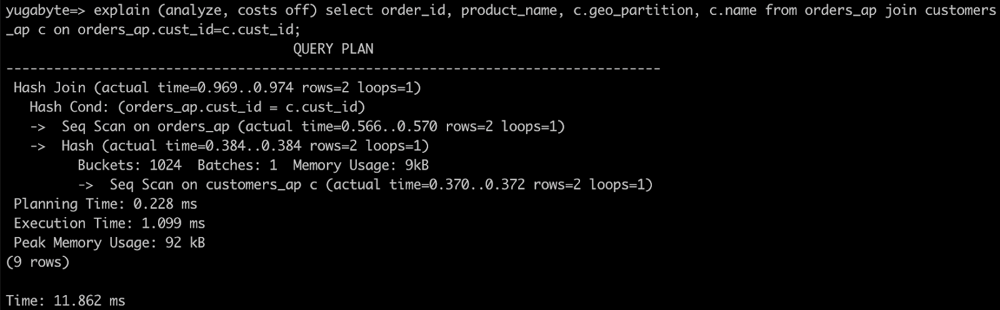

14. 親テーブル同士を結合して、Where条件でリージョンを指定しても前の手順と同じクエリ結果が得られます。実行計画を確認して、実行方法の違いを確認しましょう。

```
explain (analyze, costs off) select order_id, product_name, c.geo_partition, c.name from orders join customers c on orders.cust_id=c.cust_id where c.geo_partition='ASIA';
```

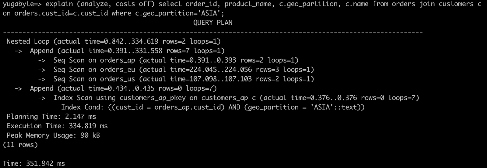

16. ジオ・パーティションのクラスタを使用したハンズオンは以上です。ダッシュボードの右上にある **[Actions]** ボタンをクリックして、**[Pause Cluster]** を選択します。

 

> aside positive
> 
> このクラスタをもう使用しない場合は、[Terminate Cluster] を選択して、クラスタを削除しても構いません。

17. 確認画面で、**[Confirm & Pause]** をクリックして、クラスタを一時停止してください。


以上で、このセクションは完了です。


## まとめ


以上で、YugabyteDB Managedの分散トポロジー体験ハンズオンは完了です。

YugabyteDB Managedでは、AZ障害やリージョン障害に耐えるクラスタ構成や、データの配置場所を特定した構成が簡単にできることを確認できたと思います。このハンズオンではシンプルに単一のクライアントからクエリを実行しましたが、実際のワークロードを想定した負荷をかける等の検証を行いたい場合は、以下のリンクを参考にしてください。

### 次におすすめのハンズオン

以下のハンズオンも実施してみてください。

*  [YugabyteDB Managedの耐障害性と拡張性](https://yugabytedb-japan.github.io/codelabs/ybm-cluster-resiliency/index.html)
*  [Benchmark (公式ドキュメント)](https://docs.yugabyte.com/preview/benchmark/)

### 参考資料

*  [YugabyteDB Managed 公式ドキュメント](https://docs.yugabyte.com/preview/yugabyte-cloud/)
*  [YugabyteDB API Doc](https://api-docs.yugabyte.com/)


