# YugabyteDB VoyagerによるPostgreSQLからYugabyteDBへの移行

[Codelab Feedback](https://yugabytedb-japan.github.io/)


## はじめに
Duration: 01:00


**Last Updated:** 2024-01-20

### **データベースのマイグレーション**

データベースの移行は、日常的に行うオペレーションではありません。しかしYugabyteDBを適用するアプリケーションが新規開発ではなく、既存アプリケーションの移行である場合には必須のプロセスです。

YugabyteDBは、Oracle、PostgreSQL、MySQLのインターフェースを持つ各データベースから、YugabyteDBへと移行するオープンソースの移行ツールVoyagerを提供しています。

このハンズオンでは、YugabyteDB Voyagerを使用して、既存のPostgreSQLデータベースからスキーマとデータを移行して、移行ステップや移行の考慮点について学びます。

### **ハンズオンで実施すること**

このハンズオンでは、ローカルのPostgreSQLとYugabyteDB Managedのクラスタを使用し、YugabyteDB Voyagerでサンプルのデータセットを移行します。

以下の内容を実施します:

* ローカルのPostgreSQLのセットアップ
* YugabyteDB Managedのクラスタ作成
* YugabyteDB Voyagerのインストール
* Voyagerを使用した、スキーマのエクスポートとインポート
* Voyagerを使用した、データのエクスポートとインポート

### **ハンズオンで学習すること**

* YugabyteDB Voyager のインストール
* YugabyteDB Voyager の設定パラメータ
* YugabyteDB とPostgreSQL とのスキーマ変換と制約事項

### ハンズオン実施に必要なもの

* Docker
* YugabyteDB Managedアカウント


## マイグレーションのステップ
Duration: 01:00


YugabyteDB Voyagerは、既存データベースを稼働したまま実行するオンライン・マイグレーションと、既存データベースからアプリケーション・ワークロードを停止して行うオフライン・マイグレーションをサポートしています。（注：2024年4月時点では、オンライン・マイグレーションのサポート対象はOracleおよびPostgreSQLデータベースです。）

ここでは、オフライン・マイグレーションのステップを確認します。

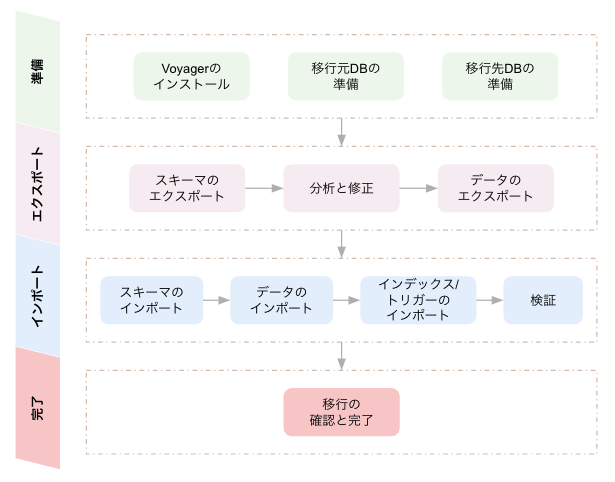

### **準備**

Voyagerのダウンロードとインストール、またVoyagerのコマンドが移行元と移行先のデータベースに接続し必要な操作を行うためのユーザー権限の設定を行います。

### **エクスポート**

移行元データベースから、スキーマとデータをエクスポートします。YugabyteDBで未サポートの機能などを分析レポートで確認し、必要に応じてスキーマの修正を行います。

### **インポート**

移行先データベースに、スキーマとデータをインポートします。データ投入後に、インデックスやトリガーを作成します。

### **完了**

全てのデータの移行が完了したことを確認し、ログ等をクリーンアップします。


## マイグレーションの準備
Duration: 30:00


### **YugabyteDB Voyagerのインストール**

YugabyteDB Voyagerは、Linux、MacOS、Dockerで実行することができます。このハンズオンでは、Docker版のVoyagerを使用します。Dockerがインストールされていない場合は、 [こちら](https://docs.docker.com/get-docker/)から環境にあったDockerをインストールしてください。

1. Terminalやコマンドプロンプトを使用して、VoyagerのDockerイメージをダウンロードします。

```
docker pull yugabytedb/yb-voyager
```

2. GitHubリポジトリから、Voyagerを実行するためのスクリプトをダウンロードし、ローカルのbinディレクトリに保存して実行可能にします。

```
wget -O ./yb-voyager https://raw.githubusercontent.com/yugabyte/yb-voyager/main/docker/yb-voyager-docker && chmod +x ./yb-voyager && sudo mv yb-voyager /usr/local/bin/yb-voyager
```

3. 以下のコマンドを実行して、スクリプトが実行可能であることを確認してください。

```
yb-voyager version
```

下のような応答が返れば、Voyagerが実行可能になっています。

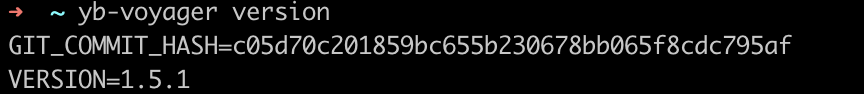

以上で、YugabyteDB Voyagerのインストールは完了です。

### **PostgreSQLサンプル・データベースの作成**

ここではVoyagerの移行元として使用する、PostgreSQLの [サンプル・データベース](https://www.postgresqltutorial.com/postgresql-getting-started/postgresql-sample-database/)を準備します。使用可能なPostgreSQLがない場合は、PostgreSQLのDockerイメージをインストールしてください。

1. 以下のコマンドを入力して、Dockerイメージをダウンロードします。

```
docker pull postgres
```

2. ダウンロードしたDockerイメージを実行します。

```
docker run --name postgres-test -e POSTGRES_PASSWORD=password \
    -p 5432:5432 -d postgres
```

3. psqlを使用して、サンプル・データベースのスキーマとデータをリストアするデータベースを作成します。

```
docker exec -it postgres-test psql -U postgres
```

postgres=# 

```
CREATE DATABASE dvdrental;
```

postgres=# 

```
\q
```

4. サンプル・データベースのサイトにある  [**[Download DVD Rental Sample Database]** ](https://www.postgresqltutorial.com/wp-content/uploads/2019/05/dvdrental.zip)のリンクから、zipファイルをダウンロードして解凍します。

5. 解凍したファイルを、Dockerイメージ内にコピーします。

```
docker cp <zipを解凍したフォルダ> postgres-test:/tmp
```

6. PostgreSQLにリストアします。

```
docker exec -it postgres-test sh -c "pg_restore -U postgres --host localhost --port 5432 --dbname dvdrental --format=d /tmp/dvdrental"
```

7. サンプル・データベースにアクセスして、スキーマとデータがリストアされていることを確認してください。

```
docker exec -it postgres-test psql -U postgres -d dvdrental
```

dvdrental=# 

```
\dt
```

dvdrental=# 

```
select * from store;
```

以上で、サンプル・データベースの準備は完了です。

### **YugabyteDB Managed クラスタの作成**

ここではVoyagerの移行先データベースとして、YugabyteDB Managedのシングルリージョン・クラスタ (3ノードのクラスタ) を作成します。

1. YugabyteDB Managedのアカウントにログインします。
2. 左側のメニューから **[Clusters]** を選択し、 **[Create a Free cluster]**  (既にクラスタ作成済みの場合は **[Add Cluster]** ) ボタンをクリックしてください。
3. クラスタ作成のウィザードが開始します。右側のDedicatedにある **[Request a Free Trial]** ボタンをクリックしてください。

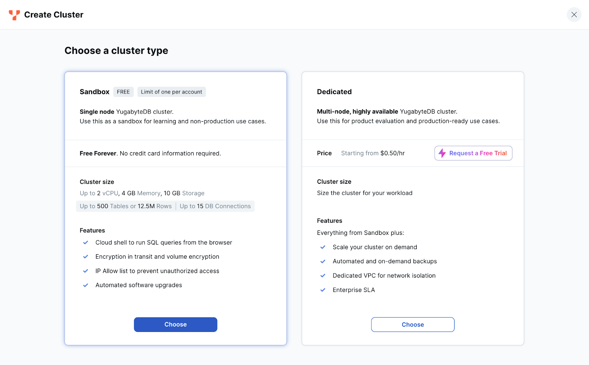

4. トライアル申し込みのウィンドウが表示されます。右側にプロモーション・コードを入力し、**[Start Free Trial]** ボタンをクリックしてください。


5. プロモーションコードが適用されると、画面上部に適用されたクレジットと有効期限が表示されます。クラスタ作成の画面に戻るので、右側のDedicatedにある **[Choosel]** ボタンをクリックしてください。


6. General settingsページが表示されます。クラスタの名前には適当な名前が自動生成されます。クラウド・プロバイダーには **[AWS]** 、データベース・バージョンはより新しいバージョンである **[Innovation Track]** を選択して、 **[Next]** をクリックしてください。


7. Cluster setupページが表示されます。ページ上部にある **[Single-Region Deployment]** を選択します。1の耐障害性レベルには **[Availability Zone Level]** 、2のリージョンには **[Tokyo]** を選択してください。 クラスタの仕様は、vCPUを最小の **[2]** に設定します。vCPUのサイズを変更すると、メモリのとディスクのサイズは自動的に変更されます。


8. Cluster setupページの下部には、VPCの設定を行う箇所があります。このハンズオンでは使用しませんので、**[Select a VPC]** をオフにしたまま、**[Next]** をクリックしてください。


9. Network Accessの設定ページが表示されます。**[Add Current IP Address]** をクリックして、自分の端末のIPアドレスをアクセス許可リストに追加してください。

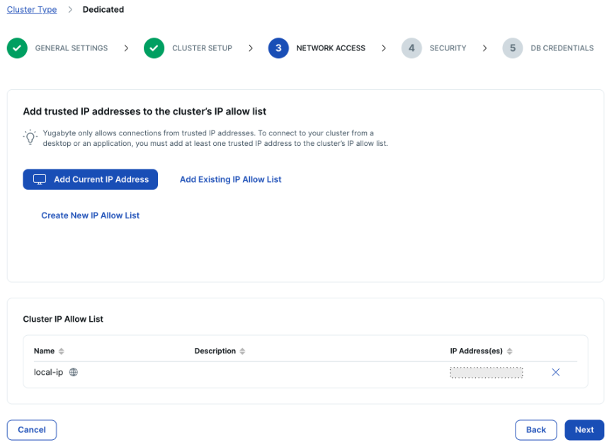

> aside negative
> 
> **Note:** [Could not detect a valid IPv4 address] というエラーメッセージが表示される場合は、コマンドラインや外部サイトを使用して、ハンズオンで使用しているマシンのグローバルIPを確認し、**[Create New IP Allow List]** からIP許可リストに追加してください。

10. **[Next]** をクリックします。保管データの暗号化の設定を行うページが表示されます。今回は使用しないため、そのままで **[Next]** をクリックしてください。


11. DB Credentialsページが表示されます。ユーザー名とパスワードは自動設定されます。設定をカスタマイズしたい場合は、 **[Add your own credentials]** をクリックしてユーザー名をパスワードを自分で設定します。このままで問題なければ **[Download credentials]** ボタンをクリックして、アクセス情報のファイルをローカルに保存してください。


> aside negative
> 
> **Note:** このアクセス情報は、ハンズオンの後のステップで使用します。ファイルを保存した場所を忘れないようにしてください。

12. **[Create Cluster]** ボタンをクリックします。プロビジョニングが開始され、DBクラスタが開始するまでに数分かかります。


13. 起動が完了するとクラスターのダッシュボードが表示されます。


以上で、クラスタの作成は完了です。

### **YugabyteDB Managed クラスタの設定変更**

YugabyteDBは、セッション・レベル または クラスタ・レベルでの設定によって機能を調整することができます。基本的に、全てのユーザーにとってメリットのある機能 (例：pushdown) はデフォルトで有効化されますが、テクニカルプレビューとして提供されている新機能などは、設定を変更することで期待する挙動やパフォーマンスを得ることができます。

セッション・レベルの設定変更であればSETコマンドで実施できますが、クラスタ・レベルでの設定変更を行う場合、YugabyteDB Managedではサポートへの依頼が必要です。

ここではサポートへの依頼方法の確認も兼ねて、いくつかのフラグをクラスタ・レベルで変更します。

1. YugabyteDB Managedの画面左下にある、**[Support]** を展開し、**[Contact Support]** をクリックしてください。

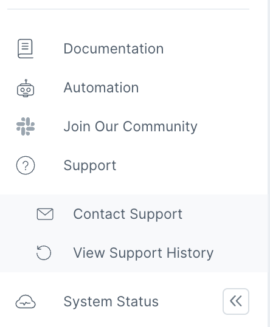

2. Contact Support のウィンドウで、以下のように入力してください。

| ISSUE TYPE (問題の種類) | Feature Request |
| --- | --- |
| SUBJECT (タイトル) | フラグの設定 |
| DESCRIPTION (内容) | 以下のフラグを設定してください。--yb_bnl_batch_size=1024--ysql_sequence_cache_method=server--ysql_enable_packed_row=true--ysql_enable_packed_row_for_colocated_table=true |
| CLUSTER (対象クラスタ名) | (前の手順で作成したクラスタの名前) |
| SEVIRITY (重要度) | Normal |

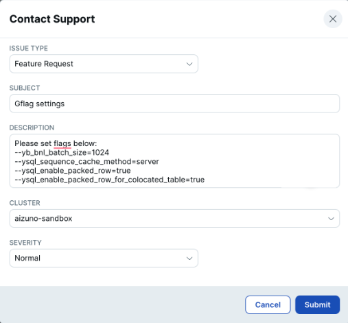

Batched Nested Loop (yb_bnl_batch_size) は、YugabyteDB 2.21以降でデフォルト有効となる予定です。Sequence Cashe (ysql_sequence_cache_method) は、デフォルトでsessionに設定されています。

3. 設定に関する確認事項や、完了の連絡がサポートからあると、登録しているEメールアドレスに通知が届きます。また、YugabyteDB Managedのメニューから **[Support]** &gt; **[View Support History]** からサポート・ポータルにアクセスすると、サポートとのやりとりが確認できます。

4. 設定が完了していることの確認は、YSQLインターフェースからも可能です。クラスタのダッシュボードから、右上にある **[Connect]** ボタンをクリックし、Cloud Shellでクラスタにアクセスしてください。

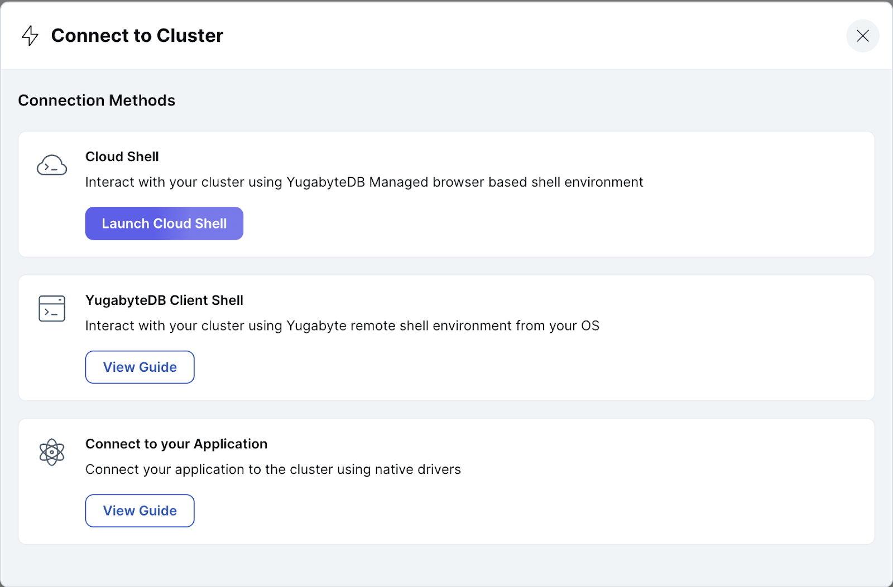

5. パスワードの入力後、以下のコマンドを入力して、設定が有効になっていることを確認してください。

```
SHOW yb_bnl_batch_size;
```

6. 移行先のデータベースを作成し、接続できることを確認します。コロケーションを使用予定のため、有効化したデータベースを作成していることに注意してください。

```
CREATE DATABASE dvdrental WITH COLOCATION=true;
\c dvdrental
```

以上で、移行先となるYugabyteDB Managedのクラスタ準備は完了です。


## スキーマとデータのエクスポート
Duration: 30:00


### **スキーマのエクスポート**

YugabyteDB Voyagerを使用して、移行元データベースであるPostgreSQLからスキーマをエクスポートします。

1. スキーマのエクスポートは、VoyagerのCLIを使用して行います。最初に、エクスポート・コマンドのパラメータを確認します。下表はコマンドで提供されるパラメータの一部です。詳細は -h オプションで確認するか、 [ドキュメント](https://docs.yugabyte.com/preview/yugabyte-voyager/reference/schema-migration/export-schema/)をご覧ください。

| オプション | 説明 | 設定例 |
| --- | --- | --- |
| -e, --export-dir | エクスポートしたスキーマ・ファイルを出力するディレクトリ（事前に作成しておく） | ./export |
| --source-db-host | 移行元DBのホスト | localhost |
| --source-db-name | 移行元DBの名前 | dvdrebtal |
| --source-db-port | 移行元DBのポート | 5432 |
| --source-db-schema | 移行元DBのスキーマ | default |
| --source-db-type | 移行元DBの種類 | postgresql |
| --source-db-user | 移行元DBのユーザー | postgres |
| --source-db-password | 移行元DBのユーザー・パスワード | (なし) |

2. 以下のコマンドを、ターミナルやコマンドプロンプトから入力してください。

```
yb-voyager export schema --export-dir ./export \
        --source-db-type postgresql \
        --source-db-host localhost \
        --source-db-user postgres \
        --source-db-name dvdrental \
        --source-db-schema public
```

3. コマンドでパスワードを指定しない場合、プロンプト入力を求められます。Dockerイメージの実行時に指定した初期パスワード (password) を入力すると、スキーマがエクスポートされます。

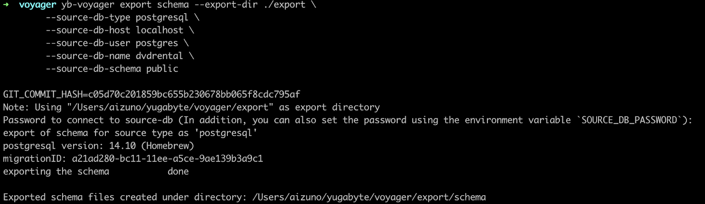

4. エクスポート・ディレクトリの下に複数のフォルダとファイルが作成されていることを確認してください。

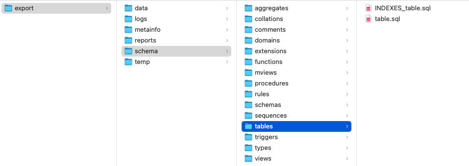

### **スキーマの分析と修正**

YugabyteDBはPostgreSQL互換のデータベースですが、YugabyteDB Voyagerを使用してエクスポートしたスキーマが、そのままYugabyteDBにインポートできるわけではありません。非サポート機能のチェックや、データをどのように分散配置するかを考慮した調整が必要です。

Voyagerでは、スキーマを分析してレポートを出力することで、非サポート機能のチェックを支援します。

1. YugabyteDB VoyagerのCLIで、スキーマの分析を行います。以下のコマンドをターミナルやコマンドプロンプトから入力してください。

```
yb-voyager analyze-schema --export-dir ./export --output-format txt
```

2. エクスポート・ディレクトリのreportsフォルダに、分析レポートが出力されます。スキーマ、シーケンス、テーブルなどのオブジェクト毎に、移行性が評価され対象数が表示されます。レポートの最後に表示される問題 (Issues) の内容を確認してください。

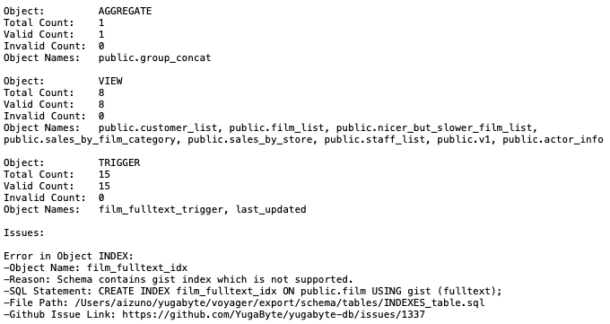

3. サンプル・データベースでは、YugabyteDBで未サポートの gist インデックスが使用されています。このインデックスを作成しないように、INDEX_tables.sqlファイルからインデックス `film_fulltext_index` を作成する行を削除します。（下の例では、13行目をコメントアウトしています。)

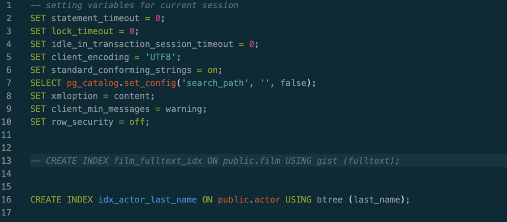

4. 再度、スキーマの分析を行います。 手順1と同じ以下のコマンドを入力してください。(レポートは上書きされるので、初期レポートを残す必要がある場合は、名前を変更しておいてください。)

```
yb-voyager analyze-schema --export-dir ./export --output-format txt
```

5. エクスポート・ディレクトリのreportsフォルダに、分析レポートが出力されます。問題 (Issues) がなくなっていることを確認してください。

### **データモデリング**

従来のシングルノード・データベースからYugabyteDBに移行すると、データは単一ディスクではなく、分散されたノードに配置されることになります。どのようにデータを分散するか、しないかを予め設計しておくことで、移行後のクエリのパフォーマンスをより改善することができます。

データの適切な分散を検討するには、テーブルのデータ量 (既存と今後の増加見込み) 、実行されるクエリパターンを把握することが重要です。

検討するポイントは、以下のような点があります。（参考： [ドキュメント](https://docs.yugabyte.com/preview/yugabyte-voyager/reference/data-modeling/)）

* **データを分散するか、しないか**：大量のデータを持つテーブルは分散した方が良いが、比較的小規模なテーブルは分散しない方が良い（コロケーションを検討）
* **データをどのように分割し、順序づけるか**：検索条件が範囲指定される場合は、その項目の昇順/降順でデータを分割・保持する（プライマリキーの設定によるHash/Rangeシャーディングの調整）
* **どのようなインデックスが必要か**：クエリ条件はプライマリインデックスでカバーされているか、クエリ対象が一部カラムや一部範囲に限定されていないか（セカンダリ・インデックス、カバリング・インデックス、部分インデックスを検討）

ここでは、 [サンプル・データベースのER図](https://www.postgresqltutorial.com/postgresql-getting-started/postgresql-sample-database/)を確認し、想定するクエリパターンを元に分散SQLに移行するためのデータモデリングを行います。まずは最小限の修正を行ってからスキーマとデータを移行し、移行先でスキーマの変更を含むデータモデルの変更を行います。

1. ユースケースに基づいてデータを分散するか、しないかを検討します。以下は、dvdrentalデータベースの各テーブルのサイズと特徴をまとめた表です。

| テーブル名 | 行数 | データ増加 | 更新頻度 | 参照頻度 | 移行案 |
| --- | --- | --- | --- | --- | --- |
| actor | 200 | 中 | 低 | 高 | コロケーション |
| address | 603 | 大 | 中 | 低 | JSONB型で統合 |
| category | 16 | 小 | 低 | 中 | enumで統合 |
| city | 600 | 小 | 低 | 低 | JSONB型で統合 |
| country | 109 | 小 | 低 | 低 | JSONB型で統合 |
| customer | 599 | 大 | 中 | 中 | 分散 |
| film | 1000 | 中 | 低 | 高 | コロケーション |
| film_actor | 5462 | 中 | 低 | 高 | コロケーション |
| film_category | 1000 | 中 | 低 | 中 | enumで統合 |
| inventory | 4581 | 大 | 低 | 高 | 分散 |
| language | 6 | 小 | 低 | 中 | enumで統合 |
| payment | 14596 | 大 | 低 | 低 | 分散 |
| rental | 16044 | 大 | 低 | 高 | 分散 |
| staff | 2 | 中 | 中 | 低 | コロケーション |
| store | 2 | 中 | 低 | 低 | コロケーション |

> aside positive
> 
> このハンズオンでは、サンプル・アプリケーションを用いているため、テーブルのサイズは比較的小さくなっています。実際には、各タブレットのサイズが10-40GBになるよう、分散の要否や分割数を調整します。

2. Voyagerのエクスポート・ディレクトリにある `/schema/tables/table.sql` を開いてください。`table.sql` には、15の `CREATE TABLE` ステートメントがありますが、`NOT NULL` 制約があるだけでプライマリキーは設定されていません。`CREATE TABLE` ステートメントの後に、`ALTER TABLE` ステートメントがあり(160行目前後から)、そこでプライマリキーが設定されていることを確認してください。

3. actor, film_actor, film テーブルは、参照頻度が高く、常に結合されるテーブルです。データ量は、100万行を超えるような規模にはならないため、3つともコロケーション対象とします。現行スキーマを維持し、何も変更は加えません。

4. address, city, countryテーブルは常に結合され、customer, staff, store テーブルから参照されるため、移行後に参照元テーブルにJSONB型でデータを結合します。まずはそのままの形で移行するため、何も変更は加えません。 `/schema/tables/INDEX_table.sql を開いて、`移行先で不要となるインデックスを作成しないよう、19, 22, 25行目をコメントアウトしてください。

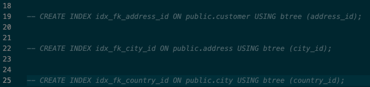

5. category, language テーブルは、それぞれ16行と6行しかない小さなテーブルです。データ移行後に、enumを作成し、filmテーブルに統合します。まずはそのままの形で移行するため、テーブルのDDLには変更を加えません。`INDEX_table.sql にある、language_id のインデックスは不要になるため、37行目をコメントアウトしてください。` 

6. customerテーブルは、非コロケーション・テーブルにします。`CREATE TABLE public.customer...` のDDLステートメントを探して、ステートメントの最後に `WITH (COLOCATION = false) SPLIT INTO 1 TABLETS` を追加してください。

7. inventory, payment, rental テーブルは、データ量も増加率も高いため、非コロケーション・テーブルにします。`CREATE TABLE` のDDLステートメントを探して、ステートメントの最後に `WITH (COLOCATION = false) SPLIT INTO 3 TABLETS` と追加します。

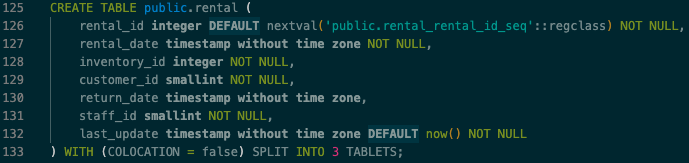

> aside positive
> 
> YugabyteDB V2.18以降ではタブレットの自動分割が可能ですが、データを移行する際に自動分割を行うと、データのバルクロードとデータ増加に伴う分割 (新しいタブレットの作成とデータコピー) を同時に行うことになり、大量のCPUリソースやディスクIOを消費します。あらかじめ分割数を指定しておくほうが、効率的なデータ移行が可能です。
> 
> ここでは、比較的行数の少ないcustomerとaddressテーブルは分割数1、つまり最初は分割しないもののデータ増加に合わせて分割可能な設定、行数の多いinventory、payment、rentalテーブルはノード数と同じ3つに分割されるよう設定しています。

8. staff, storeテーブルは、データ量も参照頻度も低いため、コロケーション・テーブルにします。DDLへの変更はありません。

以上で、移行前のスキーマ編集は完了です。

### **データのエクスポート**

YugabyteDB Voyagerを使用して、移行元データベースであるPostgreSQLからデータをエクスポートします。

1. データのエクスポートは、VoyagerのCLIを使用して行います。最初に、エクスポート・コマンドのパラメータを確認します。下表はコマンドで提供されるパラメータの一部です。詳細は -h オプションで確認するか、 [ドキュメント](https://docs.yugabyte.com/preview/yugabyte-voyager/reference/data-migration/export-data/)をご覧ください。

| オプション | 説明 | 設定例 |
| --- | --- | --- |
| -e, --export-dir | エクスポートしたスキーマ・ファイルを出力するディレクトリ（事前に作成しておく） | ./export |
| --source-db-host | 移行元DBのホスト | localhost |
| --source-db-name | 移行元DBの名前 | dvdrental |
| --source-db-port | 移行元DBのポート | 5432 |
| --source-db-schema | 移行元DBのスキーマ | default |
| --source-db-type | 移行元DBの種類 | postgresql |
| --source-db-user | 移行元DBのユーザー | postgres |
| --source-db-password | 移行元DBのユーザー・パスワード | (なし) |

2. 以下のコマンドを、ターミナルやコマンドプロンプトから入力してください。

```
yb-voyager export data --export-dir ./export \
        --source-db-type postgresql \
        --source-db-host localhost \
        --source-db-port 5432 \
        --source-db-user postgres \
        --source-db-name dvdrental \
        --source-db-schema public
```

3. コマンドでパスワードを指定しない場合、プロンプト入力を求められます。正しく入力されると、スキーマがエクスポートされます。

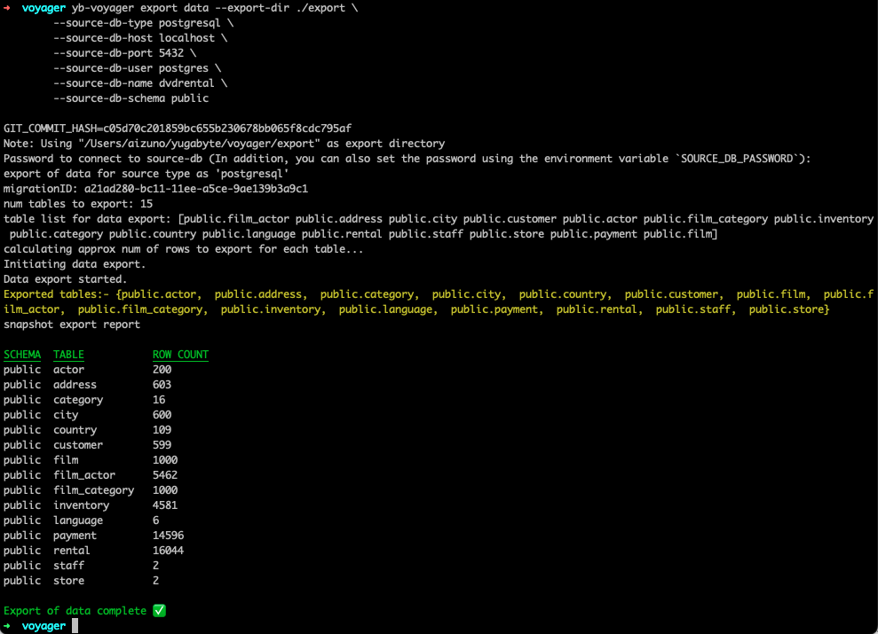

4. エクスポート・ディレクトリの data フォルダに、複数のファイルが作成されていることを確認してください。

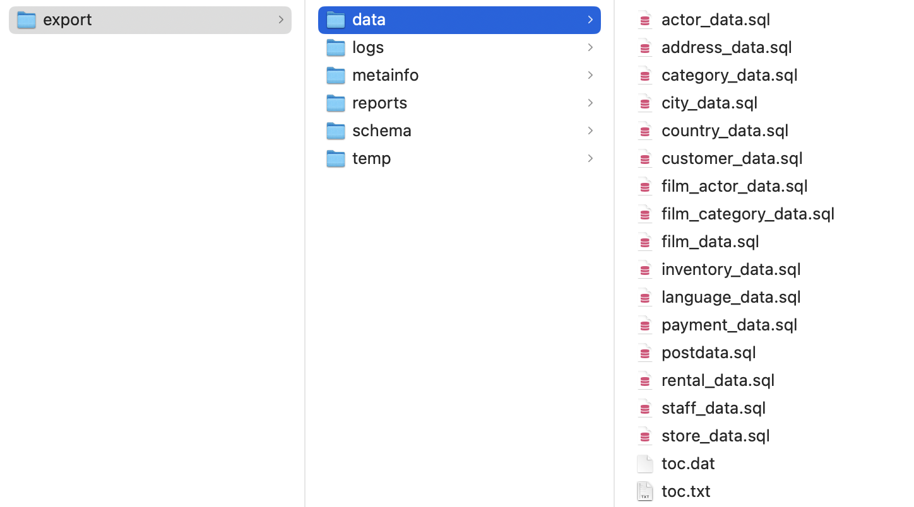


## スキーマとデータのインポート
Duration: 30:00


### **スキーマのインポート**

1. スキーマのインポートは、VoyagerのCLIを使用して行います。最初に、インポート・コマンドのパラメータを確認します。下表はコマンドで提供されるパラメータの一部です。詳細は -h オプションで確認するか、 [ドキュメント](https://docs.yugabyte.com/preview/yugabyte-voyager/migrate/migrate-steps/#import-schema)をご覧ください。

| オプション | 説明 | 設定例 |
| --- | --- | --- |
| -e, --export-dir | エクスポートしたスキーマ・ファイルを出力するディレクトリ（事前に作成しておく） | ./export |
| --target-db-host | 移行先DBのホスト | ap-northeast-1.&lt;uuid&gt;.aws.ybdb.i |
| --target-db-name | 移行先DBの名前 | dvdrental |
| --target-db-port | 移行先DBのポート | 5433 |
| --target-db-user | 移行先DBのユーザー | admin |
| --target-db-password | 移行先DBのユーザー・パスワード | password |

2. 以下のコマンドを、ターミナルやコマンドプロンプトから入力してください。

```
yb-voyager import schema --export-dir ./export \
        --target-db-host  ap-northeast-1.<uuid>.aws.ybdb.io\
        --target-db-port 5433 \
        --target-db-user admin \
        --target-db-name dvdrental
```

3. 複数のSQLファイルが連続して実行されます。エラーが発生した場合は、内容を確認してSQLを修正してください。

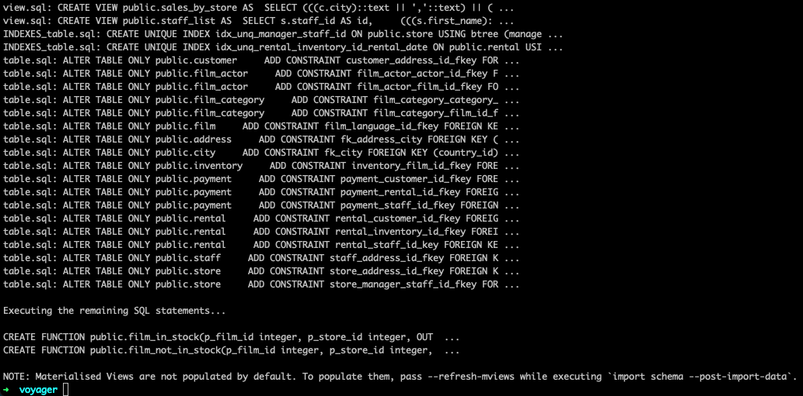

4. SQL修正後に再実行する場合は、既に作成済みのオブジェクトをスキップする必要があります。例えば、table.sqlの実行途中でエラーになった場合は、type.sql、domain.sql、sequence.sqlのファイル名を変更して実行対象から外すようにしてください。

### **データのインポート**

1. データのインポートは、VoyagerのCLIを使用して行います。最初に、インポート・コマンドのパラメータを確認します。下表はコマンドで提供されるパラメータの一部です。詳細は -h オプションで確認するか、 [ドキュメント](https://docs.yugabyte.com/preview/yugabyte-voyager/migrate/migrate-steps/#import-data)をご覧ください。

| オプション | 説明 | 設定例 |
| --- | --- | --- |
| -e, --export-dir | エクスポートしたスキーマ・ファイルを出力するディレクトリ（事前に作成しておく） | ./export |
| --target-db-host | 移行先DBのホスト | ap-northeast-1.&lt;uuid&gt;.aws.ybdb.i |
| --target-db-name | 移行先DBの名前 | dvdrental |
| --target-db-port | 移行先DBのポート | 5433 |
| --target-db-user | 移行先DBのユーザー | admin |
| --target-db-password | 移行先DBのユーザー・パスワード | password |
| --parallel-jobs | インポートJOBの並列度 | 6 |
| --table-list | データをインポートする対象テーブルのリスト。指定しなければ全てのテーブルが対象となる。 |  |
| --exclude-table-list | データのインポートから除外するテーブルのリスト。 |  |
| --start-clean | インポート済みのデータを削除し、最初からインポートを行う。 |  |

2. 以下のコマンドを、ターミナルやコマンドプロンプトから入力してください。

```
yb-voyager import data --export-dir ./export \
        --target-db-host  ap-northeast-1.<uuid>.aws.ybdb.io\
        --target-db-port 5433 \
        --target-db-user admin \
        --target-db-name dvdrental \
        --parallel-jobs 6
```

3. データのインポートが完了すると、テーブルごとにインポートされた行数のサマリーが表示されます。

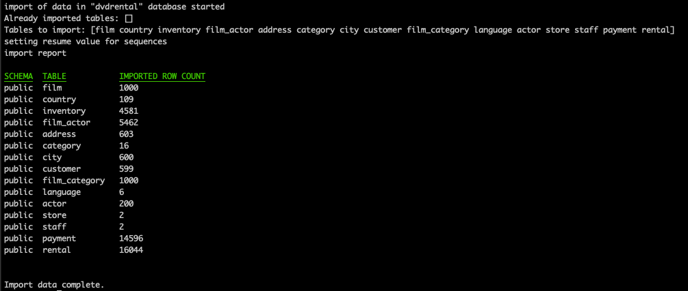

### **インデックスとトリガーのインポート**

1. データのインポート後に、インデックスの作成を行います。下表は Voyager CLI コマンドで提供されるパラメータの一部です。詳細は -h オプションで確認するか、 [ドキュメント](https://docs.yugabyte.com/preview/yugabyte-voyager/migrate/migrate-steps/#import-indexes-and-triggers)をご覧ください。

| オプション | 説明 | 設定例 |
| --- | --- | --- |
| -e, --export-dir | エクスポートしたスキーマ・ファイルを出力するディレクトリ（事前に作成しておく） | ./export |
| --target-db-host | 移行先DBのホスト | ap-northeast-1.&lt;uuid&gt;.aws.ybdb.i |
| --target-db-name | 移行先DBの名前 | dvdrental |
| --target-db-port | 移行先DBのポート | 5433 |
| --target-db-user | 移行先DBのユーザー | admin |
| --target-db-password | 移行先DBのユーザー・パスワード | password |
| --refresh-mviews | マテリアライズドビューにデータを投入するためのフラグ。 |  |
| --post-import-data | データインポート後にインデックスを作成するためのフラグ。 |  |

2. 以下のコマンドを、ターミナルやコマンドプロンプトから入力してください。

```
yb-voyager import schema --export-dir ./export \
        --target-db-host  ap-northeast-1.<uuid>.aws.ybdb.io\
        --target-db-port 5433 \
        --target-db-user admin \
        --target-db-name dvdrental \
        --refresh-mviews
        --post-import-data
```

3. スキーマとトリガーが作成されます。エラーが表示されていないことを確認してください。

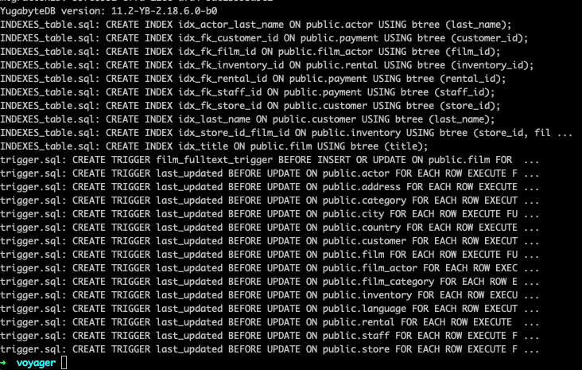

### **スキーマの変更**

移行前に確認したテーブルの特性だけでなく、クエリパターンに基づいてテーブルの統合 (非正規化) を検討します。

1. 以下は、各テーブルのクエリパターンです。

| テーブル名 | クエリパターン (ユースケース) | 備考 |
| --- | --- | --- |
| actor | filmに出演しているactorをactor_idで検索actorのlast_nameでfilmを検索 | film_actor, filmと結合 |
| address | customer, store, staffの住所をaddress_idで取得、更新 | 他テーブルで特定されたaddress_idでポイント検索 |
| category | category_idでfilmを検索 | film_category, filmと結合 |
| city | addressの一部として取得 | address, countryと結合 |
| country | addressの一部として取得 | address, cityと結合 |
| customer | 貸出時にcustomer_idで検索支払時にcustomer_idで検索登録情報変更時にlast_nameで検索店舗からのDM発送時にstore_idで検索 |  |
| film | title検索category, release_year, ratingでの検索film_id, release_year, ratingでの検索language_idでのフィルタリング | category, film_category,actor, film_actorと結合 |
| film_actor | 特定filmに出演しているactorをリスト特定actorの出演filmをリスト | film_idでポイント検索 (actorと結合)actor_idでポイント検索 (filmと結合) |
| film_category | 特定categoryのfilmをリスト特定filmのcategoryをリスト | category_idでポイント検索 (filmと結合)film_idでポイント検索 (category)と結合 |
| inventory | 貸出/返却時にinventory_idで検索 |  |
| language | film検索の一部として参照 | filmと結合 |
| payment | 支払時にrental_idを指定して更新支払状況の確認時にrental_idで検索スタッフごとの支払処理確認時にstaff_idで検索 | customer_idでポイント検索rental_idでポイント検索staff_idでポイント検索 |
| rental | 貸出時にinventry_id, customer_id, staff_id, rental_dateを指定して更新返却時にinventory_idとrental_dateからrental_idを特定し、return_dateを更新 |  |
| staff | paymentやrentalの担当staff確認時に、staff_idで検索 | staff_idでポイント検索 |
| store | 貸出可能filmの在庫検索時に、store_idで店舗情報を参照 | inventory, filmと結合 |

2. 分散対象となる、customer, inventry, payment, rental テーブルのシャーディングキー、クラスタリングキーの設定を中心に確認します。 

1. customer テーブルは、主にcustomer_idでポイント検索され、組み合わせて検索される条件がないため、プライマリキーはcustomer_idのHashで問題ありません。また、last_nameでの検索、store_idでの検索はインデックスでカバーされています。
2. inventry テーブルは、inventry_idでポイント検索されるので、プライマリキーはinventry_idのHashで問題ありません。
3. payment テーブルは、貸出時 (レンタル料金の支払時) にrental_idを指定して新しいレコードが作成されます。また、customre_id、rental_id、staff_idでの検索がインデックスでカバーされています。一方で、payment_idで検索されることはありません。プライマリキーを、(rental_id Hash, payment_date DESC) に変更したnew_payment テーブルを作成し、payment テーブルからデータを挿入します。

```
CREATE TABLE public.new_payment(
    customer_id smallint NOT NULL,
    staff_id smallint NOT NULL,
    rental_id integer NOT NULL,
    amount numeric(5,2) NOT NULL,
    payment_date timestamp without time zone NOT NULL,
    CONSTRAINT new_payment_pkey 
        PRIMARY KEY (rental_id Hash, payment_date DESC),
    CONSTRAINT new_payment_customer_id_fkey 
        FOREIGN KEY (customer_id) 
        REFERENCES public.customer(customer_id)
        ON UPDATE CASCADE ON DELETE RESTRICT,
    CONSTRAINT new_payment_rental_id_fkey
        FOREIGN KEY (rental_id)
        REFERENCES public.rental(rental_id)
        ON UPDATE CASCADE ON DELETE SET NULL,
    CONSTRAINT new_payment_staff_id_fkey
        FOREIGN KEY (staff_id)
        REFERENCES public.staff(staff_id)
        ON UPDATE CASCADE ON DELETE RESTRICT
) WITH (COLOCATION = false) SPLIT INTO 3 TABLETS;

INSERT INTO public.new_payment
    SELECT customer_id,staff_id,rental_id,amount,payment_date
    FROM public.payment;
```

4. new_paymentテーブルに、customer_idとstaff_idのインデックスを作成します。

```
CREATE INDEX new_idx_fk_customer_id ON public.new_payment USING lsm (customer_id);
CREATE INDEX new_idx_fk_staff_id ON public.new_payment USING lsm (staff_id);
```

5. rental テーブルは、貸出時にinventry_id, customer_id, staff_id, rental_dateを指定して新しいレコードが作成されます。同時に、customer_idで未返却の貸出がないことを確認します。返却時には、inventory_idと最新のrental_dateからrental_idを特定し、return_dateを更新します。rental_idで検索されることはありませんが、rental_id はpayment テーブルから参照される外部キーなので、2つのテーブルを統合しない限り、削除することはできません。プライマリキーは、rental_idのままで、インデックスを(inventory_id Hash, rental_date DESC) と  (customer_id Hash, return_date DESC) に変更します。 

```
CREATE UNIQUE INDEX idx_unq_rental_inventory_id_rental_date ON public.rental USING lsm (inventory_id Hash, rental_date DESC);
CREATE INDEX idx_rental_customer_id_return_date ON public.rental USING lsm (customer_id Hash, return_date DESC);
```

3. enumを作成し、小規模な参照テーブルである languageをfilm テーブルに統合します。

```
CREATE TYPE lang AS ENUM (
    'English',
    'Italian',
    'Japanese',
    'Mandarin',
    'French',
    'German'
);

ALTER TABLE public.film ADD COLUMN language lang;

UPDATE public.film SET language='English' where language_id=1;
UPDATE public.film SET language='Italian' where language_id=2;
UPDATE public.film SET language='Japanese' where language_id=3;
UPDATE public.film SET language='Mandarin' where language_id=4;
UPDATE public.film SET language='French' where language_id=5;
UPDATE public.film SET language='German' where language_id=6;
```

4. 同様にenumを作成し、小規模な参照テーブルであるcategoryをfilmテーブルに統合します。

```
CREATE TYPE ctgy AS ENUM (
    'Action',
    'Animation',
    'Children',
    'Classics',
    'Comedy',
    'Documentary',
    'Drama',
    'Family',
    'Foreign',
    'Games',
    'Horror',
    'Music',
    'New',
    'Sci-Fi',
    'Sports',
    'Travel'
);

ALTER TABLE public.film ADD COLUMN category ctgy;

UPDATE public.film SET category='Action'
Where film_id IN (
    SELECT film_id from film_category where category_id=1
);
UPDATE public.film SET category='Animation'
Where film_id IN (
    SELECT film_id from film_category where category_id=2
);
UPDATE public.film SET category='Children'
Where film_id IN (
    SELECT film_id from film_category where category_id=3
);
UPDATE public.film SET category='Classics'
Where film_id IN (
    SELECT film_id from film_category where category_id=4
);
UPDATE public.film SET category='Comedy'
Where film_id IN (
    SELECT film_id from film_category where category_id=5
);
UPDATE public.film SET category='Documentary'
Where film_id IN (
    SELECT film_id from film_category where category_id=6
);
UPDATE public.film SET category='Drama'
Where film_id IN (
    SELECT film_id from film_category where category_id=7
);
UPDATE public.film SET category='Family'
Where film_id IN (
    SELECT film_id from film_category where category_id=8
);
UPDATE public.film SET category='Foreign'
Where film_id IN (
    SELECT film_id from film_category where category_id=9
);
UPDATE public.film SET category='Games'
Where film_id IN (
    SELECT film_id from film_category where category_id=10
);
UPDATE public.film SET category='Horror'
Where film_id IN (
    SELECT film_id from film_category where category_id=11
);
UPDATE public.film SET category='Music'
Where film_id IN (
    SELECT film_id from film_category where category_id=12
);
UPDATE public.film SET category='New'
Where film_id IN (
    SELECT film_id from film_category where category_id=13
);
UPDATE public.film SET category='Sci-Fi'
Where film_id IN (
    SELECT film_id from film_category where category_id=14
);
UPDATE public.film SET category='Sports'
Where film_id IN (
    SELECT film_id from film_category where category_id=15
);
UPDATE public.film SET category='Travel'
Where film_id IN (
    SELECT film_id from film_category where category_id=16
);
```

5. 最後に、filmテーブルから不要になったカラム language_idと、film_categoryとcategoryのテーブルを削除します。(オプション、変更前と後の実行計画を比較したい場合は残しておいてください。）
6.  次に、customerテーブルにJSONB型のaddress カラムを作成して、addressテーブルから住所情報を移行します。

```
ALTER TABLE public.customer ADD COLUMN address jsonb;
ALTER TABLE public.store ADD COLUMN address jsonb;
ALTER TABLE public.staff ADD COLUMN address jsonb;

do
$$
declare
    addr_count integer;
    addr_store integer[]=(select array_agg(address_id) from public.store);
    addr_staff integer[]=(select array_agg(address_id) from public.staff);
    addr jsonb;
begin
    SELECT count(*) INTO addr_count FROM address;

    for counter in 1..addr_count loop

      SELECT jsonb_build_object(
        'address_id', a.address_id,
        'address', a.address,
        'address2', a.address2,
        'district', a.district,
        'city_id', a.city_id,
        'city', ci.city,
        'country', co.country,
        'postal_code', a.postal_code,
        'phone', a.phone
      ) INTO addr
      from address a
      join city ci ON ci.city_id=a.city_id
      join country co ON co.country_id=ci.country_id
      where a.address_id=counter;

      IF counter=ANY(addr_store) then
        UPDATE public.store SET address=addr
        where address_id=counter;
      ELSIF counter=ANY(addr_staff) then
        UPDATE public.staff SET address=addr
        where address_id=counter;
      ELSE
        UPDATE public.customer SET address=addr
        where address_id=counter;
      END IF;

    end loop;
end;
$$;
```


## マイグレーションの完了と検証
Duration: 10:00


### **マイグレーションの完了**

YugabyteDB Voyagerを使用したマイグレーションを、以下のコマンドで完了します。

```
yb-voyager end migration --export-dir ./export \
        --backup-log-files=true \
        --backup-data-files=true \
        --backup-schema-files=true \
        --save-migration-reports=true \
        --backup-dir ./backup
```

### **データモデルの比較**

前のステップでは、分散SQLに適したデータモデルにするために、3つの変更を行いました。

* paymentテーブルのクエリパターンに合わせ、プライマリキーを変更したnew_paymentテーブルを作成
* 小規模な参照テーブルであるlanguage, film_category, category テーブルをenumとしてfilmテーブルに統合
* 同時に参照されることが多いaddress, city, country テーブルを非正規化し、customer, store, staff テーブルのカラムとして統合

以上の変更によって、dvdrentalデータベースのテーブルスキーマは以下のようになっています。 [こちら](https://www.postgresqltutorial.com/postgresql-getting-started/postgresql-sample-database/)にあるPostgreSQLチュートリアルのER図と比較すると、テーブルの数が15から9に減り、シンプルになっていることがわかります。

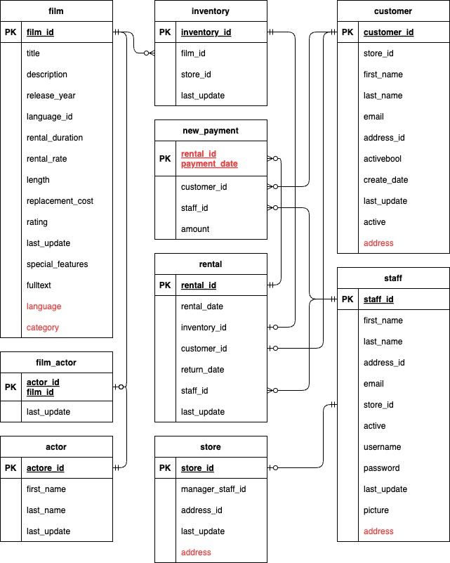

### **実行計画の確認**

各テーブルのクエリが、どのように変化したかを確認しましょう。

1. filmテーブルでは、category, release_year, ratingでの検索とlanguage_idでのフィルタリングを行うため、以下のようなクエリが実行されます。両方のクエリに `explain (analyze, dist, costs off)` をつけて実行計画を確認してください。

```
–-original query for the existing data model
SELECT f.title, f.description FROM film f
    JOIN language l ON f.language_id=l.language_id
    JOIN film_category fc ON f.film_id=fc.film_id
    JOIN category c ON fc.category_id=c.category_id
WHERE c.name='Action'
    AND f.release_year > 2000
    AND f.rating IN ('G','PG')
    AND l.name='English';

--updated query for the new data model
select title, description from film 
where category='Action' 
    AND release_year > 2000
    AND rating IN ('G','PG')
    AND language='English';
```

2. paymentテーブルでは、返却時に支払状況を確認するためにrental_idで検索するため、以下のようなクエリが実行されます。両方のクエリに `explain (analyze, dist, costs off)` をつけて実行計画を確認してください。

```
–-original query for the existing data model
SELECT r.rental_id, r.rental_date, r.return_date,
 p.payment_date, p.amount from payment p
JOIN rental r ON r.rental_id=p.rental_id
WHERE r.rental_id=1395
ORDER BY p.payment_date DESC;

--updated query for the new data model
SELECT r.rental_id, r.rental_date, r.return_date,
 p.payment_date, p.amount from new_payment p
JOIN rental r ON r.rental_id=p.rental_id
WHERE r.rental_id=1395
ORDER BY p.payment_date DESC;
```

3. paymentテーブルでは、支払いが行われた時にrental_idを指定して新規レコードを作成します。以下のクエリについても、 `explain (analyze, dist, costs off)` をつけて実行計画を確認してください。

```
–-original query for the existing data model
INSERT INTO payment 
    (customer_id, staff_id, rental_id, amount,payment_date)
VALUES (43,1,123,50.0,now());

--updated query for the new data model
INSERT INTO new_payment
    (customer_id, staff_id, rental_id, amount,payment_date)
VALUES (43,1,123,50.0,now());
```

4. customerテーブルでは、店舗からのDM発送時にstore_idで検索して宛先と住所をリストします。以下のクエリに、`explain (analyze, dist, costs off)` をつけて実行計画を確認してください。

```
–-original query for the existing data model
SELECT co.country, ci.city, 
  a.address, a.district, a.postal_code,
  c.first_name, c.last_name from customer c
JOIN address a ON c.address_id=a.address_id
JOIN city ci ON ci.city_id=a.city_id
JOIN country co ON co.country_id=ci.country_id
JOIN store s ON s.store_id=c.store_id
WHERE s.store_id=1;

--updated query for the new data model
SELECT first_name,last_name,address from customer 
WHERE store_id=1;
```

filmテーブルとcustomer (address) テーブルの変更については、実行計画がよりシンプルになりクエリ実行が効率的になっていることが確認できるはずです。

一方で、paymentテーブルについてはselectの実行計画には大きな変化がみられません。不要なインデックスが削除されたことで、新規レコードを追加するinsertではクエリ実行がより効率的になっていることが確認できます。

以上で、データモデルを変更した効果の確認は完了です。


## まとめ
Duration: 01:00


YugabyteDB VoyagerによるPostgreSQLからYugabyteDBへの移行ハンズオンが完了しました！

データモデルやクエリパターンに合わせたデータの分散方法を設計することで、スケールやパフォーマンスの目標に合わせたデータの配置になることが、実行計画から確認できました。

### 次におすすめのハンズオン

以下のハンズオンも実施してみてください。

*  [YSQLハンズオン](https://yugabytedb-japan.github.io/codelabs/ysql-basics/index.html)
*  [YugabyteDB Managedの分散トポロジー](https://yugabytedb-japan.github.io/codelabs/ybm-cluster-topology/index.html)

### 参考資料

*  [ブログ](https://www.yugabyte.com/blog/postgresql-migration-options-using-yugabytedb-voyager/)


