# YSQLハンズオン

[Codelab Feedback](https://yugabytedb-japan.github.io/)


## はじめに
Duration: 01:00


**Last Updated:** 2022-04-06

### **YSQLとは？**

YugabyteDBはPostgresSQLのクエリ層を再利用することで、PostgreSQLとの高い互換性を提供しています。このPostgreSQL互換のAPIが、Yugabyte Structured Query Language (**YSQL**) です。

YSQLを使用して作成されたテーブルなどのオブジェクトは、Postgres用に開発された様々なツールやドライバーを活用したり、既存のアプリケーションで使用されているSQLを編集せずにそのまま使用したりすることができます。

### **ハンズオンで実施すること**

このハンズオンではYugabyteDB Managedに作成したNorthwindサンプルデータベースを使用して、様々なYSQLのクエリや関数、ストアードプロシージャを使います。YugabyteDB Managedのアカウントや無料枠のクラスターを未作成の場合は、先に [『YugabyteDB Managed入門』](https://yugabytedb-japan.github.io/codelabs/getting-started-ybm/index.html)のハンズオンを実施してください。

以下の内容を実施します:

* 結合(Join)を使用したデータの読み取り
* 組み込み関数の使用
* PostgreSQL 拡張機能の使用
* コロケーション・データベースの作成
* 実行計画の確認とパフォーマンス分析

### **ハンズオンで学習すること**

* Northwindデータベースの作成
* YSQLを使用したデータベースの操作

### **ハンズオン実施に必要なもの**

* インターネット接続可能な端末
* ブラウザ (Chrome, Safari, Microsoft Edge, Firefoxなど)
* YugabyteDB Managedアカウント
* YugabyteDB Managedのクラスター


## Northwindデータベースの作成
Duration: 10:00


#### **Northwindデータベースとは**

Northwind データベースは、もともと Microsoft 社が作成し、数十年にわたってさまざまなデータベース製品のチュートリアルに使用されてきたサンプルデータベースです。Northwind データベースには、世界中の特殊食品を輸出入している「Northwind Traders」という架空の会社の売上データが格納されています。Northwind データベースには、顧客、注文、在庫、購買、仕入、出荷、従業員など、以下のER図にある14のテーブルとテーブル間のリレーションシップが定義されています。


#### **DLLとDMLのインポートによるテーブル作成とデータ投入**

このセクションでは、YugabyteDB ManagedにCloud Shell（Webブラウザ上のCLI）を使用してアクセスし、Northwindデータベースを作成します。

既に、 [YugabyteDB Managedの基礎](https://yugabytedb-japan.github.io/codelabs/ybm-basics/index.html)を実施してNorthwindデータベースを作成済みの場合は、次のステップに進んでください。

1.  [YugabyteDB Managed](https://cloud.yugabyte.com/)にログインし、クラスタのダッシュボードを開きます。
2. クラスタのダッシュボードの右上にある、[Coneect]ボタンをクリックしてください。
3. クラスタに接続するための方法が複数表示されます。一番上にある[Launch Cloud Shell]ボタンをクリックしてください。
4. 既にNorthwindデータベースを作成している場合は、データベース名に**northwind**、未作成の場合は**yugabyte**と入力します。APIに**YSQL**が選択されていることを確認し、[Confirm]ボタンをクリックします。


5. 新しいブラウザ・タブが開き、クラスタにアクセスするCloud Shellが表示されます。クラスタ作成時にダウンロードしたcredentialファイルに記載された、パスワードを入力してください。パスワードが認証されると、指定したデータベースに接続し、YSQLの入力モード になります。
6. Cloud Shellから `CREATE DATABASE northwind;` と入力します。CREATE DATABASEのメッセージが返ってくることを確認してください。

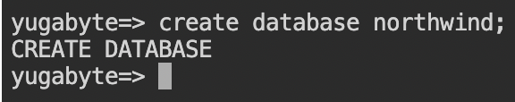

7. 続いて、`\c northwind` と入力して作成したばかりのNorthwindデータベースに接続します。

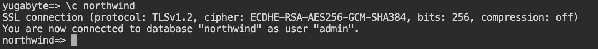

8. データベースにテーブルを作成するDDLファイル( [northwind_ddl.sql.txt](https://files.cdn.thinkific.com/file_uploads/540012/attachments/a36/29a/bd2/northwind_ddl.sql.txt))をブラウザで開きます。全てのテキストをコピーし、Cloud Shellに貼り付けてください。Enterキーを押して、最後のSQLステートメントまで実行されたことを確認します。
9. `\d` と入力し、14個のテーブルが作成されたことを確認してください。

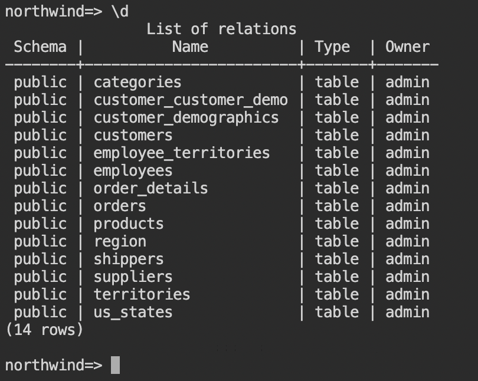

10. 続いて、データを挿入するDMLファイル( [northwind_data.sql.txt](https://files.cdn.thinkific.com/file_uploads/540012/attachments/886/c8a/550/northwind_data.sql.txt))をブラウザで開きます。先ほどと同様に、全てのテキストをコピーして、Cloud Shellに貼り付けてください。
11. 全てのデータを挿入するには、しばらく時間がかかります。(途中でCloud Shellのセッションが切れてしまう場合もあります。）実行が終わったら、 `select count(*) from &lt;table_name&gt;;` をいくつかのテーブルに対して実行して、データが挿入されていることを確認してください。

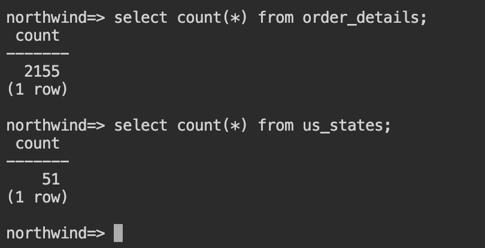

> aside positive
> 
> 全てのテーブルにはプライマリキーが設定されているので、INSERT句を重複して実行した場合はキー重複のエラーが返ります。いくつかの行に対して繰り返してINSERTを行なっても問題ありません。

以上で、Northwindデータベースの作成は完了です。


## YSQLによるリレーショナルデータの操作
Duration: 10:00


#### **このセクションで実施すること**

YSQLは、PostgreSQL互換のAPIを提供します。SQLの中でも、最も標準的な（SQL方言のない）SQLステートメントを使用して、様々なデータベース操作を行うことができます。ここでは、以下のSQL表現を使用してデータの操作を行います。

* Join (テーブル結合)
* プリぺアドステートメント
* Alter Table (テーブルの変更)
* 再帰SQL

#### **従業員の担当テリトリーを表示**

1.  [YugabyteDB Managed](https://cloud.yugabyte.com/)にログインし、クラスタのダッシュボード右上にある[Coneect]ボタンをクリックします。Cloud Shellからnorthwindデータベースに接続してください。
2. Northwindデータベースの従業員 (employees) 、担当テリトリー(employee_territories)、テリトリー(territories)、リージョン(region) テーブルを結合して、各従業員が担当しているテリトリーをリストします。以下のSQLをコピーして、Cloud Shellに入力してください。

```
select
    e.employee_id,
    e.first_name,
    t.territory_description,
    r.region_description from employees e
join employee_territories et on e.employee_id=et.employee_id 
join territories t on et.territory_id=t.territory_id 
join region r on t.region_id=r.region_id;
```

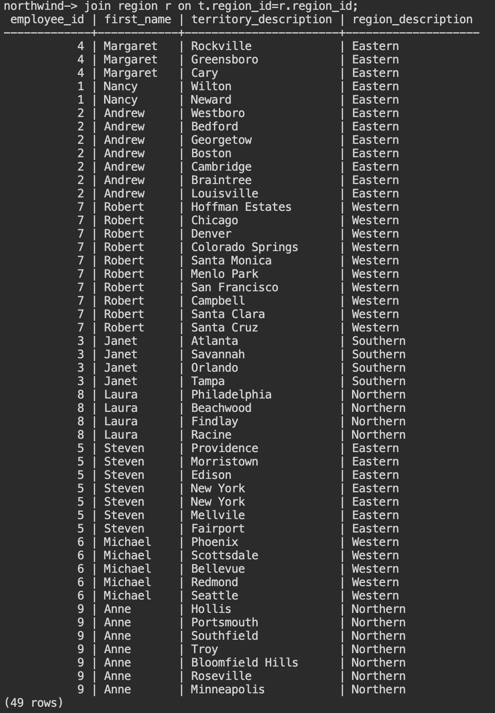

3. 従業員一人当たり複数のテリトリーを担当しているので、49行の結果が返ってきます。次は、一人当たりいくつのテリトリーを担当しているのか、多い順にリストしてみましょう。

```
select
    e.employee_id, 
    e.first_name, 
    count(t.territory_description) as num_of_territories 
from employees e 
join employee_territories et on e.employee_id=et.employee_id 
join territories t on et.territory_id=t.territory_id 
group by e.employee_id 
order by num_of_territories desc;
```

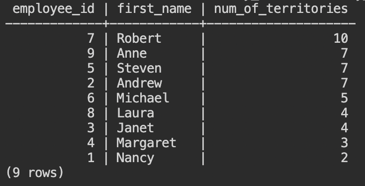

4. 従業員ごとに担当テリトリー数が集計されて、9行の結果が返ります。では、各従業員の担当テリトリーをリストするプリぺアドステートメントを作ってみましょう。

```
prepare emp_territories(int) as select e.first_name,
    t.territory_description from employees e
join employee_territories et on e.employee_id=et.employee_id 
join territories t on et.territory_id=t.territory_id
where e.employee_id=$1;
```

5. PREPAREという応答が返ったことが確認できたら、`execute emp_territories(3);` のようにパラメータに1から9 の従業員番号を入れて実行してみてください。

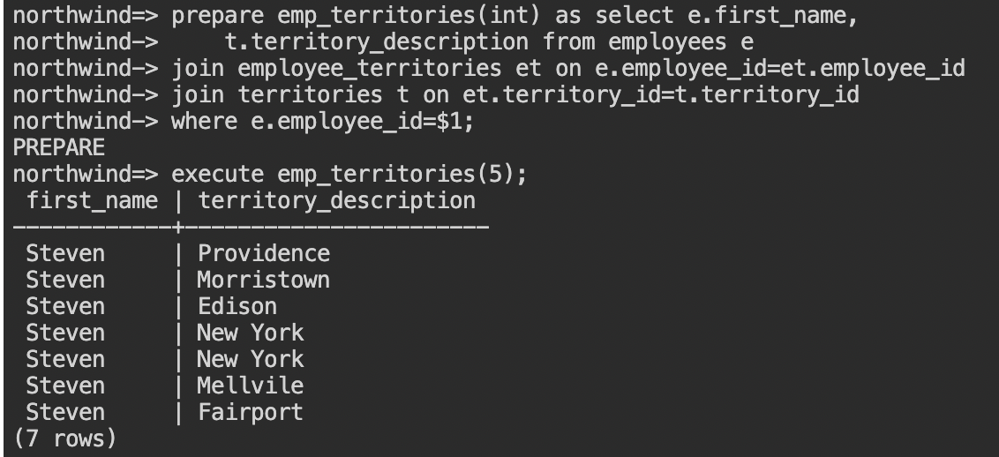

6. プリペアドステートメントは、セッション内に限り有効で、他のユーザーと共有することはできません。使用しなくなったプリペアドステートメントは無効化することでメモリを解放することができます。`deallocate emp_territories;` と入力して作成したステートメントを削除してください。

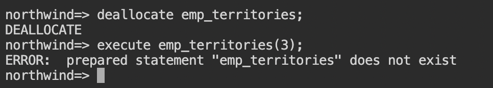

#### **従業員のレポートラインを表示**

1. 次は、従業員 (employee) テーブルに新しい列、テキスト型のtest_nameを追加します。 `ALTER TABLE employees add column test_name text;` と入力してください。

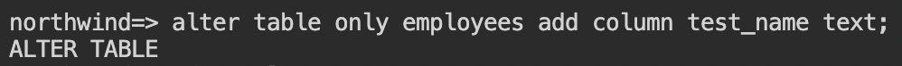

2. 追加したtest_name列には、デフォルト値を指定しなかったため、NULLになっています。全ての行で、first_nameからtest_nameに値をコピーします。 `UPDATE employees set test_name=first_name;` と入力してください。

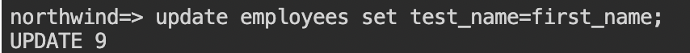

3. test_nameの値を使って、再帰SQLでレポートラインを取得します。以下のSQLを入力してください。

```
with recursive report_structure as ( 
      SELECT employee_id, first_name, test_name as path
      FROM employees WHERE employee_id = 2
  UNION ALL 
      SELECT e.employee_id, e.first_name, 
                     rs.path || ' manages ' || e.first_name
      FROM employees e INNER JOIN report_structure rs
      ON e.reports_to=rs.employee_id
)
SELECT * from report_structure;
```

再帰SQLとは、前の処理の結果を使って処理の繰り返し（ループ）を行なう場合に使われます。今回は、従業員テーブルのreports_toとemployee_idをキーにテーブル結合を行うことで、pathという列にレポートラインを表示する再帰処理を行なっています。

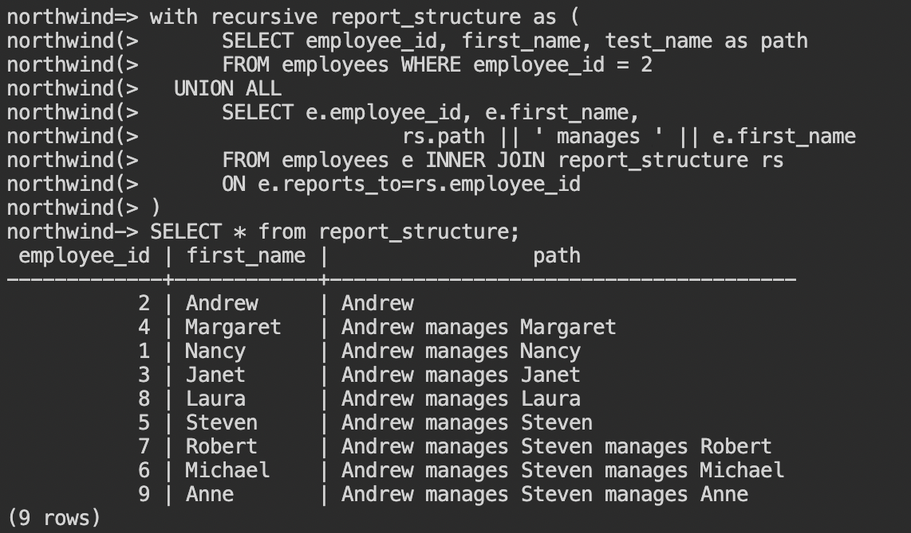

以上で、このセクションは完了です。


## 組込み関数の使用
Duration: 10:00


#### **このセクションで実施すること**

PostgreSQLは様々な組み込み関数を提供しています。このセクションでは、代表的な関数をいくつか使用して、Northwindデータベースのデータを様々な形で利用する方法を学習します。

* 文字列操作
* 日付計算
* 集約関数：AVG, COUNT, MAX, MIN, SUMなど
* ウィンドウ関数：AVG, LAG, RANKなど

#### **従業員Eメールの追加**

1.  [YugabyteDB Managed](https://cloud.yugabyte.com/)にログインし、クラスタのダッシュボード右上にある[Coneect]ボタンをクリックします。Cloud Shellからnorthwindデータベースに接続してください。
2. 従業員 (employee) テーブルに新しい列、テキスト型のtest_emailを追加します。 `ALTER TABLE employees add column test_email text;` と入力してください。
3. 追加したtest_email列には、デフォルト値を指定しなかったため、NULLになっています。全ての行で、last_nameとfirst_nameを使用してEメールアドレスを設定します。以下のSQLをコピーして、Cloud Shellから入力してください。

```
UPDATE employees
 set test_email=CONCAT (first_name,'.', last_name, '@northwindtraders.com');
```

4. Eメールがどのように設定されているか、`select employee_id, first_name, last_name, test_email from employees;` と入力して確認してください。

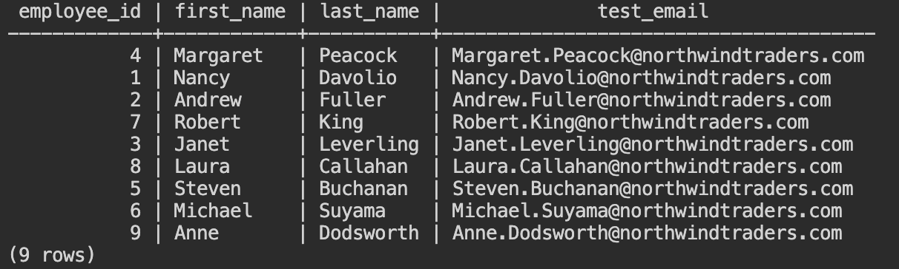

#### **正規表現での条件**

1. 正規表現を使用して、顧客 (customers) テーブルからハイフン (-) を使用した郵便番号の顧客をリストします。以下のSQLをコピーして、Cloud Shellから入力してください。

```
select
    customer_id,
    company_name, 
    country, 
    postal_code 
from customers 
where postal_code ~ '.*-.*';
```

`.*`は、どんな文字でも、何文字でも良いことを表します。上記の正規表現では、ハイフンの前後はどんな文字列でも構わないという条件で文字列を検索しています。

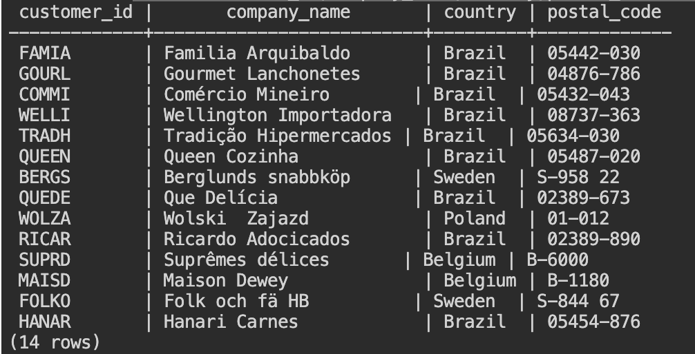

2. 続いて、特定顧客の注文から発送までの待ち日数を確認してみましょう。前のステップでリストされた顧客ID ‘FAMIA' の注文履歴を確認します。`select order_id, order_date from orders where customer_id='FAMIA' order by order_id;` と入力してください。


3. 顧客ID ‘FAMIA'の顧客は、7回の注文履歴があることがわかります。各注文の発注から発送までの日数をAGE関数を使って取得します。以下のSQLをコピーして、Cloud Shellから入力してください。

```
SELECT
order_id,
AGE(shipped_date, order_date) AS time_to_fill_order
FROM orders
WHERE customer_id = 'FAMIA' 
ORDER BY order_id;
```

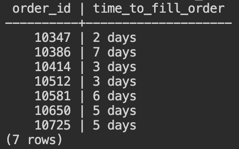

#### **商品カテゴリごとの平均単価と単価ランキング**

1. AVG()を使用して、商品 (products) テーブルから商品カテゴリごとの平均単価を取得します。以下のSQLをコピーして、Cloud Shellから入力してください。

```
SELECT
product_id,        
unit_price,
category_id,
        AVG (unit_price) OVER (
           PARTITION BY category_id ) avg_unit_price_for_category
FROM products
WHERE category_id between 1 and 2;
```

商品カテゴリ1の平均単価と、商品カテゴリ2の平均単価が、各商品のIDと単価と共に表示されます。

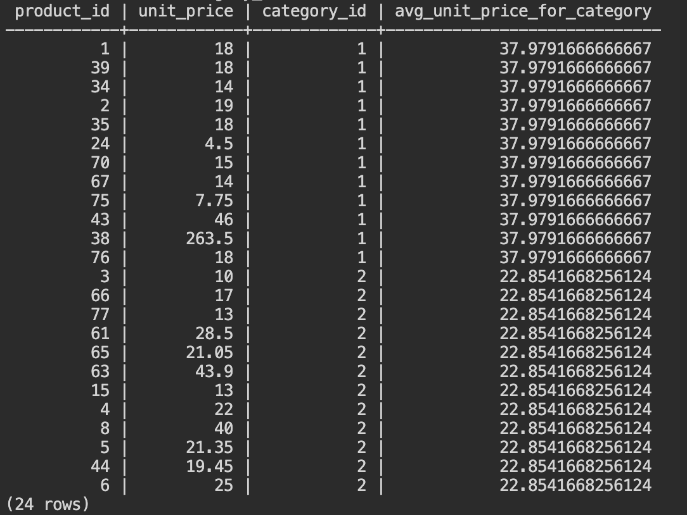

2. 集約関数のAVG()を使用した場合と比較してみましょう。

以下のSQLをコピーして、Cloud Shellから入力してください。

```
select category_id,avg(unit_price)
from products
group by category_id
order by category_id;
```


> aside positive
> 
> 集約関数のAVG()でも平均単価を取得することができますが、その場合は個別の商品のIDと単価と共にリストすることができません。

3. RANK()を使用して、商品 (products) テーブルから商品カテゴリごとの単価の高い商品をリストします。以下のSQLをコピーして、Cloud Shellから入力してください。

```
SELECT product_id, unit_price, category_id,
    RANK() OVER (
       PARTITION BY category_id
ORDER BY unit_price DESC ) unit_price_rank
FROM
    products
WHERE category_id BETWEEN 1 AND 2;
```

商品カテゴリ1の中での単価ランキングと、商品カテゴリ2の中での単価ランキングがリストされます。

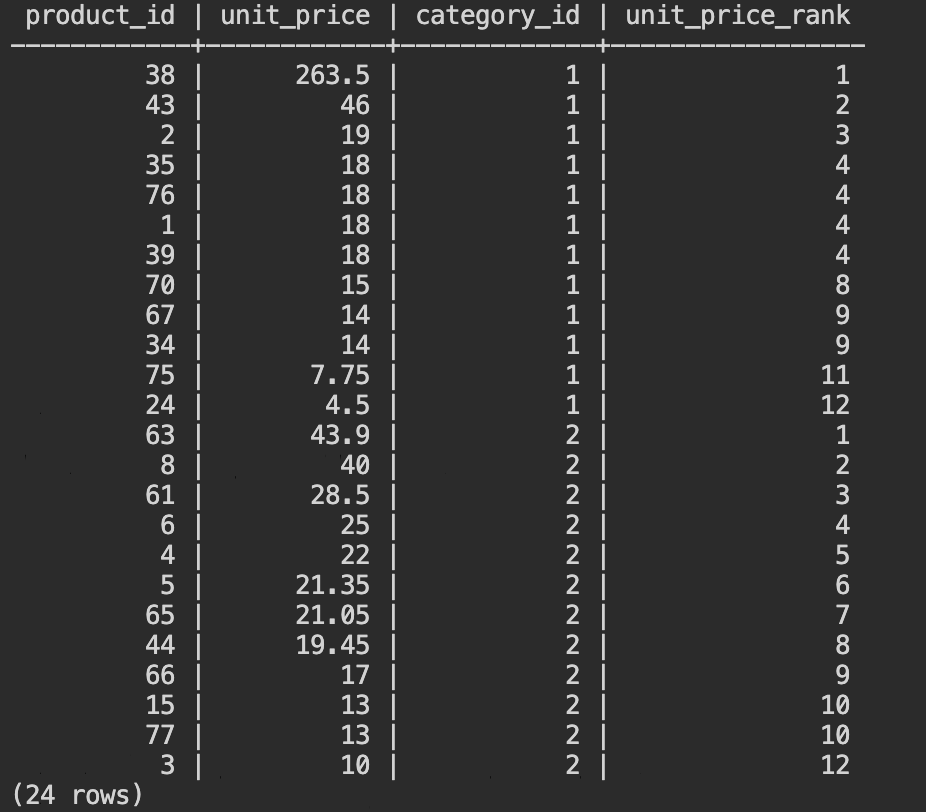

4. Rank()は、**PARTITION BY**で設定された範囲での順位づけを行います。PARTITION BYを削除して実行すると、商品カテゴリ1と2の中での単価ランキングが表示されることを確認してください。

```
SELECT product_id, unit_price, category_id,
    RANK() OVER (
ORDER BY unit_price DESC ) unit_price_rank
FROM
    products
WHERE category_id BETWEEN 1 AND 2;
```

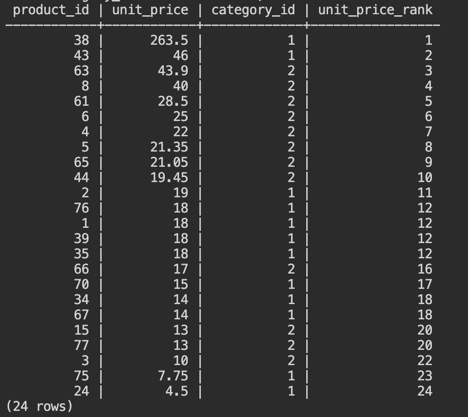

以上で、このセクションは完了です。


## 拡張機能とパフォーマンス分析
Duration: 15:00


#### **このセクションで実施すること**

YSQLは、標準的な(方言の少ない)SQLをサポートしているだけでなく、様々な [高度な機能](https://docs.yugabyte.com/preview/explore/ysql-language-features/advanced-features/)を提供しています。

また、PostgresSQLコミュニティから提供される様々な [拡張機能](https://docs.yugabyte.com/preview/explore/ysql-language-features/pg-extensions/)をプラグインして使用することができます。あらかじめバンドルされているPostgreSQL Extensionは、YugabyteDBのインストールディレクトリ ~/postgres/share extensionに含まれています。

> aside negative
> 
> 注：ストレージ層と相互作用する拡張機能（分散ストレージの概念がなく開発された機能）は、そのままでは動作しない可能性があります。

ここでは、YSQLでサポートされるいくつかの機能を紹介します。また分散ストレージに対するクエリ実行を効率化する、パフォーマンス分析についても触れています。

* 暗号化 (pgcrypt)
* 統計情報 (pg_stat_statements)
* コロケーション

#### **拡張機能 (pgcrypt) の有効化**

1.  [YugabyteDB Managed](https://cloud.yugabyte.com/)にログインし、クラスタのダッシュボード右上にある[Coneect]ボタンをクリックします。Cloud Shellから任意のデータベースに接続してください。（前のステップまで使用していたnorthwindでも、デフォルトで作成されるyugabyteでも、お好きなデータベースを使用してください。）
2. YugabyteDBにバンドルされている拡張機能は、CREATE EXTENTIONステートメントで有効化することができます。暗号化関数を提供するpgcryptoモジュールを使用するため、`CREATE EXTENSION pgcrypto;` と入力してください。
3. crypt()を使用して、パスワードのハッシュ化を行います。

`SELECT crypt('new-password', gen_salt('bf', 8));` と入力してください。

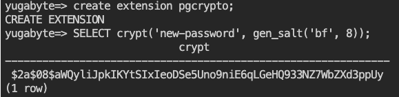

> aside positive
> 
> `crypt(password text, salt text)`は、パラメータに指定された文字列を、`gen_salt(type text [, count integer])` で生成されたソルト文字列でハッシュします。使用可能なアルゴリズムは、MD5、Blowfishなどです。

4. 今度は、アルゴリズムをMD5に変更してみましょう。`SELECT crypt('new-password', gen_salt('md5'));` と入力してください。先ほどのBlowfish (bf) アルゴリズムとは異なる結果が返ります。

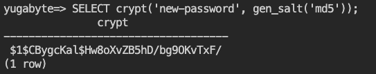

#### **統計情報 (pg_stat_statements)**

pg_stat_statementsは、パフォーマンス分析のための統計情報を取得するPostgreSQLの拡張機能です。CREATE EXTENSIONステートメントを使用しなくても、最初から使用可能になっています。

1. ビューの定義を確認します。Cloud Shellから `\d+ pg_stat_statements` と入力してください。

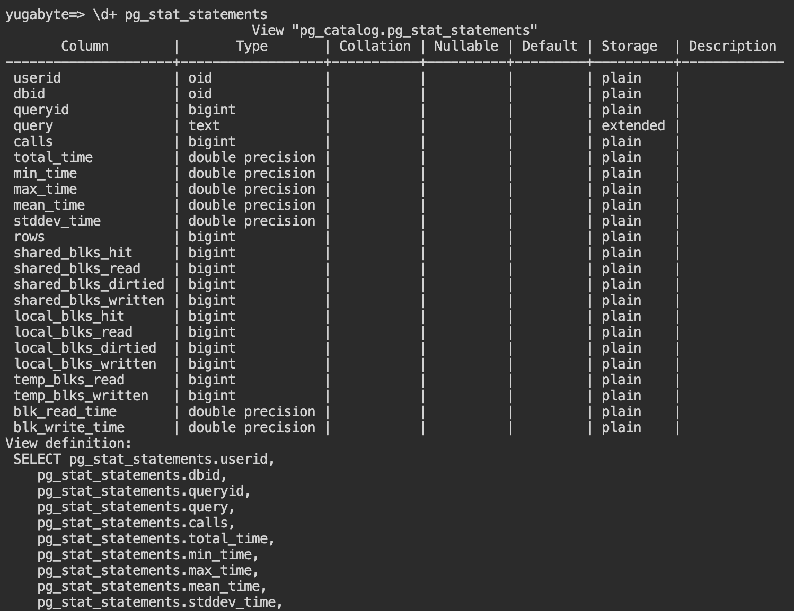

> aside positive
> 
> クエリ実行に関する様々な統計情報がpg_stat_statementsビューから参照できることがわかります。shared_blks_*などの一部の情報は、カラムとしては用意されていますがYugabyteDBに該当しないため統計情報が表示されることはありません。

2. これまでの統計情報をリセットしてから、いくつかのSQLを実行して統計情報を確認します。以下のSQLを、Cloud Shellから入力してください。（2行目以降は、任意のSQLで構いません。）

```
select pg_stat_statements_reset();
create table demo (i bigint primary key, t text, d date not null, b boolean);
select * from demo where i=42 and t='x' and d is not null and b;
```

3. 統計情報を確認してみましょう。`select query, calls, total_time from pg_stat_statements; と`入力してください。

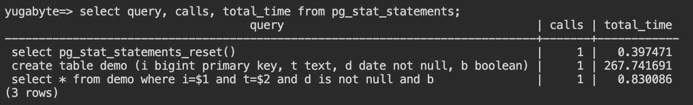

実行されたクエリは、値が変数 ($1, $2) に変わっています。where句での条件の形式が一緒であれば、数値が違っても同じクエリとして集計されます。

#### **コロケーション・データベースの作成**

コロケーションとは、YugabyteDBのデフォルトである自動シャーディングと分散配置を無効化し、1つのタブレットにテーブル全体を配置する機能です。比較的小さくデータが増加しないテーブルが多数あるような場合、分散による同期的なコンセンサスがネットワークの負荷を大きくしたり、細分化されたタブレットがクエリ実行のパフォーマンスに影響したりすることがあります。

1. コロケーションは、データベース作成時に設定する必要があります。Cloud Shellで`CREATE DATABASE col_db WITH colocation = true;` と入力してください。
2. `\c col_db` と入力して、作成したcol-dbに接続します。
3. コロケーション・データベースでは、デフォルトでテーブルのコロケーションが有効化(colocation = true) されます。以下のように入力して、2つのコロケーション・テーブルと2つの非コロケーション・テーブルを作成してください。

```
CREATE TABLE tbl1 (k int primary key, v int);
CREATE TABLE tbl2 (k int primary key, v int);
CREATE TABLE tbl3 (k int primary key, v int) with (colocation=false);
CREATE TABLE tbl4 (k int primary key, v int) with (colocation=false);
```

4. 作成したテーブルに適当なデータを挿入するため、各テーブルにgenerate_series()を使用した値を挿入します。

```
insert into tbl1 select i, i%10 from generate_series(1,100000) as i;
insert into tbl2 select i, i%10 from generate_series(1,100000) as i;
insert into tbl3 select i, i%10 from generate_series(1,100000) as i;
insert into tbl4 select i, i%10 from generate_series(1,100000) as i;
```

5. 実行時間を計測するため、`\timing` と入力します。
6. Tbl1とtbl3にセカンダリ・インデックスを作成します。以下のように入力してください。

```
create index on tbl1 (v);
create index on tbl3 (v);
```

これで、コロケーション有無とセカンダリ・インデックス有無が異なる4つのテーブルが作成されました。

7. 4つのテーブルそれぞれで、同じクエリがどのように実行されるのかを実行計画で確認します。まずは、インデックス有りのtbl1とtbl3について、以下のように入力して実行計画を確認してください。

```
explain (analyze, costs off) select * from tbl1 where v=6;
explain (analyze, costs off) select * from tbl3 where v=6;
```

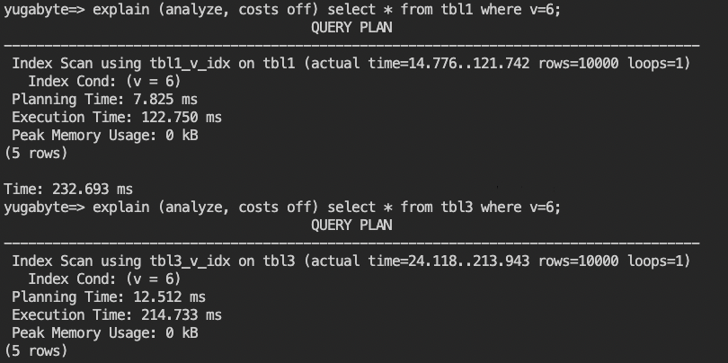

> aside positive
> 
> インデックスを作成してあるため、どちらもIndex Scanで効率的に実行されていますが、実行時間がコロケーション・テーブル(tbl1)の方が早いことがわかります。コロケーション・テーブルに作成されたインデックスは、デフォルトでコロケーションされます。一方、非コロケーション・テーブルでは、インデックスが複数タブレットに分散しているため、インデックス・スキャンにもより多い実行時間がかかります。

8. 続いて、テーブル結合(Join)した時のパフォーマンスを比較します。以下のように入力して、実行計画を確認してください。

```
explain (analyze, costs off) select * from tbl1, tbl2 where tbl1.k=tbl2.k and tbl1.v=6;
explain (analyze, costs off) select * from tbl3, tbl4 where tbl3.k=tbl4.k and tbl3.v=6;
```

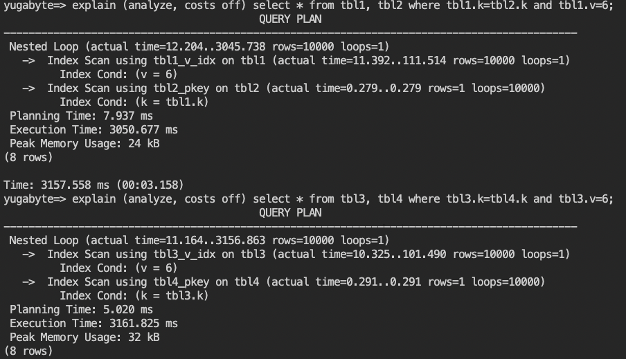

9. YugabyteDBでは、分散ストレージへの読み取りリクエストを減らしてクエリ実行を効率化するため、Batched Nested Loopの機能を提供しています。（2.17時点ではベータ版、詳細は [こちら](https://dev.to/yugabyte/batched-nested-loop-to-reduce-read-requests-to-the-distributed-storage-j5i)のブログをご確認ください。）`set yb_bnl_batch_size=1024;` と入力して、Batched Nested Loopを有効化してください。
10. 手順 8. と同様にexplainコマンドを入力して、再度実行計画を確認してください。

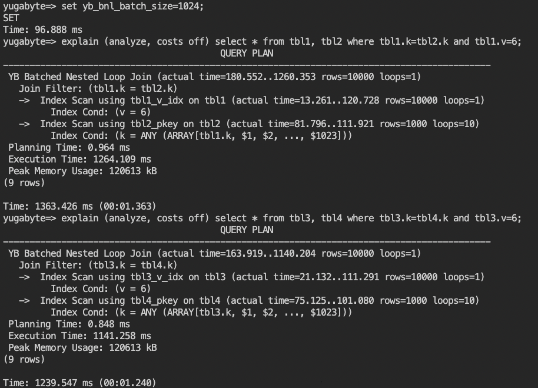

> aside positive
> 
> 結合 (Join) を使用したクエリ実行が、Nested LoopからBatched Nested Loopに変わりました。コロケーション・テーブル、非コロケーション・テーブル共に、実行時間が短くなっていることを確認してください。

以上で、このセクションは完了です。


## まとめ
Duration: 01:00


お疲れ様でした。YSQLハンズオンは、これで終了です。

YugabyteDB Managedは、データベースを導入するハードウェアやOSを準備しなくても、数ステップの操作で使い始められるマネージドのデータベース・サービスです。

YugabyteDB Managedでは、CLIやGUIのツールを使って、使い慣れたSQLで操作できることを確認できたと思います。

### 次におすすめのハンズオン

以下のハンズオンも実施してみてください。

*  [YugabyteDB Managedの耐障害性と拡張性](https://yugabytedb-japan.github.io/codelabs/ybm-cluster-resiliency/index.html)

### 参考資料

*  [YugabyteDB Managed 公式ドキュメント](https://docs.yugabyte.com/preview/yugabyte-cloud/)
*  [Yugabyte University: YugabyteDB YSQL Development Fundamentals](https://university.yugabyte.com/courses/yugabytedb-ysql-development-fundamentals)
*  [Yugabyte University: YugabyteDB Managed Basics](https://university.yugabyte.com/courses/yugabytedb-managed-basics)


